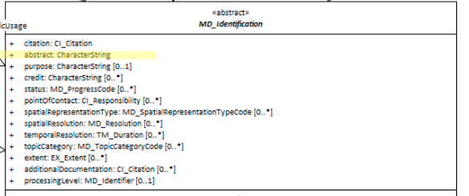

#  Abstract ★★★★★
*In order to quickly find, catagorise and evaluate the fitness of a resource to our needs it is usefull to include in our metadata a human readable narrative description of the resource. This is often the most important tool to users for first pass evaluation.*

- **Path** - *MD_Metadata.identificationInfo>MD_DataIdentification.abstract*
- **Governance** -  *Common ICSM, Agency, Domain*
- **Purpose -** *discovery, evaluation*
- **Audience -** 
  - machine resource - ⭑⭑
  - general - ⭑⭑⭑⭑⭑
  - data manager - ⭑⭑⭑⭑
  - specialist - ⭑⭑⭑⭑
- **Metadata type -** *descriptive*
- *ICSM Level of Agreement* - ⭑⭑⭑⭑

## Definition 
**A brief narrative summary of the cited resource.**

### ISO Obligation 
- There must be one and only one [1..1] *abstract* entries for the resource in the metadata  *[MD_DataIdentification](./class-MD_DataIdentification)* package of type *character String* in a metadata record.

### ICSM Good Practice 
  - Provide enough narative to give the reader a good understanding of the nature of the resource. Use common language for at least the first few statements.
  
## Discussion 
Abstract is a mandatory element. It contains a human readable description of the resource that gives a user a first understanding of the resource. Typically, an abstract is several sentences long.

Consideration needs be given to the audience and what they need to know about the resource to decide it's utility for them.

The abstract should address the 5Ws What is it; Who generated it; When was it generated; Why was it generated; and Where is the place that it deals with. But in a general way with the most common launguage posible while still containing sufficient information to provide a good understanding of the resource to your most likely audience.

  
### Outstanding Issues
> **Dublin core / CKAN / data.gov.au**
Also defines this element as additional information describing or analysing the data. But while this can be static it also can be an editable wiki which anyone can contribute to instantly or via admin moderation. This latter approach is currently difficult to support in ISO 19115-1.

> **DCAT**
This element may also contain a table of contents, a graphical representation, or a free-text account of the resource.

> **element - Purpose**
Some guidance needs to be developed to guide users as to what belongs in `abstract` and what belongs in `purpose`.

## Recommendations 
Therefore - An abstract should be written in a style that your human audience will easily comprehend. As this is a top level field for harvested records to general purpose catalogues, common language should be used that most people could understand. If there is a need for more technical language to describe the resource, this should be included at the end of the abstract.

The contents of an abstract should address the 5Ws What is it; Who generated it; When was it generated; Why was it generated; and Where is the place that it deals with (Time and Location). But in a general way with the most common launguage posible while still containing sufficient information.

> Note BC 18-7 - The compilation of best practice Abstracts as examples to guide metadata authors in writing abstracts in a consistent manner would be of high utility.

## Crosswalk considerations

<details>

#### Dublin core / CKAN / data.govt.nz
Maps to `description`

#### DCAT
Maps to `dct.description`

#### RIF-CS
Maps to `Description 'full'`

</details>

## Also Consider
- **[Purpose -](./Purpose.md)** provides A brief summary of the intentions with which the resource was developed. Some overlap of usage with `abstract` may exist. The MDWG should provide some guidance as to what belongs in `abstract` and what belongs in `purpose`
- **MD_DataIdentification.supplimentalInformation -** provides a description of the resource in the producer's processing environment, including items such as the software, the computer operating system, file name, and the dataset size.

## Examples

<details>

### ABARES
> *TOPO_2.5M is a national seamless data product aimed at regional or national applications. 
The data are suitable for location or distribution mapping at a small scale and can be readily combined with other data products.
TOPO_2.5M is an intermediate product between AUSLIGs TOPO_10M (data at 1:10 million scale) and TOPO_250K (data at 1:250 000 scale). 
It has been specifically designed for map production and does not carry the additional attributes which support GIS analysis. 
TOPO_2.5M is topologically structured including closed polygons and properly intersecting lines and is comprised of the following themes Built-up Areas, Framework, Localities, Roads, Railways, Streams, Waterbodies and Reefs. 
The user guide can be accessed at a link provided below. 
Link to licence and licence conditions //Baldric/publicmetadata/data/glompr_gm__001/glompr_gm__00111a00pdf______/licence_template.pdf. 
The licence allows the use of the data for any maps (including Internet applications) but the data itself must not be supplied to any third party. 
All products must include an appropriate copyright statement.*

### GA
 > *Publicly available bathymetry and geophysical data has been used to map geomorphic features of the Antarctic continental margin and adjoining ocean basins at scales of 1:1-2 million. The key bathymetry datasets used were GEBCO08 and ETOPO2 satellite bathymetry (Smith & Sandwell 1997), in addition to seismic lines in key areas. Twenty-seven geomorphic units were identified based on interpretation of the seafloor bathymetry with polygons digitised by hand in ArcGIS. Seafloor features were classified largely based on the International Hydrographic Organisation (2001) classification of undersea features, and expanded to include additional features, including those likely to have specific substrate types and influence on oceanography. This approach improves the technique as a predictor of physical conditions that may influence seafloor communities. The geomorphic map has been used for developing a benthic bioregionalisation and for developing a representative system of Marine Protected Areas for East Antarctica. Slight modifications have been made since original publication in O'Brien et al. 2009 and Post et al. 2014. These include: - updating of some feature names; - combining "wave affected banks" with "shelf banks" - Combining "coastal terrance" with "island coastal terrane" as "Coastal/Shelf Terrane" - replacing canyon vectors with polygons by using a buffer around the vectors Further details of the original mapping can be found in: O'Brien, P.E., Post, A.L., Romeyn, R., 2009. Antarctic-wide geomorphology as an aid to habitat mapping and locating Vulnerable Marine Ecosystems, Commission for the Conservation of Antarctic Marine Living Resources Vulnerable Marine Ecosystems Workshop, Paper WS-VME-09/10. CCAMLR, La Jolla, California, USA. Post, A.L., Meijers, A.J.S., Fraser, A.D., Meiners, K.M., Ayers, J., Bindoff, N.L., Griffiths, H.J., Van de Putte, A.P., O'Brien, P.E., Swadling, K.M., Raymond, B., 2014. Chapter 14. Environmental Setting, In: De Broyer, C., Koubbi, P., Griffiths, H.J., Raymond, B., d'Udekem d'Acoz, C., et al. (Eds.), Biogeographic Atlas of the Southern Ocean. Scientific Committee on Antarctic Research, Cambridge, pp. 46-64.*
 
### AAD
 > This dataset is a collection of aerial images taken from a camera mounted in the fuselage of the CASA-212 400 aircraft used to survey for pygmy blue whales. Line transect data from that survey are also available (but see Gill, P.C., Pirzl, R., Morrice, M.G. and Lawton, K. (2015). "Cetacean diversity of the continental shelf and slope off southern australia." The Journal of Wildlife Management 79(4): 672-681 for more details). 
 The digital images were taken with a Nikon D200 camera, using a 35mm lens. The survey altitude was approximately 1500 ft. Images have full EXIF data attached. Image footprints are approximately 204 m along-track by 306 m across track, with some image overlap.
  Aerial images; downward facing images along track from a line transect survey. 
 There are ~41K jpeg images. 
 Images taken with Nikon D200 camera, with 35 mm lens. 
 Aerial survey altitude was approximately 1500 ft. 
 Each image has a water-surface footprint of 204 m along-track by 306 m across track; there is some image overlap along-track.
 The EXIF data for each image is populated.
 Images taken in January 2012 along the Bonney Upwelling, along the south-east coast of Australia, an area known to be a summer (Nov-May) feeding ground for pygmy blue whales; the surveys focussed on the area bounded by 138.0-145.0ºE and 36.6-40.3ºS.

### data.gov.au
 > The Department of Human Services Service Centre locator contains information updated weekly, a search function and maps.


### XML 
```
<mdb:MD_Metadata>
....
  <mdb:identificationInfo>
    <mri:MD_DataIdentification>
    ....
      <mri:abstract>
        <gco:CharacterString>This is an example dataset to demonstrate the use of ISO 19115-3.  Below is a sample abstract reprinted from the document AS/NZS ISO 19115.1:2015.
        Location of all current mineral Exploration Licences issued under the Mining Act, 1971.
        Exploration Licences provide exclusive tenure rights to explore for mineral resources for up to a maximum
        of 5 years. Comment is sought on applications for Exploration Licences from numerous sources
        before granting. Exploration programs are subject to strict environmental and heritage conditions.
        Exploitation of identified resources must be made under separate mineral production leases.</gco:CharacterString>
      </mri:abstract>
    ....
    </mri:MD_DataIdentification>
  </mdb:identificationInfo>
....
</mdb:MD_Metadata>
```

### UML diagrams
Recommended elements highlighted in Yellow


</details>
