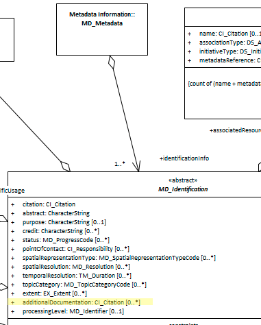

# Additional Documentation ★★★
*A cited resource may have any number of related documents such as articles, publications, user guides, data dictionaries that are useful in applying the resource to desired purposes. Often these are difficult to discover and manage. Capturing these in the metadata is recommended.*

- **Path** - *MD_Metadata.identificationInfo>MD_DataIdentificationr.additionalDocumentation*
- **Governance** - *Domain, Agency*
- **Primary use** - *Data Management, Resource Use*
- **Audience -** 
  - machine resource - ⭑ 
  - general - ⭑⭑⭑
  - data manager - ⭑⭑⭑⭑⭑
  - specialist - ⭑⭑⭑⭑⭑
- **Metadata type -** *descriptive*
- *ICSM Level of Agreement* - ⭑⭑⭑

# Definition 
**Citation of other documentation associated with the resource, e.g. related articles, publications, user guides, data dictionaries.**

## ISO Obligation 
There may be zero to many [0..\*] *additionalDocumentation* packages for the cited resource in the  *[MD_DataIdentification](./class-MD_DataIdentification)* package of class [CI_Citation](./class-CI_Citation) in the metadata record. 

##  ICSM Good Practice recommendation
This element should be populated in all metadata records with a minimum of `title`, `identifier`, `date` and `citedResponsibleParty`. If posible, use the link to the metadata for the cited additional documentation as its landing page.

### Recommended Sub-Elements
* **title -** *(type - charStr)* [1..1] mandatory for citations, the name by which the cited resource is known
* **date -** *(class - [CI_Date](./class-CI_Date))* recommended, the reference date for the cited resource. 
In addition, some direction should be given about how to access the cited additional resource.
* **onlineResource -** *(class [CI_OnlineResource](./class-CI_OnlineResource))* [0..\*] a description of how to access the cited additional resource online
* **citedResponsibleParty -** *(class [CI_Responsibility](./class-CI_Responsibility))* [0..\*] contact information for someone who can give guidance about accessing the cited additional resource


# Discussion
To make best use of a given resource, additional documentation may be useful or required. Providing instructions for accessing these documents can greatly enhance the value of a resource to its users and providers. Capturing these additional documents in the metadata is also helpful to resource managers who need to properly track the linkages between a resource and its documentation.

## Outstanding Issues
> **DCAT**
Previously captured DCAT related documentation on this elements calls what is considered the equivalent "A free-text account of the catalog." Mapping seems incorrect.


# Recommendations 

Therefore to make best use of a given resource capturing the the links to additional documentation related to this resource is highly recommended. Capture those documents of the highest value to your most likely community of users. If posible, include some reference to documentation or its metadata that can be easily understood by lay people and label this accordingly.


## Crosswalk considerations 

### DCAT 
Maps to `dct.description` free-text 

### RIF-CS 
Maps to `Description 'notes'`

# Also Consider 
- **[MD_DataIdentification.supplementalInformation -](https://www.isotc211.org/hmmg/HTML/ConceptualModels/EARoot/EA1/EA13/EA2/EA12/EA4420.htm)**  is defined as "any other descriptive information about the resource". 
- **[MD_AssociatedResource -](https://www.isotc211.org/hmmg/HTML/ConceptualModels/EARoot/EA1/EA13/EA2/EA12/EA4419.htm)**  contains information about resources of which this resource is a piece. Association types are taken from the [DS_AssociationTypeCode](https://www.isotc211.org/hmmg/HTML/ConceptualModels/EARoot/EA1/EA13/EA2/EA12/EA4378.htm).

# Examples

## XML 
```
<mdb:MD_Metadata>
....
   <mdb:identificationInfo>
      <mri:MD_DataIdentification>
      ....
         <mri:additionalDocumentation>
            <cit:CI_Citation>
               <cit:title>
                  <gco:CharacterString>Usage guide</gco:CharacterString>
               </cit:title>
               <cit:date>
                  <cit:CI_Date>
                     <cit:date>
                        <gco:Date>2019-07-01</gco:Date>
                     </cit:date>
                     <cit:dateType>
                        <cit:CI_DateTypeCode codeList="http://standards.iso.org/ittf/PubliclyAvailableStandards/ISO_19139_Schemas/resources/codelist/ML_gmxCodelists.xml#CI_DateTypeCode"
                                             codeListValue="creation"/>
                     </cit:dateType>
                  </cit:CI_Date>
               </cit:date>
               <cit:citedResponsibleParty>
                  <cit:CI_Responsibility>
                     <cit:role>
                        <cit:CI_RoleCode codeList="http://standards.iso.org/ittf/PubliclyAvailableStandards/ISO_19139_Schemas/resources/codelist/ML_gmxCodelists.xml#CI_RoleCode"
                                         codeListValue="custodian"/>
                     </cit:role>
                     <cit:party>
                        <cit:CI_Organisation>
                           <cit:name>
                              <gco:CharacterString>OpenWork Ltd</gco:CharacterString>
                           </cit:name>
                           <cit:contactInfo>
                              <cit:CI_Contact>
                                 <cit:address>
                                    <cit:CI_Address>
                                       <cit:electronicMailAddress>
                                          <gco:CharacterString>info@openwork.nz</gco:CharacterString>
                                       </cit:electronicMailAddress>
                                    </cit:CI_Address>
                                 </cit:address>
                              </cit:CI_Contact>
                           </cit:contactInfo>
                           <cit:individual>
                              <cit:CI_Individual>
                                 <cit:name>
                                    <gco:CharacterString>Byron Cochrane</gco:CharacterString>
                                 </cit:name>
                              </cit:CI_Individual>
                           </cit:individual>
                        </cit:CI_Organisation>
                     </cit:party>
                  </cit:CI_Responsibility>
               </cit:citedResponsibleParty>
               <cit:onlineResource>
                  <cit:CI_OnlineResource>
                     <cit:linkage>
                        <gco:CharacterString>https://openwork-nz.github.io/Resources/2019/04/25/gn-plugins.html</gco:CharacterString>
                     </cit:linkage>
                     <cit:protocol gco:nilReason="missing">
                        <gco:CharacterString/>
                     </cit:protocol>
                     <cit:name gco:nilReason="missing">
                        <gco:CharacterString/>
                     </cit:name>
                     <cit:description gco:nilReason="missing">
                        <gco:CharacterString/>
                     </cit:description>
                     <cit:function>
                        <cit:CI_OnLineFunctionCode codeList="http://standards.iso.org/ittf/PubliclyAvailableStandards/ISO_19139_Schemas/resources/codelist/ML_gmxCodelists.xml#CI_OnLineFunctionCode"
                                                   codeListValue=""/>
                     </cit:function>
                  </cit:CI_OnlineResource>
               </cit:onlineResource>
            </cit:CI_Citation>
         </mri:additionalDocumentation>
      ....
      </mri:MD_DataIdentification>
   </mdb:identificationInfo>
....
</mdb:MD_Metadata>
```

## UML diagrams
Recommended elements highlighted in Yellow


