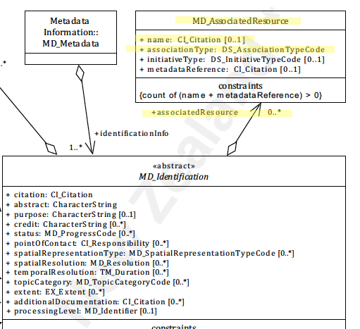

# Associated Resource ★★★
*Geospatial data and service often are part of a larger collection of resources.  Geospatial practitioners need to be provided linkages to these associated resources of which a given resource is a part. There are many types of associated resources, spatial and non-spatial. Associated resources can also provide useful path for discovery.*

- **Path** -  *MD_Metadata.identificationInfo>MD_DataIdentification.associateResource*
- **Governance** -  *Agency, Domain*
- **Purpose -** *Resource use, Discovery*
- **Audience -** 
  - machine resource - ⭑⭑
  - general - ⭑⭑⭑
  - resource manager - ⭑⭑⭑ 
  - specialist - ⭑⭑⭑⭑⭑
- **Metadata type -** *administrative, descriptive*
- *ICSM Level of Agreement -* ⭑⭑⭑


# Definition 
**An entity to indicate association between resources and records related to the resources**

## ISO Obligation -
  - In a metadata record there should be zero to many [0..\*] *associatedResources* packages for the cited resource in the  *[MD_DataIdentification](https://www.loomio.org/d/oqKd8GHM/class-md_dataidentification)* package of class *[MD_AssociatedResource](http://wiki.esipfed.org/index.php/MD_AssociatedResource)* that relate a resource to other resources. These should be of type *[DS_AssociationTypeCode](http://wiki.esipfed.org/index.php/ISO_19115-3_Codelists#DS_AssociationTypeCode)*.

### ICSM Recommended Sub-Elements 
* **associationType -** *(codelist - [DS_AssociationTypeCode](http://wiki.esipfed.org/index.php/ISO_19115-3_Codelists#DS_AssociationTypeCode))* [1..1] Mandatory for associated resource citations - one name for the type of relationship
  * crossReference - reference from one resource to another
  * largerWorkCitation - reference to a master resource of which this one is a part
  * partOfSeamlessDatabase - part of same structured set of data held in a computer
  * stereoMate - part of a set of imagery that when used together, provides three-dimensional images
  * isComposedOf - reference to resources that are parts of this resource
  * collectiveTitle - common title for a collection of resources
  * series - associated through a common heritage such as produced to a common product specification
  * dependency - associated through a dependency
  * revisionOf - resource is a revision of associated resource
* **name -** *(class - [CI_Citation](https://www.loomio.org/d/Iei80UQH/class-ci_citation))*  {0..\*]} - citation information about the associated resource
* *Optional sub elements*
  * **initiativeType -** *(codelist - [DS_InitiativeTypeCode](http://wiki.esipfed.org/index.php/ISO_19115-3_Codelists#DS_InitiativeTypeCode))*  [0..1] - type of initiative under which the associated resource was produced 
  * **metadataReference -** *(class - [CI_Citation](https://www.loomio.org/d/Iei80UQH/class-ci_citation))*  [0..1] - reference to the metadata of the associated resource

# Discussion  

When important aspects or information about a spatial resource are derived by the association of this resource to others, it is useful that these associations be documented in the metadata so as these can be captured and discovered.  Doing so provides important avenues for additional data discovery.  Some resources are indeed of little use unless combined with others of which they are a part. 

## Outstanding Issues
> **Geonetwork support**
 Support of associated resources for iso19115-3 in GeoNetwork 3.6 seems limited and perhaps broken. This needs investigation.

### Other discussion
> **DCAT**
Def - *A resource with an unspecified relationship to the catalogued item.*
Notes - *Use only if more specific subproperty is not available. Sub-properties of dct:relation in particular dcat:distribution, dct:hasPart, (and its sub-properties dcat:catalog, dcat:dataset, dcat:service ), dct:isPartOf, dct:conformsTo, dct:isFormatOf, dct:hasFormat, dct:isVersionOf, dct:hasVersion, dct:replaces, dct:isReplacedBy, dct:references, dct:isReferencedBy, dct:requires, dct:isRequiredBy*

# Recommendations 
Therefore - in order to provide an effective way to document, preserve and provide discovery of associated resources, these relations should be documented in the metadata.  At a minimum this should include a name, description of the relationship and link to the to the resource or its metadata. In contraxt to `additionalDocumentation` which can be thought of as outputs used to describe and understand a cited resource, an `associatedResource` is something that is of a piece of, or an input to, the cited resource.


## Crosswalk considerations 

### ISO19139 
MD_AssociatedResource replaces MD_AggregateInformation to clarify its
role as a mechanism for associating resources. Changes include:

- MD_AssociatedResource/name:CI_Citation replaces MD_AggregateInformation/aggregateDatasetName
  - The name this role was simplified along with the change to the name of the class.
- MD_AggregateInformation/aggregateDataSetIdentifier
  - This MD_Identifier was removed because the MD_Identifier in the name:CI_Citation can be used to provide an identifier for the associated resource.
- MD_AssociatedResource /metadataReference:CI_Citation was added
  - This new element was added to avoid ambiguity about whether the name:CI_Citation refers to a resource or to metadata for that resource. Now it is clear that name:CI_Citation refers to the resource and the metadataReference refers to metadata for that resource.

### Dublin core / CKAN / data.govt.nz 
TBD {mapping to *DC element* and discussion???}

### DCAT 
Maps to dct:relation

### RIF-CS
Maps to "Related Information"

# Also Consider
- **[additionalDocumentation -](https://www.loomio.org/d/At7CL4Fv/md_identification-additionaldocs-definition)**  other documentation associated with the resource, e.g. related articles, publications, user guides, data dictionaries.
- **[resourceLineage -](https://www.loomio.org/d/ifwCE2kg/md_identification-resourcelineage-definition)** Information about the provenance, source(s), and/or the production process(es) applied to the resource.
- **[browseGraphic -](https://www.loomio.org/d/MDiF0QYb/md_identification-browsegraphic-definition)**  associates to a large number of packages to provide linkage to associated image files, such as business or product icons and logos
- **[supplementalInformation -](https://www.isotc211.org/hmmg/HTML/ConceptualModels/EARoot/EA1/EA13/EA2/EA12/EA4420.htm)**   a free text field that is defined as "any other descriptive information about the resource". 

# Examples

## XML 
```
<mdb:MD_Metadata>  
....
  </mdb:identificationInfo>     
    </mri:MD_DataIdentification>
    ....   
      <mri:associatedResource>
        <mri:MD_AssociatedResource>
          <mri:name>
            <cit:CI_Citation>
              <cit:title>
                <gco:CharacterString>Big Project</gco:CharacterString>
              </cit:title>
            </cit:CI_Citation>
          </mri:name>
          <mri:associationType>
            <mri:DS_AssociationTypeCode codeList="https://schemas.isotc211.org/19115/resources/Codelist/cat/codelists.xml#DS_AssociationTypeCode"
            codeListValue="largerWorkCitation"/>
          </mri:associationType>
        </mri:MD_AssociatedResource>
      </mri:associatedResource>
    ....
    </mri:MD_DataIdentification>
  </mdb:identificationInfo>
....
</mdb:MD_Metadata>
```


## UML diagrams
Recommended elements highlighted in Yellow


