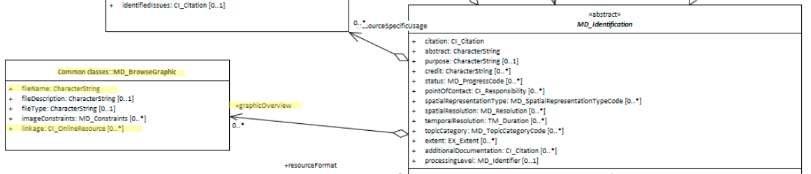

# Resource Graphic Overview ★★★
*Geospatial data and service are largely visual by nature.  Geospatial practicianers tend to be visually oriented. Browse graphics are a way of including in the metadata visual clues as to the nature and usefulness of resources.*

- **Path** -  *MD_Metadata.identificationInfo>MD_DataIdentification.graphicOverview*
- **Governance** -  *Agency, Domain*
- **Purpose -** *Discovery*
- **Audience -** 
  - machine resource - ⭑ 
  - general - ⭑⭑⭑⭑⭑
  - resource manager - ⭑ ⭑ 
  - specialist - ⭑⭑⭑
- **Metadata type -** *descriptive*
- *ICSM Level of Agreement* - ⭑⭑⭑

# Definition 

**A graphic that provides an illustration of a resource**

NOTE - Should include a legend for the graphic, if applicable.

EXAMPLE - A dataset, an organisation logo, security constraint or citation graphic..

## ISO Obligation

In a metadata record there should be zero to many [0..\*] *graphicOverview* packages for the cited resource in the  *[MD_DataIdentification](./class-MD_DataIdentification)* package of class *[MD_BrowseGraphic](http://wiki.esipfed.org/index.php/MD_BrowseGraphic)* in a metadata record.

## ICSM Good Practice 
A graphic overview image of the resource should be included in the metadata and typically include the name linkage to the graphic.

### Recommended Sub-Elements 
From class *[MD_BrowseGraphic](http://wiki.esipfed.org/index.php/MD_BrowseGraphic)*
- **fileName -** *(type - CharStr)* [1..1] Mandatory for browse graphic elements - name of the file that contains a graphic that provides an illustration of the resource. 
- **linkage -** *(class - [CI_OnlineResource](./class-CI_OnlineResource))*  [0..\*] - link to browse graphic.
- Optional:
  - **imageConstraints -** *(class - [MD_Constraints](./class-MD_Constraints))*  [0..\*]  - restriction on access and/or use of browse graphic
  - **fileType -** *(type - CharStr)* [0..\*]  - format in which the illustration is encoded (e.g.: EPS, GIF, JPEG, PBM, PS, TIFF, PDF)
  - **extent -** *(class -  [EX_Extent](./ResourceExtent))* [0..\*] Information about the horizontal, vertical and temporal extent of the resource specified by the scope

# Discussion  

Geospatial professionals by nature, rely to a large extent on visual information to gain understanding of resources. Browse graphics provide in the metadata a way to communicate with users visually. 

## Outstanding Issues

> **Geonetwork support**
Support of browse graphics for iso19115-3 in GeoNetwork 3.6 seems limited and perhaps broken. This needs investigation.


# Recommendations 

Therefore - in order to provide a quick way for users to discover and identify the resource they need, provide a graphic overview in the metadata.  At a minimum this should include a name and link to the image.

## Crosswalk considerations 

<details>

### ISO19139 

**browseGraphic** is a new package in iso19115-1. New elements include:
- **MD_BrowseGraphic.imageConstraint** *(class - [MD_Constraints](./class-md_constraints))
  - This new element was added in order to allow the specification of constraints on a browse graphic associated with a resource.
- **MD_BrowseGraphic.linkage** *(class - [CI_OnlineResource](./class-CI_OnlineResource))
  - This new element was added in order to allow a straightforward specification of the link to the browse graphic and the capability to add additionalinformation (name, description, …) about that graphic.

</details>

# Also Consider
- **[MD_BrowseGraphic -](http://wiki.esipfed.org/index.php/MD_BrowseGraphic)**  associates to a large number of packages for different purposes, such as business or product icons and logos
- **[CI_OnLineFunctionCode -](http://wiki.esipfed.org/index.php/ISO_19115-3_Codelists#CI_OnLineFunctionCode)** This codelist contains an option *browseGraphic*

# Examples

<details>

## XML -

```
<mdb:MD_Metadata>
....
    <mdb:identificationInfo>
      <mri:MD_DataIdentification>
         <mri:citation>
            <cit:CI_Citation>
               ....
               <cit:graphic>
                  <mcc:MD_BrowseGraphic>
                     <mcc:fileName>
                        <gco:CharacterString>https://static.wixstatic.com/media/414fd2_2f712656fb5547f39a08a53aab98cc29~mv2.png/v1/fill/w_92,h_146,al_c,q_80,usm_0.66_1.00_0.01/IFaGR9yg.webp</gco:CharacterString>
                     </mcc:fileName>
                     <mcc:linkage>
                        <cit:CI_OnlineResource>
                           <cit:linkage>
                              <gco:CharacterString>https://static.wixstatic.com/media/414fd2_2f712656fb5547f39a08a53aab98cc29~mv2.png/v1/fill/w_92,h_146,al_c,q_80,usm_0.66_1.00_0.01/IFaGR9yg.webp</gco:CharacterString>
                           </cit:linkage>
                           <cit:protocol>
                              <gco:CharacterString>WWW:LINK-1.0-http--link</gco:CharacterString>
                           </cit:protocol>
                           <cit:name gco:nilReason="missing">
                              <gco:CharacterString/>
                           </cit:name>
                           <cit:description gco:nilReason="missing">
                              <gco:CharacterString/>
                           </cit:description>
                           <cit:function>
                              <cit:CI_OnLineFunctionCode codeList="https://schemas.isotc211.org/19115/resources/Codelist/cat/codelists.xml#CI_OnLineFunctionCode"
                                                         codeListValue="browseGraphic"/>
                           </cit:function>
                        </cit:CI_OnlineResource>
                     </mcc:linkage>
                  </mcc:MD_BrowseGraphic>
                  ....
            </cit:CI_Citation>
         </mri:citation>
      </mri:MD_DataIdentification>
   </mdb:identificationInfo>
....
</mdb:MD_Metadata>
```

## UML diagrams

Recommended elements highlighted in Yellow



</details>
