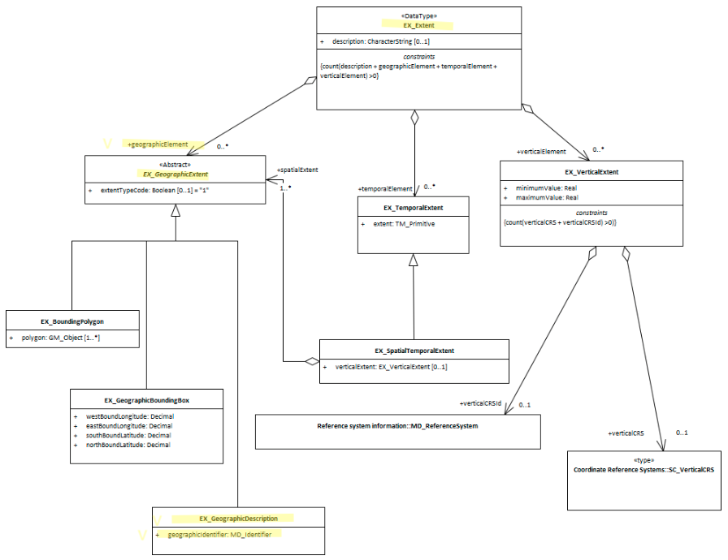

# Extent Geographic Description ★★★★
*In order to quickly determine the general location of spatial features included in an cited resource, it is useful that the extent information contains a verbal description of the geographic extent using common (to your community) place names.*

- **Path** - *MD_Metadata.identificationInfo>MD_DataIdentification.extent >EX_Extent.geographicElement>EX_GeographicDescription.geographicIdentifier*
- **Governance** - *Common, Domain*
- **Purpose** - *Discovery*
- **Audience -**
  - machine resource - ⭑⭑
  - general - ⭑⭑⭑⭑
  - data manager - ⭑⭑
  - specialist - ⭑⭑ (higher if domain specific placenames are used)
- **Metadata type -** *descriptive*
- *ICSM Level of Agreement* - ⭑⭑⭑

## Definition
**A Geographic description which describes the location of the resource.**


### ISO Obligation
- A metadata record may have zero to many  [0..\*] *geographicIdentifier* elements for the cited resource in the  *[GeographicExtent](./GeographicExtent)* package of class *EX_GeographicDescription* that described the geographic extent of a cited resource.

### ICSM Good Practice
- The MDWG recommends including as many instances of Geographical Extent packages as useful to give a common understanding of the spatial coverage of the cited resource. These names may be particular to your domain.

#### Recommended Sub-Elements
Use **extentTypeCode** *(type - Boolean)* [0..1] with a value of "0" to indicate exclusions
class MD_Identifier
* **code -** *(type - charStr)* mandatory for MD_Identifier
* **codespace -** *(type - charStr)*  ?a codelist that contains the code?
* **authority -** *(class - [CI_Citation](./class-CI_Citation))* optional, may contain the provider of the codelist of placenames

## Discussion
In order to provide a quick guide as tothe spatial area of interest for a cite resource, every metadata record describing geographic resources should contain a descriptor that indicates the location of the area of interest of the resource.  Catalogue software can use this information to analyse and narrow searches to particular areas of interest. 

The use of multiple descriptor is recommended for more complicated geometries, including exclusion areas.

### Outstanding Issues
> **GeoNetwork use of EX_Extent.description** 
The *"description"* element of EX_Extent offers a freeform way of describing the extent of a resource. GeoNetwork uses it to provide a codelist delimited set of values by which the EX_GeographicBoundingBox elements are populated in addition. It would seem more correct to use EX_GeographicDescription and its MD_Identifier element to this purpose.


## Recommendations
Therefore - It is highly recommended that to support discovery of resources, every metadata record that describes a geographic resource contains geographic descriptions of the area of interest for the resource. This description must contain a *code* that holds the value of the geographic descriptor and should contain in the *codespace* the codelist or domain from which it was derived. The *authority* element may contain additional documentation of the codelist.


### Crosswalk considerations

<details>

#### Dublin core / CKAN / data.govt.nz {if any}
Mapping geographic extents to CKAN and Dublin core elements, particularly as used by data.gov.au needs discussion

</details>

## Also Consider
- **[EX_Extent](./ResourceExtent)** The class that contains all extent information about the cited resource - vertical, geographical or temporal.
- **[EX_GeographicExtents](./ExtentGeographic)** is an abstract class and the parent of **EX_GeographicDescription**
- **[EX_GeographicBoundingBox -](./ExtentBoundingBox)**  a sibling to this element.
- **EX_BoundingPolygon**  While very useful, particularly in describing irregular areas, this element is not described by the MDWG as a recommended element due to the difficult that many systems have in implementing it.
- **[EX_TemporalExtent](./TemporalExtents)** Contains temporal extent information for the cited resource
- **[EX_VerticalExtent -](./VerticalExtent)**  captures the vertical range of a resource.
- **[GeoNames -](https://www.geonames.org/about.html)** Provides a free geographical database is available for download free of charge under a creative commons attribution license. It contains over 25 million geographical names and consists of over 11 million unique features whereof 4.8 million populated places and 13 million alternate names. All features are categorized into one out of nine feature classes and further subcategorized into one out of 645 feature codes.

## Examples

<details>

### XML
```
<mdb:MD_Metadata>
....
    <mdb:identificationInfo>
      <mri:MD_DataIdentification>
      ....
         <mri:extent>
            <gex:EX_Extent>
               <gex:temporalElement>
                  <gex:EX_TemporalExtent>
                     <gex:extent>
                        <gml:TimePeriod gml:id="A1234">
                           <gml:beginPosition/>
                           <gml:endPosition/>
                        </gml:TimePeriod>
                     </gex:extent>
                  </gex:EX_TemporalExtent>
               </gex:temporalElement>
            </gex:EX_Extent>
         </mri:extent>
         <mri:extent>
            <gex:EX_Extent>
               <gex:geographicElement>
                  <gex:EX_GeographicBoundingBox>
                     <gex:westBoundLongitude>
                        <gco:Decimal>110.70922852</gco:Decimal>
                     </gex:westBoundLongitude>
                     <gex:eastBoundLongitude>
                        <gco:Decimal>157.79663086</gco:Decimal>
                     </gex:eastBoundLongitude>
                     <gex:southBoundLatitude>
                        <gco:Decimal>-39.32048764</gco:Decimal>
                     </gex:southBoundLatitude>
                     <gex:northBoundLatitude>
                        <gco:Decimal>-10.68489957</gco:Decimal>
                     </gex:northBoundLatitude>
                  </gex:EX_GeographicBoundingBox>
               </gex:geographicElement>
               <gex:geographicElement>
                  <gex:EX_GeographicDescription>
                     <gex:geographicIdentifier>
                        <mcc:MD_Identifier>
                           <mcc:code>
                              <gco:CharacterString>Australia</gco:CharacterString>
                           </mcc:code>
                        </mcc:MD_Identifier>
                     </gex:geographicIdentifier>
                  </gex:EX_GeographicDescription>
               </gex:geographicElement>
            </gex:EX_Extent>
         </mri:extent>
      ....
      </mri:MD_DataIdentification>
   </mdb:identificationInfo>
....
</mdb:MD_Metadata>
```

### UML diagrams
Recommended elements highlighted in Yellow


</details>
