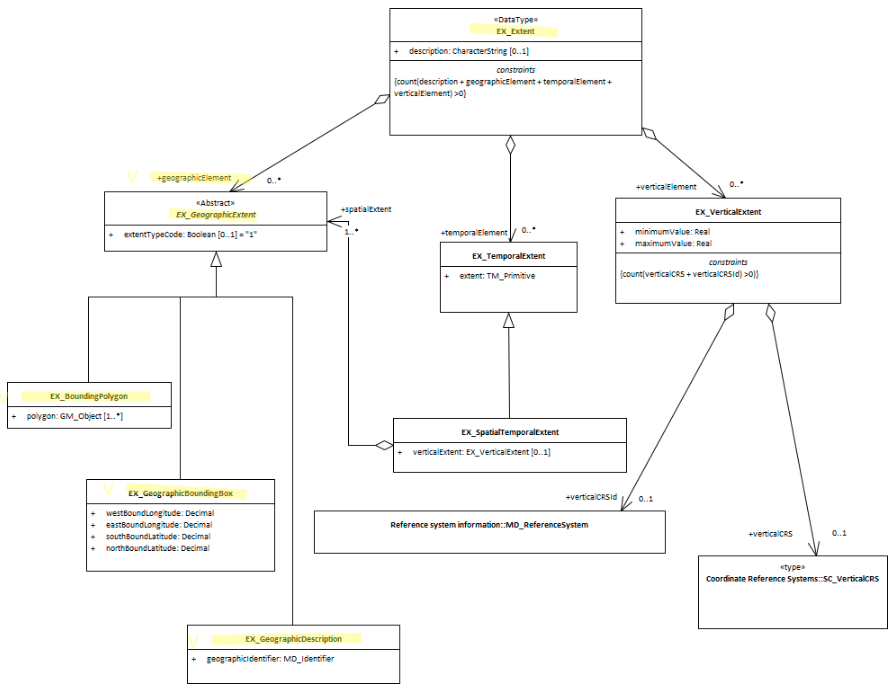

# Geographic Extent ★★★★

*In order to quickly determine the general location of spatial features included in an cited resource  it is useful that the extent information is provided in such a way so that the geographical extent of the resource can be easily understood.*

- **Path** - *MD_Metadata.identificationInfo>MD_DataIdentification.extent >EX_Extent.geographicElement>EX_GeographicExtent*
- **Governance** - *Common ICSM, Domain*
- **Purpose** - *Discovery*
- **Audience -**
  - machine resource - ⭑⭑⭑⭑
  - general - ⭑⭑⭑⭑
  - data manager - ⭑⭑
  - specialist - ⭑⭑ (higher if domain specific placenames are used)
- **Metadata type -** *descriptive*
- *ICSM Level of Agreement* - ⭑⭑⭑

## Definition
**A description of the spatial area of the resource. These may be of the type Bounding Box, Geographic Description, or Bounding Polygon.**

### ISO Obligation

- There can be zero to many [0..\*] *Geographical Extent* packages for the cited resource in the  *[Resource Extent](./ResourceExtent)* package. These may be of the type *Bounding Box* (EX_GeographicBoundingBox), *Geographic Description* (EX_GeographicDescription), or *Bounding Polygon* (EX_BoundingPolygon).

### ICSM Good Practice -

- The MDWG recommends populating as many instances of Geographical Extent packages as need to give a common understanding of the spatial coverage of the cited resource.

#### Recommended Sub Types

**EX_GeographicExtent** is an abstrat class that is expressed by one of the three options

- **[Geographic Bounding Box](./ExtentBoundingBox)** - *(class - EX_GeographicBoundingBox)* highly recommended for resources with geographic extent.  An approximate geographic position of the resource using EPSG 4326 coordinate pairs with a precision of up to two decimal places
- **[Geographic Description](./ExtentGeographicDescription)** - *(class - EX_GeographicDescription)* highly recommended for resources with geographic extent. A description of the geographic area using identifiers 
- **Bounding Polygon** - *(class EX_BoundingPolygon)* optional - not recommended by MDWG except in cases where the other options do not suit 
Use **extentTypeCode** *(Boolean)* [0..1] witha value of "0" to indicate exclusions

## Discussion

Every metadata record describing geographic resources should contain  descriptions that expalin the area of interest of the resource. These may be in the form of place names, bounding box coordinate values and lastly, bounding polygons. With these, those searching for resources can be provided a quick visual of the usable location of the resource. Catalogue software can use these descriptions to analyse and narrow searches to particular areas of interest. 

The use of multiple geographic extents is recommended for more complicated geometries, including exclusion areas.

As these extents are meant to be used to give a general rough comparison to other geospatial data from sources, cordinates values should be captured in WGS 84 (EPSG 4326)

#### Other discussion

> **data.gov.au guidance**
Free text with a mandatory requirement to use one of the following:

- a point/polygon (WKT);
- an administrative boundary API; or,
- a reference URL (website address) from the National Gazatteer. Gazetteer reference URLs can be found by searching for a place at http://www.ga.gov.au/place-names/ then clicking through to the most appropriate location "Reference ID", and then copying and pasting the URL from the page into the Geospatial field in data.gov.au. 

## Recommendations

Therefore - It is strongly recommended that to support discovery of resources, every metadata record that describes a geographic resource contains geographic descriptions of the area of interest for the resource. At a minimum one description needs be in bounding box coordinate values. If there be any exclusion areas, the use of the boolean extentTypeCode (set to "0") is reccomended.

### Crosswalk considerations

#### Dublin core / CKAN / data.gov.au 

Maps to `jurisdiction` or `geospatial coverage`

#### DCAT

Maps to `dct.spatial`

#### RIF-CS

Maps to `Coverage/Spatial`

## Also Consider

- **EX_GeographicExtents** is an abstract class that can be express three ways:
  - **[EX_GeographicBoundingBox -](./ExtentBoundingBox)**  at least one of these should be present for resources that describe geographic resources
  - **[EX_GeographicDescription -](./ExtentGeographicDescription)**  One of these should be present for resources that describe geographic resources
  - **EX_BoundingPolygon**  While very useful, particularly in describing irregular areas, this element is not described by the MDWG as a recommended element due to the difficult that many systems have in implementing it.
- **[EX_Extent](./ResourceExtent)** The class that contains all extent information about the cited resource - vertical, geographical or temporal.
- **[EX_TemporalExtent](./TemporalExtents)** Contains temporal extent information for the cited resource
- **[EX_VerticalExtent -](./VerticalExtent)**  captures the vertical range of a resource.

## Examples

### UML diagrams
Recommended elements highlighted in Yellow

\pagebreak
