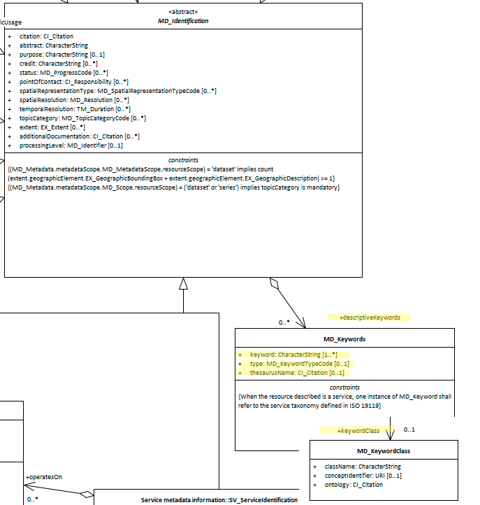

# Keywords ★★★★★
*Keywords are the important ideas and topics that summarise and define what your resource is about. In most search engines, these are indexed and typically normalised to resemble the base word in order to capture variations. Keywords are useful in discovering and organising resources.*

- **Path** - *MD_Metadata.identificationInfo>MD_DataIdentification.descriptiveKeywords*
- **Governance** - *Common ICSM, Agency, Domain*
- **Primary use -** *Discovery, Data management*
- **Audience -**
  - machine resource - ⭑⭑⭑⭑⭑
  - general - ⭑⭑⭑⭑⭑
  - data manager - ⭑⭑⭑⭑⭑
  - specialist - ⭑⭑⭑⭑⭑
- **Metadata type -** *descriptive*
- *ICSM Level of Agreement* - ⭑⭑⭑

## Definition -
**Words or phrases describing the resource to be indexed and searched.**

### ISO Obligation
- There can be zero or many [0..\*] descriptive keywords for the cited resource in the  *[MD_DataIdentification](./class-MD_DataIdentification)* package of class *[MD_Keywords](http://wiki.esipfed.org/index.php/MD_Keywords)* in a metadata record.

### ICSM Good Practice
- There should be multiple keywords selected from a referenced thesaurus present in a metadata record for a spatial resource.

#### Recommended Sub-Elements
From class *[MD_Keywords](http://wiki.esipfed.org/index.php/MD_Keywords)*
* **keyword -** *(type - charStr) Mandatory, preferably chosen from a thesaurus
* **type -** *(codelist - [MD_KeywordTypeCode](http://wiki.esipfed.org/index.php/ISO_19115_and_19115-2_CodeList_Dictionaries#MD_KeywordTypeCode))* highly recommended - 15 options (substantial increase from iso19139)
  - *discipline* - keyword identifies a branch of instruction or specialized learning
  - *place* - keyword identifies a location  
  - *stratum* - keyword identifies the layer(s) of any deposited substance or levels within an ordered system 
  - *temporal* - keyword identifies a time period related to the dataset 
  - *theme* - keyword identifies a particular subject or topic  
  - *dataCentre* - keyword identifies a repository or archive that manages and distributes data  
  - *featureType* - keyword identifies a resource containing or about a collection of feature instances with common characteristics  
  - *instrument* - keyword identifies a device used to measure or compare physical properties  
  - *platform* - keyword identifies a structure upon which an instrument is mounted  
  - *process* - keyword identifies a series of actions or natural occurrences    
  - *product* - keyword identifies a type of product  
  - *project* - keyword identifies an endeavour undertaken to create or modify a product or service  
  - *service* - keyword identifies an activity carried out by one party for the benefit of another 
  - *subTopicCategory* - refinement of a topic category for the purpose of geographic data classification   
  - *taxon* - keyword identifies a taxonomy of the resource 
* **thesaurusName -** *(class - [CI_Citation](./class-CI_Citation))* highly recommended if thesaurus is used. Must include at minimum the title of the thesaurus.
* **keywordClass -** *(class - [MD_KeywordClass](http://wiki.esipfed.org/index.php/MD_KeywordClass))* recommended for enhanced ontology support. Includes the following subelements
  - **className -** *(type - charStr)* [1..1] Mandatory for MD_KeywordClass. A character string to label the keyword category in natural language
  - **conceptIdentifier -** *(type - URI)* [0..1]  Recommended. URI of concept in ontology specified by the ontology attribute; this concept is labeled by the className: CharacterString.
  - **ontology -** *(class - [CI_Citation](./class-CI_Citation))* [1..1] Mandatory for MD_KeywordClass. A reference that binds the keyword class to a formal conceptualisation of a knowledge domain for use in semantic processing. NOTE: Keywords in the associated MD_Keywords keyword list must be within the scope of this ontology


## Discussion
Keywords are a foundational technology for organising and discovering resources. ISO19115-1 provides powerful tools to expand on these capabilities but these tools are most often very lightly used. The use of thesauri to normalise and standardise terms helps greatly. Ontologies and registries in which the definitions of these terms may be stored and linked help ensure consistent use and understanding. In Australia several agencies have developed and implemented thesauri and mandated their use. These include:
* *"ABS Field of Research* - The Australian and New Zealand Standard Research Classification (ANZSRC), 2008 defined field or fields of research relevant to the dataset.
* *ABARES Keywords* - (Need Definition)
* *AGIFT Keyword* - Australian Governments' Interactive Functions Thesaurus (AGIFT) that describes the high-level business functions carried out across Commonwealth, state and local governments in Australia.
* *GCMD Keywords* - The Global Change Master Directory (GCMD) Keywords are a hierarchical set of controlled Earth Science vocabularies that help ensure Earth science data, services, and variables are described in a consistent and comprehensive manner and allow for the precise searching of metadata and subsequent retrieval of data, services, and variables.

NOTE - When the resource described is a service, one instance of `MD_Keyword` should refer to the service taxonomy defined in ISO 19119.

#### Ontology support with keywordClass
A `keywordClass` role is an association of a `MD_Keywords` instance with a `MD_KeywordClass` used to provide user-defined categorisation of groups of keywords that extend or are orthogonal to the standardised `KeywordTypeCodes` and are associated with an ontology that allows additional semantic query processing.
The thesaurus citation specifies a collection of instances from some ontology, but is not an ontology. It might be a list of places that include rivers, mountains, counties and cities. There might be a Laconte county, the city of Laconte, the Laconte River, and Mt. Laconte; when searching it is useful for the user to be able to restrict the search to only rivers. the addition of `keywordClass` provides support for this functionality.

### Outstanding Issues

> **CORE ISSUE:**
Current practice in most agencies in use of keywords is not good.  Thesauri are too often not used. Comma delimited list are common in some shops where others have separate entries. Good practice guidance development and training is needed and should be a special focus area.

> **Thesaurus citation:**
What is important to capture beside the mandatory title element in the citation of a thesaurus?

> **Tech issue needs fix - GN Thesaurus builder**
References the old KeywordTypeCode list

## Recommendations

Therefore - It is highly recommended that the metadata for spatial resources contains as many keywords as needed to provide ease of discovery and improved data management practices. Capture keywords for multiple audiences, general, domain or agency specific to aid the different users of the resource. However, excessive use of keywords that target minor aspects of a resource should be avoided. Consider providing a limit to the number of keywords used and focus on those of most importance.

It is recommended that all keywords have a topic category assigned. These must be sourced from the 15 values in the [MD_KeywordTypeCode](http://wiki.esipfed.org/index.php/ISO_19115_and_19115-2_CodeList_Dictionaries#MD_KeywordTypeCode). Helps understand the keywords in context and further categorise resources.

In addition, while free text keywords are allowed, it is recommended that well managed thesauri be used to increase consistency of how keywords are used and understood.  Thesauri should be used whenever posible, and where they do not exist they should be created. 

The new `keywordClass` package should be explored to allow the greater use of semantic principles in search and data management.


### Crosswalk considerations

<details>

#### ISO19139
MD_KeywordClass was added to allow further categorisation of keywords

#### Dublin core / CKAN / data.govt.nz
Mapping not yet discussed.

#### DCAT
ISO 19115 can groups keywords according to type (theme, place, temporal, discipline and stratum), or according to thesaurus; this information is lost in DCAT. DCAT keywords are mapped to ISO 19115 keywords without type or thesaurus.

</details>

## Also Consider
There are several elements outside the keywords class that are in effect keywords. These include:
- **[Topic Category](./TopicCategory)** - The main themes of the resource populated from a fixed domain of values mandated by ISO19115-1
- **[Extent Geographic Description](./ExtentGeographicDescription)** - verbal description of place by names
- **[Spatial Representation Type](./SpatialRepresentationType)** - holds a set of values from a domain that provides keyword values about the technical method used by the resource to spatially represent geographic information.

## Examples

<details>

### XML -
```
<mdb:MD_Metadata>
....
   <mdb:identificationInfo>
      <mri:MD_DataIdentification>
      ....
          <mri:descriptiveKeywords>
            <mri:MD_Keywords>
               <mri:keyword gco:nilReason="missing">
                  <gco:CharacterString/>
               </mri:keyword>
               <mri:type>
                  <mri:MD_KeywordTypeCode codeListValue="theme"
                                          codeList="https://schemas.isotc211.org/19115/resources/Codelist/cat/codelists.xml#MD_KeywordTypeCode"/>
               </mri:type>
            </mri:MD_Keywords>
         </mri:descriptiveKeywords>
         <mri:descriptiveKeywords>
            <mri:MD_Keywords>
               <mri:keyword>
                  <gco:CharacterString>World</gco:CharacterString>
               </mri:keyword>
               <mri:type>
                  <mri:MD_KeywordTypeCode codeListValue="place"
                                          codeList="https://schemas.isotc211.org/19115/resources/Codelist/cat/codelists.xml#MD_KeywordTypeCode"/>
               </mri:type>
            </mri:MD_Keywords>
         </mri:descriptiveKeywords>
         <mri:descriptiveKeywords>
            <mri:MD_Keywords>
               <mri:keyword>
                  <gco:CharacterString>Tasman Sea</gco:CharacterString>
               </mri:keyword>
               <mri:type>
                  <mri:MD_KeywordTypeCode codeList="https://schemas.isotc211.org/19115/resources/Codelist/cat/codelists.xml#MD_KeywordTypeCode"
                                          codeListValue="place"/>
               </mri:type>
               <mri:thesaurusName>
                  <cit:CI_Citation>
                     <cit:title>
                        <gco:CharacterString>Continents, countries, sea regions of the world.</gco:CharacterString>
                     </cit:title>
                     <cit:date>
                        <cit:CI_Date>
                           <cit:date>
                              <gco:Date>2015-07-17</gco:Date>
                           </cit:date>
                           <cit:dateType>
                              <cit:CI_DateTypeCode codeList="https://schemas.isotc211.org/19115/resources/Codelist/cat/codelists.xml#CI_DateTypeCode"
                                                   codeListValue="publication"/>
                           </cit:dateType>
                        </cit:CI_Date>
                     </cit:date>
                     <cit:identifier>
                        <mcc:MD_Identifier>
                           <mcc:code>
                              <gcx:Anchor xlink:href="http://202.49.243.69:8080/geonetwork/srv/eng/thesaurus.download?ref=external.place.regions">geonetwork.thesaurus.external.place.regions</gcx:Anchor>
                           </mcc:code>
                        </mcc:MD_Identifier>
                     </cit:identifier>
                  </cit:CI_Citation>
               </mri:thesaurusName>
            </mri:MD_Keywords>
         </mri:descriptiveKeywords>
      ....
      </mri:MD_DataIdentification>
   </mdb:identificationInfo>
....
</mdb:MD_Metadata>
```

### UML diagrams
Recommended elements highlighted in Yellow


</details>
