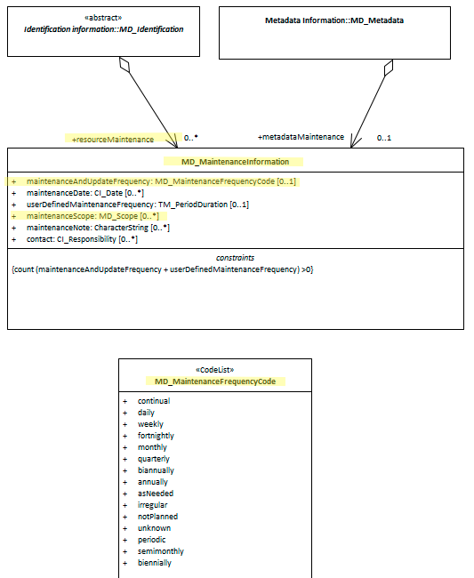

# Resource Maintenance ★★★★
*A great deal of geospatial data and service exist as living changing resources. It is often the timeliness that these cycles provide that make these resources so valuable.  These update and maintenance schedules are important to document and share so that those who wish to use such resources know how to arrange their work flows to best suit.*

- **Path** -  *MD_Metadata.identificationInfo>MD_DataIdentification.resourceMaintenance*
- **Governance** -  *Agency*
- **Purpose -** *Resource use*
- **Audience -** 
  - machine resource - ⭑⭑⭑ 
  - general - ⭑⭑
  - resource manager - ⭑⭑⭑⭑
  - specialist - ⭑⭑
- **Metadata type -** *administrative*
- *ICSM Level of Agreement* - ⭑⭑⭑

# Definition 
**Information about the frequency of resource updates, and the scope of those updates.**

## ISO Obligation 
- There should be zero to many [0..\*] *resourceMaintenance* packages for the cited resource in the  *[MD_DataIdentification](./class-MD_DataIdentification)* package of class *[MD_MaintenanceInformation](http://wiki.esipfed.org/index.php/MD_MaintenanceInformation)* in a metadata record.

## ICSM Good Practice 
- Maintenence information about a citedresource should be documented. This should include descriptions of the update and maintenance frequency and scope.

### Recommended Sub-Elements 
From class *[MD_MaintenanceInformation](http://wiki.esipfed.org/index.php/MD_MaintenanceInformation)* 
- **maintenanceAndUpdateFrequency -** *(codelist - [MD_MaintenanceFrequencyCode](http://wiki.esipfed.org/index.php/ISO_19115-3_Codelists#MD_MaintenanceFrequencyCode))* [0..1] frequency with which changes and additions are made to the resource after the initial resource is completed. 
- **userDefinedMaintenanceFrequency -** *(class - [TM_PeriodDuration](http://wiki.esipfed.org/index.php/TM_PeriodDuration))*  [0..1] alternate maintenance period other than those defined. Use when MD_MaintenanceFrequencyCode do not suit.
- **maintenanceScope -** *(class - [MD_Scope](./class-MD_Scope))*  [0..\*]  type of resource(s) and/or extent to which the maintenance information applies. Recommended subelements include:
  - **level -** *(codelist - [MD_ScopeCode](http://wiki.esipfed.org/index.php/ISO_19115-3_Codelists#MD_ScopeCode))* [1..1] Mandatory for MD_Scope. The target resource covered
  - **extent -** *(class -  [EX_Extent](./ResourceExtent))* Information about the horizontal, vertical and temporal extent of the resource specified by the scope
  - **levelDescription -** *(union - [MD_ScopeDescription](http://wiki.esipfed.org/index.php/MD_ScopeDescription))* [0..\*] detailed description/listing of the items specified by the level. As a union, only one value may be selected per instance

# Discussion  
In order for users of a resource to know when the next update will occur or to know how many cycles old a paticular version may be, resource owners and custodians should document in the metadata the maintenance and update frequnency of a resource.  If this frequency changes, this change should be reflected in the metadata. If the scope of the update is less than the whole resource, the scope limitation needs to be recorded. 

# Recommendations 
Therefore - custodians of a resource should capture in the metadata the frequensy and scope of update and maintenance of a resource.  If none are planned, then record this fact.

## Crosswalk considerations 

### ISO19139 
in ISO19115-1 attributes were replaced to provide a more flexible and unambiguous description of maintenance
dates and scope.
- **MD_MaintenanceInformation.dateOfNextUpdate** was replaced by  **MD_MaintenanceInformation.maintenanceDate`**
  - This role was replaced by maintenanceDate in order to enable inclusion of a CI_DateTypeCode to describe the type of the date. Note that nextUpdate was added to that code list.
- **MD_MaintenanceInformation.updateScope** and **MD_MaintenanceInformation.updateScopeDescription** were replaced by **MD_MaintenanceInformation.maintenanceScope**(
  - These two roles were combined into maintenance-Scope: MD_Scope [0..\*] in order to allow specifying a scope that includes a spatial and temporal extent.

### Dublin core / CKAN / data.govt.nz {if any}
Maps to `update frequency`

### RIF-CS
Maps to `Description 'lineage'`

# Also Consider
- **metadataMaintenance -** documents the update and maintenance of the metadata record and not the resource. There are many reasons the two may not be in sync. It is usually more important to document the update cycles of the resource than the metadata. (Not included in MDWG Guidance.)

# Examples

## XML 

```
<mdb:MD_Metadata>
....
    <mdb:identificationInfo>
      <mri:MD_DataIdentification>
         ....
         <mri:resourceMaintenance>
            <mmi:MD_MaintenanceInformation>
               <mmi:maintenanceAndUpdateFrequency>
                  <mmi:MD_MaintenanceFrequencyCode codeListValue="irregular" codeList="https://schemas.isotc211.org/19115/resources/Codelist/cat/codelists.xml#MD_MaintenanceFrequencyCode"/>
               </mmi:maintenanceAndUpdateFrequency>
               <mmi:maintenanceScope>
                  <mcc:MD_Scope>
                     <mcc:level>
                        <mcc:MD_ScopeCode codeList="https://schemas.isotc211.org/19115/resources/Codelist/cat/codelists.xml#MD_ScopeCode" codeListValue="attribute"/>
                     </mcc:level>
                  </mcc:MD_Scope>
               </mmi:maintenanceScope>
            </mmi:MD_MaintenanceInformation>
         </mri:resourceMaintenance>
      ....
      </mri:MD_DataIdentification>
  <mdb:identificationInfo>
....
</mdb:MD_Metadata>
```

## UML diagrams

Recommended elements highlighted in Yellow

