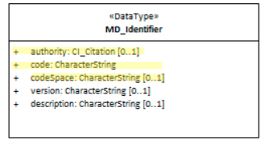

#  Metadata Identifier ★★★★★

*In order for machines and people to distinguish a metadata record from all others a Metadata record [MD_Metadata](./class-MD_Metadata) needs a unique identifier.*

- **Path** - *MD_Metadata.metadataIdentifier>MD_Identifier*
- **Governance** -  *Common ICSM*
- **Purpose -** *linkage, identification*
- **Audience -**
  - machine resource - ⭑⭑⭑⭑
  - general - ⭑
  - data manager - ⭑⭑⭑
  - specialist - ⭑⭑
- **Metadata type -** *administrative*
- *ICSM Level of Agreement* - ⭑⭑⭑⭑

## Definition
**The persistent unique alphanumeric identifier for the metadata record that describes a resource.**

### ISO Obligation
- There should be zero or one [0..1] metadataIdentifier for the cited resource in the  *[MD_Metadata](./class-MD_Metadata)* package of class *[MD_Identifier](./class-MD_Identifier)*.

### ICSM Good Practice
  - This element should be populated in all metadata records

#### Recommended Sub-Elements
From class *[MD_Identifier](./class-MD_Identifier)* 
- **code -** (*type - charStr*) [1..1] a UUID, mandatory when identifier is provided
- **codespace -** *(type - charStr)* [0..1] ideally a  URL  path by which, when combined with the uuid, the full metadata can be retrieved.
- **authority -** *(class - [CI_Citation](./class-CI_Citation))* [0..1] optional, the provider of the UUID

## Discussion
Every metadata record needs a unique identifier so as to provide certain of the identity of the record and to provide a primary key for linkages. This element should hold UUID, preferably in the form of a resolvable URI. This provides the machine readable (and human) ability to determine if this is the same or different to other metadata records. It is useful in machine to machine activities such as metadata harvesting. It is also at times useful to data managers and others to determine if a record is the same as another.

This identifier must never change, irrespective of where that metadata record is stored. This allows linkages to a metadata record to persist.

Equivalent of this field was recommended as mandatory in the previous ANZLIC Standard. Common practice is to record a UUID in this field.

### Outstanding Issues

> **CORE ISSUE:**
In ISO the identifier for the Metadata can differ from that of the data. This is not necessarily the case in other metadata standards such as Dublin Core or DCAT.

>  **Resolvable URIs**
Of note - the ISO conceptual reference model for ISO 19115-1 available at https://www.isotc211.org/hmmg/HTML/ConceptualModels/EARoot/EA1/EA12/EA2/EA4095.htm.
This includes a description that differs slightly from previous description - "Unique Identifier and onlineResource for this metadata record" In many ways it would be preferable if this field were populated with a URI that ultimately resolved to a point of truth for the metadata record. Some issues remain in software that incorrectly prohibit characters needed by URIs.
The nested tag that actually holds the UUID character string is mcc:code. This is noted in the UML for this element: "NOTE: avoid characters that are not legal in URLs". This would suggest that URIs of type URL are to be allowed. While I would not currently recommend URIs in this field, due to software limitations, it is a practice that would likely be encouraged in the future when linked data is more prevalent. A recommended solution is to populate codespace with the path by which, when combined with the uuid, the metadata can be retrieved.
In practice metadataLinkage (Link) often contains the online linkage (to the point of truth metadata record).

> **Geonetwork usage**
 By default GeoNetwork calculates a unique value for the subelement *code* and populates the *codespace* element with “urn::uuid”. These fields are not editable once generated.

#### Other discussion

> **DCAT Notes**
See long discussion at https://github.com/w3c/dxwg/issues/53 on how to represent the identifier scheme and authority; currently unresolved

> **From [data.gov.au](http://data.gov.au)**
The fileIdentifier for a metadata record must never change, irrespective of where that metadata record is stored. Should be system generated. In CKANs case the UUID is common to dataset and metadata record, and takes the UUID with it across new systems.
Automatically generated unique ID. Decided against DOI as unique ID already generated in CKAN. DOI records created in ANDS can be leveraged for those who want them given data.gov.au metadata to be harvested by ANDS.

## Recommendations

Therefore - It is Highly Recommended that every metadata record should have one and only one metadata identifier (MD_Metadata > mdb:metadataIdentifier > MD_Identifier). The child element `<mcc:code>` should contain the persistent uuid for the metadata record. While the child element `<mcc:codespace>` should contain the reference URL path by which, when combined with the uuid, this metadata record can be retrieved. It is beneficial to populate other sibling elements as needed such as `<mcc:authority>` to indicated the authority that minted the uuid.

### Crosswalk considerations

<details>

#### ISO19139
In iso19115-1 Data type `CI_ResponsibleParty` (iso19115:2004) changed to type `CI_Responsibility` such as in `MD_Metadata.contact`, `MD_DataIdentification.pointOfContact`, or `CI_Citation.citedResponsibleParty`

#### Dublin core / CKAN / data.gov.au
Maps to `metadata URI`

#### DCAT
Maps to `dct:identifier`

#### RIF-CS
Maps to `Key Identifier`

</details>

## Also Consider
- **[Resource Identifier](./ResourceIdentifier) -** provides unique identifier to the resource. This may be the same as the metadata identifier when the metadata resource in a catalogue serves as the landing page for a resource.
- **[Metadata Linkage](./MetadataLinkage)** - is most often used to provide a point of truth linkage to the metadata record.
- **[CI_Citation](./class-CI_Citation) (Authority) -** Information authority responsible for minting the UUID, be it the software package or other mechanism, may be captured in the Authority subelement using the CI_Citation package general guidance.
- **[MD_Identifier](./class-MD_Identifier)** General Guidance for the package used to hold the metadata identifier information. This package can be used to provide identity to a large number of other metadata elements.

## Examples

<details>

### Other
#### data.govt.au
http://data.gov.au/dataset/559708e5-480e-4f94-8429-c49571e82761

### XML

```
<mdb:MD_Metadata>
....
      <mdb:metadataIdentifier>
      <mcc:MD_Identifier>
         <mcc:code>
            <gco:CharacterString>314eb989-3771-4c24-a399-d22631973279</gco:CharacterString>
         </mcc:code>
         <mcc:codeSpace>
            <gco:CharacterString>https://geodata.nz/geonetwork/srv/metadata/</gco:CharacterString>
         </mcc:codeSpace>
      </mcc:MD_Identifier>
  </mdb:metadataIdentifier>
....
</mdb:MD_Metadata>
```

### UML diagrams

Recommended elements highlighted in Yellow



</details>
