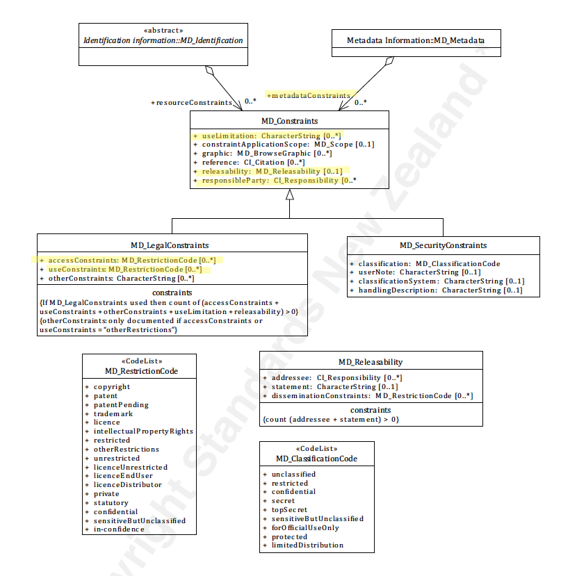

#  Metadata Legal Constraints ★★★
*The presence (or absence) of legal restrictions such as copyright, on a metadata record is important to document. Potential users need to be informed of rights, restrictions and responsibilities that apply to the use of such metadata.*

- **Path** - *MD_Metadata.metadataConstraints>MD_LegalConstraints*
- **Governance** - *Agency*
- **Purpose -** *Resource use*
- **Audience -**
  - machine resource - ⭑
  - general - ⭑⭑⭑⭑⭑
  - data manager - ⭑⭑⭑⭑
  - specialist - ⭑⭑
- **Metadata type -** *adminsitrative*
- *ICSM Level of Agreement* - ⭑⭑⭑

## Definition

**Legal restrictions on the access and use of this metadata record e.g. copyright.**

### ISO Obligation
- There may be zero  to many [0..\*] *metadataConstraints* entries for the cited resource in the  *[MD_Metadata](./class-MD_Metadata)* package of class *[MD_LegalConstraints](./class-MD_LegalConstraints)* applied to a  a metadata record,

### ICSM Good Practice
- The MDWG recommends populating this element `metadataConstraints`  with legal constraint information to sufficient level to determine the legal rights, responsibilities and restrictions on a metadata record.

#### Recommended Sub-Elements
Follow the general guidance for [MD_LegalConstraints](./class-MD_LegalConstraints).

## Discussion
Information about constraints on the access and use of a resource or its metadata is of high importance to document as this information strongly impacts on the usability of the resource to the user. Constraints may be security (*MD_SecurityConstraints*), legal (*MD_LegalConstraints*) or other (*MD_Constraints*).

A restriction may be applicable to a particular aspect of the resource. In this case capture this scope in *constraintApplicationScope* using a value from *MD_Scope*

Almost all created resources (including metadata) carry some legal rights, restrictions and responsibility regarding their access and use. For instance, in most jurisdictions, copyright is automatically granted to the creator of a creative work. Legal restrictions such as licences and end user agreements, need be documented for users and resource managers along with the identity of the holder of these rights. Each agency needs to develop consistent guidance on the use of such statement and share clear understanding of their meaning. This is often done by reference to a external body that manages the definitions of the legal constraints applied.

There is often general confusion over the restraints fields and to what they apply; metadata, resource, distribution, etc. This is a topic needing further discussion and clarification. In ISO 19115-1 two types of constraints are recognised metadataConstraints (restrictions on the access and use of metadata) and resourceConstraints (information about constraints which apply to the resources). Here we are only address constraints on Metadata.

For more discussion on the types of common legal restrictions see [Resource Legal Constraints](./ResourceLegalConstraints#copyright).

### Outstanding Issues
> **Are legal restictions on metadata useful?**
Some good legal advice on this would be very helpful!
I  am having some difficulty understanding the value on capturing legal restrictions on the metadata record itself. To restrict a metadata record in a catalogue largely defeats its purpose and if not open to be freely copied may be contrary to itself.  What happens if a restricted metadata record is harvested? By putting a metadata record in a public catalogue are you not effectively negating any restriction on that metadata record? Boiler plate stating the openness of the metadata would be useful.

> Note BC 5-7:  The issue of automated harvesters gathering metadata that by legal restriction should not (a rare case I would hope) could possibly be addressed by recommending appropriate filters on the harvesters.  This would need research..


## Recommendations
Therefore - It is important to capture any legal constraints that may apply to a metadata resord. This should include licences, end user agreements, etc. If the resource is public domain, this should be cited appropriately. Many juristrictions encourage the use of open data and Creative Commons license. This should be encouraged through the use of copyright licenses such as CC0 or CC By. Provide the user links to additional information about such constraints, there use and meaning. In addition, document the holder of such rights and how to contact for more information. As legal restrictions such as copyright are tied to the creator of an intellectual resource, make are that users have access to their information.

### Crosswalk considerations

<details>

#### ISO19139
See guidance provided in [MD_Constraints](./class-MD_Constraints)

#### DCAT
Maps to `dct.rights` as does resource legal constraints. > Note BC 22-7: Does DCAT make a distinction?

#### RIF-CS
Agregated into `Description 'notes'`

</details>

## Also Consider
- **[Resource Legal Constraints](./ResourceLegalConstraints)** contains legal restrictions that apply to the resource cited by the metadata
- **[Metadata Security Constraints](./MetadataSecurityConstraints)** A sibling to metadata legal constraints. Contains information regarding any security restriction on the metadata.

## Examples

<details>

### XML -
```
<mdb:MD_Metadata>
....
    <mdb:metadataConstraints>
      <mco:MD_LegalConstraints>
         <mco:useLimitation>
            <gco:CharacterString>Public</gco:CharacterString>
         </mco:useLimitation>
         <mco:constraintApplicationScope>
            <mcc:MD_Scope>
               <mcc:level>
                  <mcc:MD_ScopeCode codeList="https://schemas.isotc211.org/19115/resources/Codelist/cat/codelists.xml#MD_ScopeCode"
                                    codeListValue="metadata"/>
               </mcc:level>
            </mcc:MD_Scope>
         </mco:constraintApplicationScope>
         <mco:reference>
            <cit:CI_Citation>
               <cit:title>
                  <gco:CharacterString>Creative Commons 4.0 International Licence</gco:CharacterString>
               </cit:title>
               <cit:alternateTitle>
                  <gco:CharacterString>CC By</gco:CharacterString>
               </cit:alternateTitle>
               <cit:edition>
                  <gco:CharacterString>4.0 International Licence</gco:CharacterString>
               </cit:edition>
               <cit:onlineResource>
                  <cit:CI_OnlineResource>
                     <cit:linkage>
                        <gco:CharacterString>https://creativecommons.org/licenses/by/4.0/</gco:CharacterString>
                     </cit:linkage>
                     <cit:protocol gco:nilReason="missing">
                        <gco:CharacterString/>
                     </cit:protocol>
                     <cit:name gco:nilReason="missing">
                        <gco:CharacterString/>
                     </cit:name>
                     <cit:description gco:nilReason="missing">
                        <gco:CharacterString/>
                     </cit:description>
                     <cit:function>
                        <cit:CI_OnLineFunctionCode codeList="https://schemas.isotc211.org/19115/resources/Codelist/cat/codelists.xml#CI_OnLineFunctionCode"
                                                   codeListValue=""/>
                     </cit:function>
                  </cit:CI_OnlineResource>
               </cit:onlineResource>
               <cit:graphic>
                  <mcc:MD_BrowseGraphic>
                     <mcc:fileName>
                        <gco:CharacterString>cc_icon_white_x2.png</gco:CharacterString>
                     </mcc:fileName>
                     <mcc:linkage>
                        <cit:CI_OnlineResource>
                           <cit:linkage>
                              <gco:CharacterString>https://creativecommons.org/images/deed/cc_icon_white_x2.png</gco:CharacterString>
                           </cit:linkage>
                           <cit:protocol gco:nilReason="missing">
                              <gco:CharacterString/>
                           </cit:protocol>
                           <cit:name gco:nilReason="missing">
                              <gco:CharacterString/>
                           </cit:name>
                           <cit:description gco:nilReason="missing">
                              <gco:CharacterString/>
                           </cit:description>
                           <cit:function>
                              <cit:CI_OnLineFunctionCode codeList="https://schemas.isotc211.org/19115/resources/Codelist/cat/codelists.xml#CI_OnLineFunctionCode"
                                                         codeListValue=""/>
                           </cit:function>
                        </cit:CI_OnlineResource>
                     </mcc:linkage>
                  </mcc:MD_BrowseGraphic>
               </cit:graphic>
            </cit:CI_Citation>
         </mco:reference>
         <mco:responsibleParty>
            <cit:CI_Responsibility>
               <cit:role>
                  <cit:CI_RoleCode codeList="https://schemas.isotc211.org/19115/resources/Codelist/cat/codelists.xml#CI_RoleCode"
                                   codeListValue="owner"/>
               </cit:role>
               <cit:party>
                  <cit:CI_Organisation>
                     <cit:name>
                        <gco:CharacterString>OpenWork Ltd</gco:CharacterString>
                     </cit:name>
                     <cit:contactInfo>
                        <cit:CI_Contact>
                           <cit:address>
                              <cit:CI_Address>
                                 <cit:electronicMailAddress>
                                    <gco:CharacterString>info@openwork.nz
                                    </gco:CharacterString>
                                 </cit:electronicMailAddress>
                              </cit:CI_Address>
                           </cit:address>
                        </cit:CI_Contact>
                     </cit:contactInfo>
                  </cit:CI_Organisation>
               </cit:party>
            </cit:CI_Responsibility>
         </mco:responsibleParty>
         <mco:useConstraints>
            <mco:MD_RestrictionCode 
            codeList="https://schemas.isotc211.org/19115/resources/Codelist/cat
            /codelists.xml#MD_RestrictionCode" codeListValue="copyright"/>
         </mco:useConstraints>
      </mco:MD_LegalConstraints>
   </mdb:metadataConstraints>
....
</mdb:MD_Metadata>
```

### UML diagrams
Recommended elements highlighted in Yellow



</details>

\pagebreak
