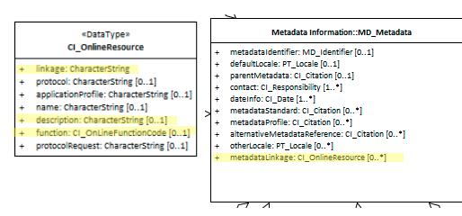

# Metadata Linkage ★★★★★

*Metadata records generally live in federated systems where metadata are harvested from catalogue to catalogue or collected from remote sources by other means.  This can lead to confusion since through the harvesting and collection processes, different versions of the same metadata may co-exist. It is useful that a metdata record contains a link to the source metadata so that a point of truth version can be deterrmined.*

- **Path** - *MD_Metadata.metadataLinkage>CI_OnlineResource*
- **Governance** -  *Common ICSM*
- **Purpose -** *linkage, identification*
- **Audience -**
  - machine resource - ⭑⭑⭑
  - general - ⭑⭑
  - data manager - ⭑⭑⭑⭑
  - specialist - ⭑⭑⭑
- **Metadata type -** *administrative*
- *ICSM Level of Agreement* - ⭑⭑⭑⭑

## Definition
**Allows unambiguous specification of the online location where the metadata is available.**

### ISO Obligation
- There should be zero to many [0..\*] *metadataLinkage* elements for the cited resource in the  *[MD_Metadata](./class-MD_Metadata)* package of class *[CI_OnlineResource](./class-CI_OnlineResource)* in a metadata record.

### ICSM Good Practice
- If posible, one instance of this element must be populated in all metadata records with a link to the source "point of truth" metadata record.

#### Recommended Sub-Elements
Follow the general guidance for [class - CI_OnlineResource](./class-CI_OnlineResource) with the following additional guidance:
- **description -** (*type - charStr*) [0..1] when `metadataLinkage` is used as a "point of truth" location of the authoritative metadata, use this field to indicate this.
- **function -** *(codelist - [CI_OnlineFunctionCode](http://wiki.esipfed.org/index.php/ISO_19115-3_Codelists#CI_OnLineFunctionCode))* [0..1] This should be populated with the value "completeMetadata".

## Discussion
The most common use of `metadataLinkage` is to record a "point of truth" location of the source authoritative metadata record. It is in the nature of metadata to be highly distrubuted.  This is commonly done through federated systems that harvest (or otherwise collect) metadata from other sources. Sometimes this process gets out of sync. Sometimes the metadata is modified in the process. In order to retain an authoritative understanding of a metadata record it is useful to provide a linkage to the source as reference.

Alternatively, `metadataLiunkage` may be used to record the location of the metadata in its current catalogue. The Discription field should be used to indicate if this differs from other instances of the metadata record that may reside elsewhere. However, if alternate versions are not in ISO19115 format, such locations should be captured in `alternativeMetadataReference`.

The use of this field to hold the local of the metadata record in the local catalogue could be better accomplished through the options provided in [metadataIdentifier](./MetadataIdentifier).

### Outstanding Issues

> **Point of Truth Issue:**
The use of a standardised term for "point of truth" has been suggested. While this could be applied to the `discription` element it could be placed elsewhere such as an expanded *CI_OnlineFunctionCode* codelist

## Recommendations

Therefore - There should be a "point of truth" url to a metadata record provided under metadataLinkage. Alternatively, this could be the full path to this metadata record. There may be multiple endpoints containing copies of this metadata record, one captured with the description of "Point of Truth URL for this metadata record" is recommended.
All metadataLinkage elements should have a function code of "Complete Metadata".

As for multiple locations for the same metadata, it is useful to look at MD_Metadata/alternativeMetadataReference. This allows pointers to metadata for the same resource that may be in multiple schemas. (ISO def - "reference to alternative metadata, e.g Dublin Core, FGDC, or metadata in a non-ISO standard for the same resource") Of course, this does not suggest that it be used for different versions of the metadata in the same standard, but perhaps at least different profiles?

### Crosswalk considerations

<details>

#### ISO19139
This is a new element that allows unambiguous specification of the online location where the metadata is available.

#### Dublin core / CKAN / data.govt.nz
In Dublin core the identifier element is described as holding a reference to the resource (not the metadata). However in the case of metadata records harvested by s higher level CKAN like catalogue, we view the complete metadata record as the resource. It is also standard practice that the DC Identifier field be resolvable. For a Dublin core metadata harvested via CSW from a ISO 19115-1 record, it is important that that record links to something that can be derefewrenced. That something is held in the identifier field and should be the location URL/URI for the metadata.  IF the ISO 19115-1 identifier element is only a unresolvable UUID, the metadataLinkage element may be a better choice to populate the DC Identifier field.

#### DCAT
May map to `dct:identifier` if `metadataIdentifier` is unresolvable

#### RIF-CS
May map to `Key Identifier` if `metadataIdentifier` is unresolvable

</details>

## Also Consider
- **[onlineResource -](./DistributionInfo)** (MD_Distribution.transferOptions>MD_DigitalTransferOptions.online) is used to provide online linage to the resource. 
- **[MetadataIdentifier -](./MetadataIdentifier)** is the preferred element to be used to provide linkage to the metadata record.
- **[alternativeMetadataReference](http://geos.whu.edu.cn/ont/iso19115/metadata.html#d4e52) -** *(class - CI_Citation)*[0..\*] *Page 37 - ISO 19115.1:2015* - reference to alternative metadata, e.g Dublin Core, FGDC, or metadata in a non-ISO standard for the same resource
- **[class - CI_OnlineResource -](./class-CI_OnlineResource)** provides a standardised way of collecting links to online resources 


## Examples

<details>

### XML

```
<mdb:MD_Metadata>
....
  <mdb:metadataLinkage>
    <cit:CI_OnlineResource>
      <cit:linkage>
        <gco:CharacterString>http://geodata.nz/geonetwork/srv/eng//metadata/314eb989-3771-4c24-a399-d22631973279</gco:CharacterString>
      </cit:linkage>
      <cit:description>
        <gco:CharacterString>Point of truth URL of this metadata record</gco:CharacterString>
      </cit:description>
      <cit:function>
        <cit:CI_OnLineFunctionCode codeList="http://standards.iso.org/ittf/PubliclyAvailableStandards/ISO_19139_Schemas/resources/codelist/ML_gmxCodelists.xml#CI_OnLineFunctionCode" codeListValue="completeMetadata"/>
      </cit:function>
    </cit:CI_OnlineResource>
  </mdb:metadataLinkage>
....
</mdb:MD_Metadata>
```

### UML diagrams
Recommended elements highlighted in Yellow



</details>
