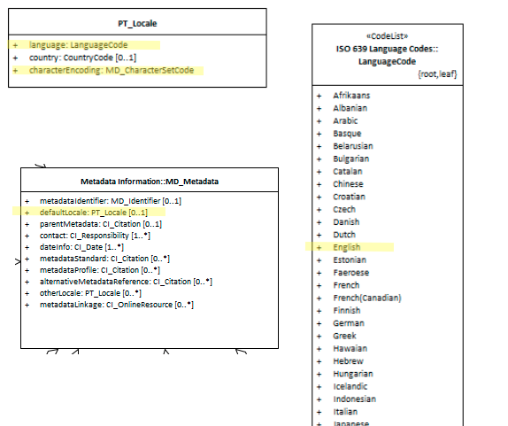

# Metadata Default Locale ★★★★
*Metadata may be captured in different languages in different locations. For users it is important that the language of the metadata be known. MD_Metadata.defaultLocale provide a way to record the primary language of the metadata.*

- **Path** - *MD_Metadata.defaultLocale*
- **Governance** -  *Common ICSM*
- **Purpose -** *discovery, data management*
- **Audience -**
  - machine resource - ⭑⭑⭑
  - general - ⭑⭑⭑
  - data manager - ⭑⭑⭑⭑⭑
  - specialist - ⭑⭑⭑⭑
- **Metadata type -** *discovery*
- *ICSM Level of Agreement* - ⭑⭑⭑

# Definition
**Language and character set used for documenting metadata.**

## ISO Obligation
- There can be one and only one [1..1] *defaultLocale* entries for the cited resource in the  *[MD_Metadata](./class-MD_Metadata)* package in the metadata record of class *[PT_Locale](./PT_Locale)*.

## ICSM Good Practice
  - The default language in our region is English and it is recommended to be used as the language in metadata records using the 3 letter code "eng".

### Recommended Sub-Elements
Follow the general guidance for [class - PT_Locale](./PT_Locale) 

### Recommended Sibling Elements -
- **otherLocale -** *[class - PT_Locale]* [0..\*] when a metadata record has information in additional languages


# Discussion
There may be only one default locale identified in one metadata record.
The element "otherLocale" can be use to provide information about alternatively used localised character strings


# Recommendations

Therefore - In order to provide metadata in a consistant manner for the users in our region, it is recommended that English be chosen as the value for `language` using the ISO 639-2, 3-alphabetic digits code "eng".

## Crosswalk considerations

<details>

### ISO19139
MD_Metadata/language moved to MD_Metadata/defaultLocale:PT_Locale - Make use of the newly added Language and character set localization package for defining local language and character set.

### Dublin core / CKAN / data.govt.nz
Maps to `language`
CKAN has one field for language that maps to both Metadata and Resource language fields. ISO 19115 recommends 639-2 3 letter codes. Data.gov.au recommends IETF RFC4646 2 letter codes as primary. See https://www.loc.gov/standards/iso639-2/faq.html#6 for discussion of the differences

### DCAT
Maps to `dct.language`

### RIF-CS
No identified mapping

</details>

# Also Consider
- **MD_Metadata.otherLocale -** *(codelist - PT_Locale)* [0..\*] provides information about alternatively used localised character strings provides information about alternatively used localised character strings
- **[MD_DataIdentification.defaultLocale](./ResourceLocale)** *(codelist - PT_Locale)* [0..1]  contains the  language and character set used within the resource, such as map labels or other text.
- **MD_DataIdentification.otherLocale -**  *(codelist - PT_Locale)* [0..\*] alternate localised language(s) and character set (s) used within the resource

# Examples

<details>

## XML -

```
<mdb:MD_Metadata>
....
   <mdb:defaultLocale>
      <lan:PT_Locale id="EN">
         <lan:language>
            <lan:LanguageCode codeList="http://www.loc.gov/standards/iso639-2/" codeListValue="eng"/>
         </lan:language>
         <lan:characterEncoding>
            <lan:MD_CharacterSetCode codeList="http://standards.iso.org/ittf/PubliclyAvailableStandards/ISO_19139_Schemas/resources/codelist/ML_gmxCodelists.xml#MD_CharacterSetCode"
                                     codeListValue="utf8"/>
         </lan:characterEncoding>
      </lan:PT_Locale>
   </mdb:defaultLocale>
....
</mdb:MD_Metadata>
```

## UML diagrams
Recommended elements highlighted in Yellow


</details>
