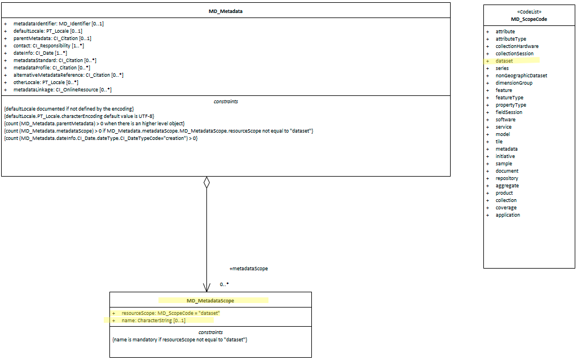

#  Metadata Scope ★★★★
*In order to quickly find, catagorise and evaluate the fitness of a resource to our needs it is usefull to include in our metadata a high level description of the scope of the resource our metadata is describing.*

- **Path** - *MD_Metadata.metadataScope*
- **Governance** -  *Common ICSM*
- **Purpose -** *discovery*
- **Audience -** 
  - machine resource - ⭑⭑⭑
  - general - ⭑⭑⭑⭑
  - data manager - ⭑⭑⭑⭑
  - specialist - ⭑⭑⭑
- **Metadata type -** *descriptiive*
- *ICSM Level of Agreement* - ⭑⭑⭑

# Definition 
**A resource code identifying the type of resource, e.g. service, a collection, an application which the metadata describes**

## ISO Obligation 
- There can be zero to many [0..\*] *metadataScope* entries for the cited resource in the  *[MD_Metadata](https://www.loomio.org/d/AniV8zO3/class-md_metadata)* package of class *[MD_MetadataScope](http://wiki.esipfed.org/index.php/MD_MetadataScope)* for the metadata record.

## ICSM Good Practice  
- At least one instance of this element should be populated in all metadata records.

## Recommended Sub-Elements 
From class - *[MD_MetadataScope](http://wiki.esipfed.org/index.php/MD_MetadataScope)* 
- **resourceScope -** *(codelist - MD_ScopeCode)* [1..1] Madatory when using `MD_MetadataScope`. Default value "dataset". See [MD_Scope](https://www.loomio.org/d/bEL0fUhA/class-md_scope#undefinedmd_scopecode-codelist) for more value options
- **name -** *(type - charStr)* [0..1] description of the scope.  Mandatory if resourceScope not equal "dataset"

# Discussion 
MetadataScope contains information that describes the scope of the resource that this metadata record documents. The standard allows multiple scopes per metadata record, but we have no examples to date to illustrate this use. Current thought is that ICSM recommendation would be one and only one entry for `metadataScope`.
MetadataScope replaces hierarchyLevel in the previous version of ISO19115. This was done to avoid ambiguity in cases where multiple scope codes and names are associated with a single record. The word hierarchy was dropped from the names because scopes can be
used in non-hierarchical structures.
This element, like a number of others, are essentially keywords, albeit of a special type, and are generally treated as such when records are harvested to other non ISO 19115 based catalogues.

## Outstanding Issues
> **Metadata for resources other than datasets:**
This element definition may warrant revision as we extend our work to cover metadata for services and other resources other than datasets.

> **ISO Comment:**
The values in the MD_ScopeCode list are intentionally general and details of their application are left to the data provider. In order to foster interoperability, the usage of the scope codes should be carefully documented in any community of practice. Clause E.5 (ISO 19115.1-2014) outlines possible applications of codes from the MD_ScopeCode codelist and related codes included in ISO/TS 19139 as part of the MX_ScopeCode list. These examples are meant to provide reasonable starting points and are certainly not exhaustive.

> **DCAT advice:**
Typically, the subject will be represented using keywords, key phrases, or classification codes. Recommended best practice is to use a controlled vocabulary.


# Recommendations 

Therefore - In order to provide top level categorisation of entries in a catalogue, it is recommended that `metadataScope` be populated.  The default value of `MD_MetadataScope.resourceScope` should be *dataset*. When the value of `resourceScope` is other than dataset, `MD_MetadataScope.name` must be populated.

## Crosswalk considerations

### ISO19139
MetadataScope replaces hierarchyLevel in the previous version of ISO19115. This was done to avoid ambiguity in cases where multiple scope codes and names are associated with a single record. The word hierarchy was dropped from the names because scopes can be
used in non-hierarchical structures. Changed elements include
- `MD_Metadata.hierarchyLevel` changed to `MD_Metadata.metadataScope>MD_MetadataScope.resourceScope`
- `MD_Metadata.hierarchyLevelName` changed to `MD_Metadata.metadataScope>MD_MetadataScope.name`
These two elements were moved to the new MD_MetadataScope class to avoid ambiguity in cases where multiple scope codes and names are associated with a single record. The word hierarchy was dropped from the names because scopes can be used in non-hierarchical structures.

### Dublin core / CKAN / data.govt.nz
In Dublin core the identifier element is described as holding a reference to the resource (not the metadata). However in the case of metadata records harvested by s higher level CKAN like catalogue, we view the complete metadata record as the resource. It is also standard practice that the DC Identifier field be resolvable. For a Dublin core metadata harvested via CSW from a ISO 19115-1 record, it is important that that record links to something that can be derefewrenced. That something is held in the identifier field and should be the location URL/URI for the metadata.  IF the ISO 19115-1 identifier element is only a unresolvable UUID, the metadataLinkage element may be a better choice to populate the DC Identifier field.

### DCAT
May map to  `dct:identifier` if `metadataIdentifier` is unresolvable

### RIF-CS
May map to `Key Identifier` if `metadataIdentifier` is unresolvable

# Also Consider
- **[keywords -](https://www.loomio.org/d/SPHb8Vkj/md_identification-keywords-definition)** - Words or phrases describing the resource to be indexed and searched by web crawlers
- **[Topic Category -](https://www.loomio.org/d/d25q1xUO/md_identification-topic-category-definition)** is the preferred element to be used to provide linkage to the metadata record.


# Examples

## XML -

```
<mdb:MD_Metadata>
....
   <mdb:metadataScope>
      <mdb:MD_MetadataScope>
         <mdb:resourceScope>
            <mcc:MD_ScopeCode codeList="http://standards.iso.org/ittf/PubliclyAvailableStandards/ISO_19139_Schemas/resources/codelist/ML_gmxCodelists.xml#MD_ScopeCode"
                              codeListValue="dataset"/>
         </mdb:resourceScope>
         <mdb:name gco:nilReason="missing">
            <gco:CharacterString/>
         </mdb:name>
      </mdb:MD_MetadataScope>
  </mdb:metadataScope>
....
</mdb:MD_Metadata>
```

## UML diagrams
Recommended elements highlighted in Yellow


