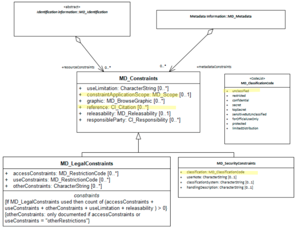

#  Metadata Security Constraints ★★
*The presence (or absence) of security restrictions on a metadata record may be important to document. Potential users need to be informed of any restrictions and responsibilities that apply to the use of such metadata.*

- **Path** - MD_Metadata.metadataConstraints>MD_SecurityConstraints*
- **Governance** - *National, Agency*
- **Purpose -** *Resource use*
- **Audience -**
  - machine resource - ⭑
  - general - ⭑⭑⭑⭑⭑
  - data manager - ⭑⭑⭑⭑
  - specialist - ⭑⭑
- **Metadata type -** *adminsitrative*
- *ICSM Level of Agreement* - ⭑⭑⭑

## Definition

**Handling restrictions imposed on this metadata record for national security or similar concerns e.g. commercial sensitivity, privacy considerations.**

### ISO Obligation
- There may be zero  to many [0..\*] *metadataConstraints* entries for the cited resource in the  *[MD_Metadata](./class-MD_Metadata)* package of class *[MD_SecurityConstraints](./class-MD_SecurityConstraints)* applied to a  a metadata record,

### ICSM Good Practice
- The MDWG recommends populating this element `metadataConstraints`  with security constraint information to sufficient level to determine the security structures and  restrictions on a metadata record.

#### Recommended Sub-Elements
Follow the general guidance for [MD_SecurityConstraints](./class-MD_SecurityConstraints).

## Discussion
This field is about recording any security restrictions on the metadata record itself - not the resource that it documents.
Security constraints on metadata records is uncommon.  Security is more commonly an issue with the cited resource. Resource security should be captured in [Resource Security Constraints](./ResourceSecurityConstraints).
For some agencies it may be important to capture under secrutity constraints that there are no constraints.
Reference for metadata security would Include the name (primary and alternate) and version by which this security restriction on the access and use of this metadata record is known.

### Outstanding Issues
> **How common are security constraints on metadata?**
A strong use case need be cited for putting security restraints on metadata to inform readers of this document when it is important.

> **Other security frameworks support**
There will be cases where other security frameworks and classification systems need be cited, such as for New Zealand Defence. Instructions for how to include these are needed.  Should such guidance be perscriptive or general?

## Recommendations
Therefore - when needed, it is important to capture any security constraints that apply to a metadata resord. Provide the user links to additional information about such constraints, their use and meaning. Include the Name (primary and alternate) and version by which this security restriction on the access and use of this metadata record is known. For example when using the Australian [Protective Security Policy Framework](https://www.protectivesecurity.gov.au/Pages/default.aspx), provide access to materials from this linked website to explain this framework.  (https://www.protectivesecurity.gov.au/Pages/default.aspx). In addition, document the holder of such rights and how to contact for more information. If your agency has requirements for stating that the metadata has no security constraints, do so in this element.

### Crosswalk considerations

#### RIF-CS
Agregated into `Description 'notes'`

## Also Consider
- **[Resource Security Constraints](./ResourceSecurityConstraints)** contains security restricion information that apply to the resource cited by the metadata
- **[Metadata Legal Constraints](./MetadataLegalConstraints)** A sibling to metadata security constraints. Contains information regarding any legal restriction on the metadata.
- **[Protective Security Policy Framework](https://www.protectivesecurity.gov.au/Pages/default.aspx)** provides information about the new security policy framework for Australia.

## Examples

<details>

### XML - Geoscience Australia
Includes reference to the constraint document - Australia Protective Security Policy Framework
```
<mdb:metadataConstraints 
xmlns:gmd="http://standards.iso.org/iso/19115/-3/gmd/1.0" 
xmlns:geonet="http://www.fao.org/geonetwork">
  <mco:MD_SecurityConstraints>
    <mco:reference>
      <cit:CI_Citation>
        <cit:title>
          <gco:CharacterString>
            The Protective Security Policy Framework
          </gco:CharacterString>
        </cit:title>
        <cit:editionDate>
          <gco:DateTime>2018-11-01T00:00:00</gco:DateTime>
        </cit:editionDate>
        <cit:onlineResource>
          <cit:CI_OnlineResource>
            <cit:linkage>
              <gco:CharacterString>
                https://www.protectivesecurity.gov.au/Pages/default.aspx
              </gco:CharacterString>
            </cit:linkage>
            <cit:protocol>
              <gco:CharacterString 
              xsi:type="gco:CodeType" 
              codeSpace="http://pid.geoscience.gov.au/def/schema/ga
              /ISO19115-3-2016/codelist
              /ga_profile_codelists.xml#gapCI_ProtocolTypeCode">
              WWW:LINK-1.0-http--link
              </gco:CharacterString>
            </cit:protocol>
          </cit:CI_OnlineResource>
        </cit:onlineResource>
      </cit:CI_Citation>
    </mco:reference>
    <mco:classification>
      <mco:MD_ClassificationCode
      codeList="codeListLocation#MD_ClassificationCode"
      codeListValue="unclassified"/>
    </mco:classification>
  </mco:MD_SecurityConstraints>
</mdb:metadataConstraints>

```


### UML diagrams
Recommended elements highlighted in Yellow



</details>

\pagebreak
