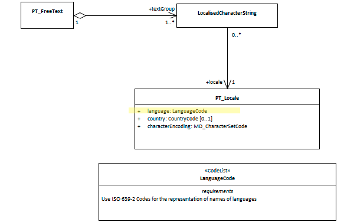

#  class - PT_Locale

To clearly identify, for humans and machines, the language in which metadata and its associated resources are captured we need a standised way to store such information.  The class PT_Locale provides us such a structure.

- **Governance** -  *ISO*
- **Metadata type -** *administrative*
- *ICSM Level of Agreement* - ⭑⭑⭑

# Definition 
**Contains the description of a locale**

## ISO Associations -
- MD_Metadata.defaultLocale
- MD_Metadata.otherLocale
- MD_DataIdentification.defaultLocale
- MD_DataIdentification.otherLocale
- MD_FeatureCatalogueDescription.locale

### ICSM Recommended Sub Element for class CI_OnlineResource 
- **language -** *(codelist - LanguageCode)* [1..1] Madatory.  Designation of the locale language in ISO 639-2, 3-alphabetic
digits code
- **country -** *(codelist - CountryCode)* [0..1] Optional. Designation of the specific country of the locale language
- **characterEncoding -** *(codelist - MD_CharacterSetCode)* [1..1] Madatory. Use UTF8

# Discussion
 A locale (identified as PT_Locale) is a combination of language, potentially a country, and a character encoding (i.e., character set) in which localised character strings are expressed. Because of our location and culture, the defualt language for jusidictions under the guidance of ICSM will most usually be to use 
 
 ## Outstanding Issues
 > DCAT Guidance states:
 "Resources defined by the Library of Congress (1, 2) SHOULD be used. If a ISO 639-1 (two-letter) code is defined for language, then its corresponding IRI SHOULD be used; if no ISO 639-1 code is defined, then IRI corresponding to the ISO 639-2 (three-letter) code SHOULD be used."
 This may present a problem of translation from ISO 19115-1 use of ISO 639-2, 3-alphabetic digits code

# Recommendations 

Therefore - given the location and area of influence of ICSM, for `language`, the three letter code chosen from the ISO 639-2 LanguageCode CodeList should default to "eng" for most instances of PT_Locale in a metadata record. Use UTF8 as the `characterEncoding` for consistancy accross catalogues.

## UML diagrams

Recommended elements highlighted in Yellow

! 
