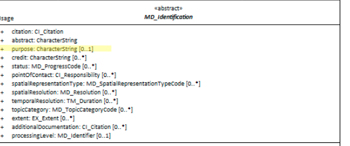

#  Purpose ★★★★★
*One of the useful ways to evaluate the fitness of a resource to our needs is to examine the purpose for which the resource was created and how well it fulfilled its intended purpose.  The *MD_DataIdentification.purpose* element is designed to hold such information.*

- **Path** - *MD_Metadata.identificationInfo>MD_DataIdentification.pupose*
- **Governance** -  *Common, Agency, Domain*
- **Purpose -** *discovery, evaluation*
- **Audience -** 
  - machine resource - ⭑
  - general - ⭑⭑⭑⭑⭑
  - data manager - ⭑⭑⭑⭑
  - specialist - ⭑⭑⭑⭑
- **Metadata type -** *descriptive*
- *ICSM Level of Agreement* - ⭑⭑⭑⭑

# Definition 
**A brief summary of the intentions with which the resource was developed**

## ISO Obligation 
- There may be no more than one [0..1] *purpose* entries for the resource in the   *[MD_DataIdentification](./class-MD_DataIdentification)* package of type *character string* in a metadata record.

## ICSM Good Practice 
- Populate the *purpose* element and provide enough narrative to give the reader a good understanding of the intent for which the resource was created. Use common language as far as possible as the readers may come from a different domain.

# Discussion 
A purpose statement provides a brief description of the reason a resource was created. Knowing this can give a good guide to potential usefulness of a resource to other potential users.

Consideration needs be given to the audience and what they need to know about the resource to decide it's utility for them.

A purpose statement is generally shorter than an abstract and should be written in a style that your human audience will easily comprehend. The purpose should capture the "why" a dataset was created and to what end it is used. Common language should be used that most people could understand. If there is a need for more technical language to describe the resource, this should be included at the end of the purpose statement.

## Outstanding Issues
> **DCAT**
Description may include but is not limited to: an abstract, a table of contents, a graphical representation, or a free-text account of the resource.

> **element - Purpose vs abstract**
Some guidance needs to be developed to guide users as to what belongs in `abstract` and what belongs in `purpose`.

# Recommendations 
Therefore - Keep the purpose statement  generally shorter than your abstract and write in a style that your human audience will easily comprehend. Capture the "why" a resource was created and to what end it is used. Use common language that most people could understand. If there is a need for more technical language to describe the resource, this should be included at the end of the purpose statement.

The contents of a purpose should include as much information as would be useful to indicate the alignment of the original purpose and potential users' requirements.

## Crosswalk considerations

### Dublin core / CKAN / data.govt.nz
Maps to *description*?

### DCAT
Maps to *dct.description* (as does *abstract*)

### RIF-CS
Maps to *dct.description*

# Also Consider
- **[Abstract](./Abstract)** provides somewhat more lengthy verbal summary description of the resource. Some overlap of usage with `purpose` may exist. The MDWG should provide some guidance as to what belongs in `abstract` and what belongs in `purpose`
- **MD_DataIdentification.supplimentalInformation -** provides a description of the resource in the producer's processing environment, including items such as the software, the computer operating system, file name, and the dataset size. 
- **[Resource Lineage](./ResourceLineage)** may contain information related to purpose.

# Examples

## ABARES
> The Australian Surveying and Land Information Group (AUSLIG) has the responsibility for providing topographic mapping information at a national scale. 
AUSLIG has undertaken the Australian Geographic Database program to enhance this topographic map information so it is suitable for use in Geographic Information Systems. 
The data resulting from this program are known as GEODATA. Each GEODATA product incorporates characteristics such as customer focus, national consistency, assured quality and comprehensive documentation.

## XML -
```
<mdb:MD_Metadata>
....
  <mdb:identificationInfo>
    <mri:MD_DataIdentification>
    ....
      <mri:purpose>
        <gco:CharacterString>  This is a sample purpose statement reprinted from the document AS/NZS ISO 19115.1:2015:
        This dataset was developed to record information necessary for the administration of the
        Mining Act.</gco:CharacterString>
      </mri:purpose>
    ....
    </mri:MD_DataIdentification>
  </mdb:identificationInfo>
....
</mdb:MD_Metadata>
```

## UML diagrams
Recommended elements highlighted in Yellow

