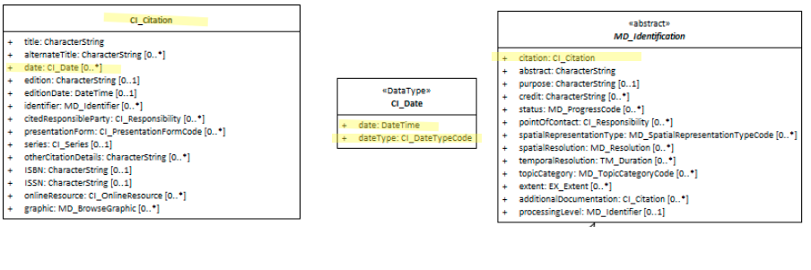

#  Resource Reference Date ★★★★★
*In order to manage resource and notification systems such as giving updates to users it is useful to include in our metadata temporal information relating to resource creation, publication, revision, etc.*

- **Path** - *MD_Metadata.identificationInfo>MD_DataIndentification.citation>CI_Citation.date*
- **Governance** -  *Agency, Domain*
- **Purpose -** *discovery, data management*
- **Audience -** 
  - machine resource - ⭑⭑⭑
  - general - ⭑⭑⭑
  - data manager - ⭑⭑⭑⭑⭑
  - specialist - ⭑⭑⭑⭑
- **Metadata type -** *descriptive*
- *ICSM Level of Agreement* - ⭑⭑⭑

# Definition 
**A named and dated event associated with the cited resource (in ISO 8601 format).**

## ISO Obligation 
- There can be zero to many [0..`*`] *Resource reference date* entries for the cited resource in the  *[MD_DataIdentification.citation](./ResourceCitation)* package of class *[CI_Date](./class-CI_Date)* in a metadata record.  One of these must be of `dateType` *creation*.

## ICSM Good Practice  
- There should be multiple entries for the Resource reference date in a metadata record.  These should include:
  - **Creation date** - This is important for intellectual property and other reasons
  - **Publication date** - Is the most common date type captured by an agency
  - **Update date** - Allows notifications and resource management
  - All updates to metadata should be include the date of last revision to the metadata. This can be an automated process.

## Recommended Sub-Elements   
Follow the general guidance for [class - CI_Date](./class-CI_Date) with the following additional guidance:
- **[dateType](http://wiki.esipfed.org/index.php/ISO_19115-3_Codelists#CI_DateTypeCode) -**  There should be an entries of value *creation*, *publication* and *lastUpdate*

# Discussion 
There should be at least one instance of a resource reference date in a metadata record (dateType - creation), but there should be multiple - including *publication* and as many *lastUpdate* entries as needed

The CI_DateType CodeList contains 16 values. Which values are of most import needs further discussion. The ability to crosswalk easily with CKAN and DCAT are of high concern. These external catalogues commonly have a single date field. Which dateType we map to this field is of interest in discussions regarding the recommended dateTypes used.

Relation of Metadata dateInfo to Resource reference date needs to be discussed. The Resource reference date is documented as the date that should be used for discovery of resources other than services. (For services MD_Metadata.identificationInfo>SV_ServiceIdentification.citation>CI_Citation.date is used.)

When does the metadata dataInfo require updating? For instance, is it okay to not update the metadata dataInfo when the Resource reference date is updated if nothing else has changed? Our good practice guide should address this and related issues.


## Other discussion
> **Date and DateTime:**
When is it okay to use Date as opposed to DateTime?

> **DCAT:**
encoded using the relevant ISO 8601 Date and Time compliant string [DATETIME] and typed using the appropriate XML Schema datatype [XMLSCHEMA11-2]


# Recommendations 
Therefore - In order to provide an idea of the age, validity and other time dependant properties of a resource, it is important to capture the important events that happened or will happen to a particular resource in the Resource Reference Date element.  One of these important events must be of `dateType` "creation".  Creation is a significant date in regards to copyright. Other important date types are "publication" and "lastUpdate".

It is recommended that `Resource Date` include - 
- *date* - (Mandatory) the reference DateTime for the metadata record.
- *dateType* - Highly recommended for Creation, when the resource was created
- *dateType* - Highly recommended for Publication, when the resource was first published.
- *dateType* - Highly recommended for Revision, when a revision is made.

This element should be updated in a consistent yet to be agreed upon manor.  We recommend GeoNetwork's current approach.  GeoNetwork updates the **revision date** for the metadata record automatically on every save. This supports systems such as notifications and harvesting regimes that  rely on the capture of the date that a metadata record was last modified.  

## Crosswalk considerations

### Dublin core / CKAN / data.govt.nz
Maps to `date (publication, update)`

### DCAT
Maps to `dct:issued* and *dct:modified`

### RIF-CS
Maps to `Date`

# Also Consider
- **[Metadata Date](./MetadataDate)** - for sdates related to the metadata record itself and not the cited resource
- **[CI_Date -](./class-CI_Date)** for general information about the class CI_Date
- **[Resource  Citation](./ResourceCitation)** - parent to this element

# Examples

## XML 
```
</mdb:MD_Metadata>
....
   <mdb:identificationInfo>
      <mri:MD_DataIdentification>
         <mri:citation>
            <cit:CI_Citation>
            ....
   		<cit:date>
                  <cit:CI_Date>
                     <cit:date>
                        <gco:Date>2018-06-11</gco:Date>
                     </cit:date>
                     <cit:dateType>
                        <cit:CI_DateTypeCode codeList="http://standards.iso.org/ittf/PubliclyAvailableStandards/ISO_19139_Schemas/resources/codelist/ML_gmxCodelists.xml#CI_DateTypeCode"
                                             codeListValue="creation"/>
                     </cit:dateType>
                  </cit:CI_Date>
               </cit:date>
               <cit:date>
                  <cit:CI_Date>
                     <cit:date>
                        <gco:Date>2019-06-11</gco:Date>
                     </cit:date>
                     <cit:dateType>
                        <cit:CI_DateTypeCode codeList="http://standards.iso.org/ittf/PubliclyAvailableStandards/ISO_19139_Schemas/resources/codelist/ML_gmxCodelists.xml#CI_DateTypeCode"
                                             codeListValue="lastUpdate"/>
                     </cit:dateType>
                  </cit:CI_Date>
               </cit:date>
               ....
            </cit:CI_Citation>
          </mri:citation>
          ....
      </mri:MD_DataIdentification>
   </mdb:identificationInfo>
....
</mdb:MD_Metadata>
```

## UML diagrams
Recommended elements highlighted in Yellow

