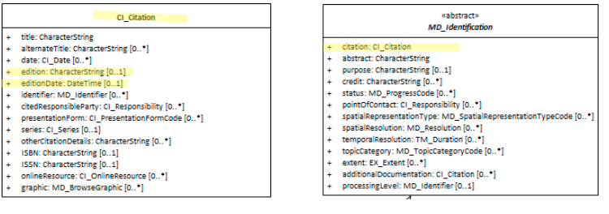

#  Resource Edition ★★★★
*For resources that change over time, it is important to users and resource managers that the edition changes be tracked in the metadata.  This informs the user if they have the particular edition the need for their pupose.*

- **Path** - *MD_Metadata.identificationInfo>MD_DataIdentification.citation>CI_Citation.edition*
- **Governance** -  *Agency, Domain*
- **Purpose -** *Discovery, identification*
- **Audience -**
  - machine resource - ⭑⭑⭑
  - general - ⭑⭑⭑⭑⭑
  - data manager - ⭑⭑⭑⭑
  - specialist - ⭑⭑⭑
- **Metadata type -** *descriptive, administrative*
- *ICSM Level of Agreement* - ⭑⭑⭑⭑

# Definition
**Version of the cited resource.**

## ISO Obligation
- There can be at most one [0..1] *edition* entries for the cited resource in the  *[MD_DataIdentification.citation](./ResourceCitation)* package in a metadata record. These are of type *character string*.

##  ICSM Good Practice
- When a new edition of a resource is created, a new metadata record needs to be created. This new metadata record needs the *resource edition* element populated with the edition name or identifier.  When such is the case, the sibling [CI_Citation](./class-CI_Citation).editionDate field should also be populated.

### Recommended Sibling Elements
- **editionDate -** *(type - DateTime)*[0..1] date of the edition. Should be populated with the date of  the publication of the new edition.

# Discussion
The [0..1] cardinality of `edition` and `editionDate` means that release of a new edition of a resource requires the creation of a new metadata record.  When such is the case, these two elements should be populated. The population of the `edition` element mandates the population of the `editionDate` element.

This element should be used wherever there's a usable edition/version as it is invaluable to know where this resource fits into a sequence. As "version" is often synomynous with "edition", it is advised that this field also be used for new tracked versions of resources.

## Issues
> **Updates vs. Editions**
As discussed, new editions require a new metadata record.  Updates to an existing resource do not.  Do we need some guidance on when some change warrants a new edition rather than an update. Or should this be at the descretion of the agency or domain?

# Recommendations
Therefore - It is recommended that the Edition information be captured when the resource is an Edition of an existing resource.

The `edition` element should be populated with the edition name.

It is recommended when capturing the edition name, the `editionDate` also be captured.

This element should be updated in a consistent yet to be agreed upon manner within an agency.

## Crosswalk considerations

<details>

### DCAT
Maps to `dct:confirmsTo`

### RIF-CS
Maps to `Version`

</details>

# Also Consider
- **[Resource Date](./ResourceDate) -** and `dateType` field.
- **[Metadata Date](./MetadataDate) -** and `dateType` field.
- **[Resource  Citation](./ResourceCitation)** - parent to this element

# Examples

<details>

## XML
```
</mdb:MD_Metadata>
....
   <mdb:identificationInfo>
      <mri:MD_DataIdentification>
         <mri:citation>
            <cit:CI_Citation>
            ....
   	       <cit:edition>
                  <gco:CharacterString>2nd new and improved edition</gco:CharacterString>
               </cit:edition>
               <cit:editionDate>
                  <gco:Date>2019-06-11</gco:Date>
               </cit:editionDate>
               ....
            </cit:CI_Citation>
          </mri:citation>
          ....
      </mri:MD_DataIdentification>
   </mdb:identificationInfo>
....
</mdb:MD_Metadata>
```

## UML diagrams
Recommended elements highlighted in Yellow


</details>
