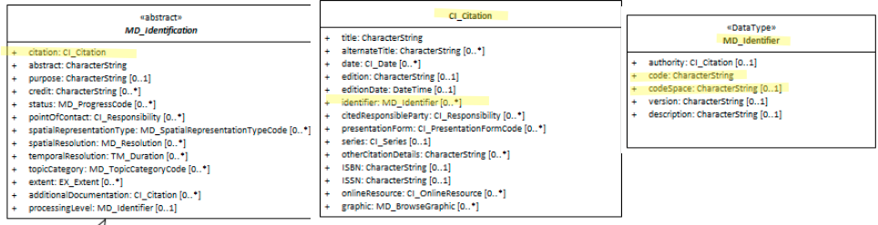

# Resource Identifier ★★★★
*An important component of the [Resource Citation](./class-CI_Citation) is the resource identification element.  Similar to the [Metadata Identifier](./MetadataIdentifier), this element hold a code that uniquely identifies the resource and differentiates it from all others. With this, machines and humans can differentiate, reference and link to the resource without ambiguity*

- **Path** - *MD_Metadata.identificationInfo>MD_DataIdentification.citation>CI_Citation.identifier*
- **Governance** -  *Common, Agency, Domain*
- **Purpose -** *linkage, identification*
- **Audience -**
  - machine resource - ⭑⭑⭑⭑
  - general - ⭑
  - data manager - ⭑⭑⭑
  - specialist - ⭑⭑
- **Metadata type -** *administrative*
- *ICSM Level of Agreement* - ⭑⭑⭑⭑

## Definition
**Alphanumeric identifier uniquely identifying this cited resource.**

### ISO Obligation
- This is an ISO optional element. There may be zero or many [0..\*] *identifier* entries for the cited resource in the  *[MD_DataIdentification.citation](./ResourceCitation)* package of class *[MD_Identifier](./class-MD_Identifier)*  in a metadata record.

###  ICSM Good Practice
- The MDWG recommends this element be populated in all metadata records, preferably with a resolvable URI that points to a landing page for the resource. This landing page may be the authoritative metadata record.

#### Recommended Sub-Elements
Follow the general guidance for **[MD_Identifier](./class-MD_Identifier)** with emphasis on the following elements:
- **code -** (*type - charstr*) [1..1] A mandataroy alphanumeric value identifying an instance in the namespace, 
- **codespace -** *(type - charstr)* [0..1] An optional but recommended namespace in which the code is valid. Ideally a  URL  path by which, when combined with the uuid, the full path to the resource landing page is provided.
- **description -** (*type - charstr*) [0..1] An optional but recommended natural language description of the meaning of the code value. Usually prepopulated in the metadata template.

## Discussion
The Resource Identifier is an identifier for the dataset, not the metadata record. The Metadata Identifier  provides an identifier for the metadata. A failure to distinguish between these two elements - especially as they apply to crosswalk between standards such as Dublin Core leads to a great deal of confusion and misunderstanding.

Commonly, standards like Dublin Core do not make a distinction between the metadata identifier and the resource identifier. Emerging practice, such as Google data search beta, suggest that the distinction is useful. Harvested metadata should point to a source metadata record - a 'point of truth' or the resource from which the record was harvested. Using this logic, the resource identifier uri would not need be harvested by a high-level catalogue such as data.gov.au.

Common practice in GA and ABARES is for this identifier to be the same as the metadata identifier. In these cases, it can be said the authoritative metadata serves as the landing page for the data resource.

In the case where a resource may have multiple identifiers, additional instances of this element can be created. It is  important that  the `discription` element be populatied in such situations to distinguish the meaning of the different identifiers.

## Recommendations
Therefore - It is recommended that this element be populated, preferably once, but more often if there are multiple identifier sytems for the same resource. In the case of multiple identifiers, it is important that  the `discription` element be populatied in such situations to distinguish the meaning of the different identifiers. `Code` must be populated in all records and it is recomended that `codeSpace` be populated as well.

Common practice has been to populate this field that is the same as or resolves to the metadata record itself. In this case, the metadata can be said to be the landing page for the resource. 

If the metadata record is for a resource that contains more than one dataset, a best practice way to document that in the metadata needs be developed. This case may better be addressed through related metadata records.

Development of URI naming conventions to describe how the reference to the resource and the reference to metadata for that resource would be useful. This would allow easy discovery of not only the data from the metadata, but solve the often more difficult problem of discovery of the metadata for a given dataset.

### Crosswalk considerations

<details>

#### Dublin core / CKAN / data.govt.nz
Maps to `identifier`
> Note BC 18-7 - may relate to issues involving confusion between metadata identifiers and resource identifiers in DC and other metadata systems.

#### DCAT
Maps to `dcat:identifier`

#### RIF-CS
Maps to `Identifier`

</details>

## Also Consider
- **[onlineResource -](./DistributionInfo)** (MD_Distribution.transferOptions>MD_DigitalTransferOptions.online) is used to provide online linage to the resource.
- **[MetadataIdentifier -](./MetadataIdentifier)** is the preferred element to be used to provide linkage to the metadata record.
- **[Resource  Citation](./ResourceCitation)** - parent to this element

## Examples

<details>

### ABARES
**MD_Identifier > code :** 942d6f4e-17b0-41fd-a623-c2c78d107e6d
**MD_Identifier > codespace :** UUID
**MD_Identifier > description :** The UUID for this resource, its citation and its metadata

### GA
**MD_Identifier > code :** http://pid.geoscience.gov.au/dataset/ga/102441
**MD_Identifier > codespace :**  Geoscience Australia Persistent Identifier

### data.gov.au
URN:UUID (example 559708e5-480e-4f94-8429-c49571e82761)


### XML
```
<mdb:MD_Metadata>
....
  <mdb:identificationInfo>
    <mri:MD_DataIdentification>
    ....
       <mri:citation>
          <cit:CI_Citation>
             ....
             <cit:identifier>
                <mcc:MD_Identifier>
                   <mcc:code>
                      <gco:CharacterString>9547e07e-6a15-403b-8b19-488778fe0cf0</gco:CharacterString>
                   </mcc:code>
                   <mcc:codeSpace>
                      <gco:CharacterString>http://202.49.243.69:8080/geonetwork/srv/eng/metadata/</gco:CharacterString>
                   </mcc:codeSpace>
                </mcc:MD_Identifier>
             </cit:identifier>
             ....
          </cit:CI_Citation>
        </mri:citation>
      ....
    </mri:MD_DataIdentification>
  </mdb:identificationInfo>
....
</mdb:MD_Metadata>
```

### UML diagrams
Recommended elements highlighted in Yellow


</details>
