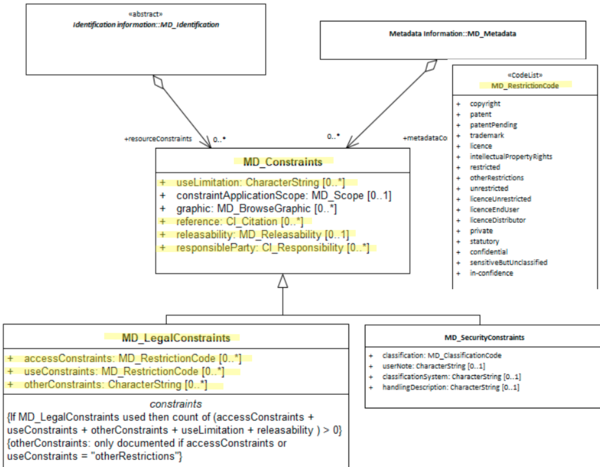

# Resource Legal Constraints ★★★★★

*When constraints ([MD_Constraints]) on a spatial resource [MD_Identification]  are of a legal nature it is important to document these.. Potential users need to be informed of rights, restrictions and responsibilities (or lack thereof) that apply to the use of such resources.*

- **Path** - *MD_Metadata.identificationInfo>MD_DataIdentification.resourceConstraints>MD_LegalConstraints*
- **Governance** - *Agency*
- **Purpose -** *Resource use*
- **Audience -**
  - machine resource - ⭑
  - general - ⭑⭑⭑⭑⭑
  - data manager - ⭑⭑⭑⭑
  - specialist - ⭑⭑
- **Metadata type -** *adminsitrative*
- *ICSM Level of Agreement* - ⭑⭑⭑

## Definition
**Legal restrictions on the access and use of this cited resource e.g. copyright**

### ISO Obligation
- There may be zero  to many [0..\*] *legalConstraints* recorded for the cited resource in the  *[MD_DataIdentification](./class-MD_DataIdentification)* package of class *[MD_LegalConstraints](./class-MD_LegalConstraints)* in a metadata record,  

### ICSM Good Practice
- The MDWG highly recommends populating this element `legalConstraints`  to sufficient level to determine the legal rights, responsibilities and restrictions on a cited resource.

#### Recommended Sub-Elements
Follow the general guidance for [MD_LegalConstraints](./class-MD_LegalConstraints)

## Discussion
Almost all spatial resources carry some legal rights, restrictions and responsibility regarding their access and use.  For instance, in most jurisdictions, copyright is automatically granted to the creator of a creative work (which includes spatial resources).  These legal restrictions such as licences and end user agreements, need be documented for users and resource managers along with the identity of the holder of these rights.  Each agency needs to develop consistent guidance on the use of such statement and share clear understanding of their meaning.  This is often done by reference to a external body that manages the definitions of the legal constraints applied.
The legal rights, restrictions and responsibilities associated with a spatial resource are important to document and share with users, distributors, managers and other who may have some use of or responsibility over a spatial resource. A standardised way to capture such information make it more easy to understand, access and use.
There is often general confusion over the restraints fields and to what they apply, be it metadata, resource, distribution, etc. This is a major topic needing clarification in MDWG. In ISO 19115-1 two types of constraints are recognised metadataConstraints (restrictions on the access and use of metadata) and resourceConstraints (information about constraints which apply to the resources). Here we are only address constraints on Metadata. (A third application of constraints in ISO 19115-1 applies to browse images.)

A few of the most common applications of legal restrictions for spatial resources include:

#### Copyright
Applies to expressions of ideas. Wikipedia - Copyright is a form of intellectual property that grants the creator of an original creative work an exclusive legal right to determine whether and under what conditions this original work may be copied and used by others
The most important thing to capture about copyright is "who holds the copyright" and the year it was granted to determine when it expires. The identity of the Author is also useful as copyright temporal applicability is determined by the author's life plus a certain number of years. Copyrights are property that can be traded and sold. Copyrights accrue to the the creator and apply to the intellectual resource created.
Mechanisms for sharing copyrighted material include licenses and contracts.

#### Copyright License
Creative Commons is a copyright license. Licenses most appropriately apply to distributions. Different distributions of a resource may be made under different license arrangements.

#### End User License Agreement
Not a true license in itself, but a contractual agreement between the Copyright holder and other parties. It grants to these other parties rights responsibilities and restrictions on the use of a copyrighted resources

## Recommendations

Therefore - It is important to capture all legal constraints that apply to a spatial resource.  This should include licences, end user agreements, etc.  If the resource is public domain, this should be cited appropriately.  Many jurisdictions encourage the use of open data and Creative Commons license.  This should be encouraged through the use of copyright licenses such as CC0 or CC By.  Provide the user links to additional information about such constraints, there use and meaning.  In addition, it is important to document the holder of such rights and how to contact for more information.

### Crosswalk considerations

<details>

#### ISO19139
See guidance provided in [MD_Constraints](./class-md_constraints) and [MD_LegalConstraints](./class-MD_LegalConstraints)

#### Dublin core / CKAN / data.gov.au
Maps to `rights`
`Reference for legal` maps to `licence`

#### DCAT
Maps to `dct.rights` as does `metadata legal constraints` > Note BC 22-7: Does DCAT make a distinction?
`Reference for legal` maps to `dct.license`

#### RIF-CS
Maps to `Rights/@licence`

</details>

## Also Consider
- **[Resource Security Constraints](./ResourceSecurityConstraints)** - contains security restrictions that apply to the resource cited by the metadata
- **[Metadata Legal Constraints](./MetadataLegalConstraints)** - A sibling to metadata legal constraints. Contains information regarding any security restriction on the metadata.

## Examples

<details>

### XML

```
<mdb:MD_Metadata>
....
  <mdb:identificationInfo>
    <mri:MD_DataIdentification>
    ....
       <mri:resourceConstraints>
          <mco:MD_LegalConstraints>
             <mco:responsibleParty>
                <cit:CI_Responsibility>
                   <cit:role>
                      <cit:CI_RoleCode codeList="https://schemas.isotc211.org/19115/resources/Codelist/cat/codelists.xml#CI_RoleCode"
                                       codeListValue="author"/>
                   </cit:role>
                   <cit:party>
                      <cit:CI_Organisation>
                         <cit:name>
                            <gco:CharacterString>OpenWork Ltd</gco:CharacterString>
                         </cit:name>
                         <cit:contactInfo>
                            <cit:CI_Contact>
                               <cit:address>
                                  <cit:CI_Address>
                                     <cit:electronicMailAddress>
                                        <gco:CharacterString>info@openwork.nz</gco:CharacterString>
                                     </cit:electronicMailAddress>
                                  </cit:CI_Address>
                               </cit:address>
                            </cit:CI_Contact>
                         </cit:contactInfo>
                         <cit:individual>
                            <cit:CI_Individual>
                               <cit:name>
                                  <gco:CharacterString>Byron Cochrane</gco:CharacterString>
                               </cit:name>
                            </cit:CI_Individual>
                         </cit:individual>
                      </cit:CI_Organisation>
                   </cit:party>
                </cit:CI_Responsibility>
             </mco:responsibleParty>
             <mco:accessConstraints>
                <mco:MD_RestrictionCode codeListValue="copyright"
                                        codeList="https://schemas.isotc211.org/19115/resources/Codelist/cat/codelists.xml#MD_RestrictionCode"/>
             </mco:accessConstraints>
             <mco:useConstraints>
                <mco:MD_RestrictionCode codeListValue="otherRestrictions"
                                        codeList="https://schemas.isotc211.org/19115/resources/Codelist/cat/codelists.xml#MD_RestrictionCode"/>
             </mco:useConstraints>
             <mco:otherConstraints gco:nilReason="missing">
                <gco:CharacterString/>
             </mco:otherConstraints>
          </mco:MD_LegalConstraints>
       </mri:resourceConstraints>
       <mri:resourceConstraints>
          <mco:MD_SecurityConstraints>
             <mco:classification>
                <mco:MD_ClassificationCode codeList="https://schemas.isotc211.org/19115/resources/Codelist/cat/codelists.xml#MD_ClassificationCode"
                                           codeListValue="unclassified"/>
             </mco:classification>
          </mco:MD_SecurityConstraints>
       </mri:resourceConstraints>
       <mri:resourceConstraints>
          <mco:MD_Constraints>
             <mco:useLimitation>
                <gco:CharacterString>Not to be used for navigation</gco:CharacterString>
             </mco:useLimitation>
          </mco:MD_Constraints>
       </mri:resourceConstraints>
     ....
     </mri:MD_DataIdentification>
  </mdb:identificationInfo>
....
</mdb:MD_Metadata>
```

### UML diagrams

Recommended elements highlighted in Yellow


</details>
