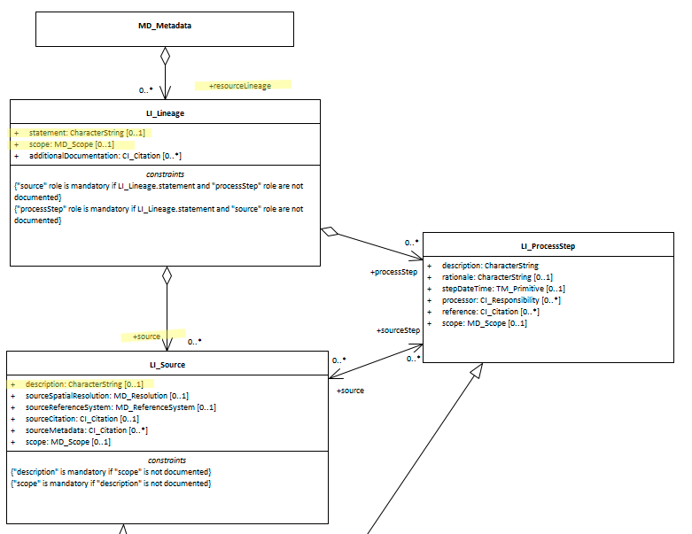

# Resource Lineage ★★★★
*Every spatial resource has a history and was built upon other work. Lineage documentation specifies a resource's source data, transformations, and input/output specifications. Such information is inherently causal, communicating the purpose, theory and meaning embodied in a resource. *

- **Path** -  *MD_Metadata.resourceLineage>LI_Lineage*
- **Governance** -  *Agency, Domain*
- **Purpose -** *Resource use*
- **Audience - ** 
  - machine resource - ⭑ 
  - general - ⭑⭑
  - resource manager - ⭑⭑⭑⭑
  - specialist - ⭑⭑⭑⭑⭑
- **Metadata type -** *descriptive*
- *ICSM Level of Agreement* - ⭑⭑⭑

# Definition 
**Information about the provenance, source(s), and/or the production process(es) applied to the resource.**

## ISO Obligation 
- A metadata record should contain zero to many [0..\*] *resourceLineage* packages for the cited resource in the  *[MD_Metadata](./class-MD_Metadata)* package of class *[LI_Lineage](http://wiki.esipfed.org/index.php/LI_Lineage)*. 

## ICSM Good Practice 
- Lineage information should be documented and include a descriptive statement of the resource provenance and its scope as an level from a hiearchy *[MD_Scope](./class-MD_Scope)*.

### Recommended Sub-Elements 
- **statement -** *(type - charstr)* 0 to 1 - Recommended by MDWG. A general explanation of the data producer's knowledge about the lineage of a resource. 
- **source -** *(class - [LI_Source](http://wiki.esipfed.org/index.php/LI_Source))* 0 to many - information about the source resource used in creating the data specified by the scope
- **description -** *(type - CharStr)* 0 to 1 - detailed description of the source
- **scope -** *(class - [MD_Scope](./class-MD_Scope))*  optional - 0 to many - type of resource and/or extent to which the lineage information applies
  - **level -** *(class - [MD_ScopeCode](http://wiki.esipfed.org/index.php/ISO_19115-3_Codelists#MD_ScopeCode))* target resource covered
  - **extent -** *(class -  [EX_Extent](./ResourceExtent))* Information about the horizontal, vertical and temporal extent of the resource specified by the scope
  - **levelDescription -** *(class - [MD_ScopeDescription](http://wiki.esipfed.org/index.php/MD_ScopeDescription))* detailed description/listing of the items specified by the level

# Discussion  
Lineage metadata provides the user with information about the events, parameters, and source data which constructed the resource, and information about the responsible parties.  It provide a good understanding of the original intent and limitations of a resource. It also allows one to reproduce the process or avoid reproducing a process where unnecesary. Lineage information can help specialist users  avoid the problem of too heavily citing the same resource by not knowing their sources share common provenance. Lineage information can help custodians more intelligently manage their resources.

## Outstanding Issues

> **CORE ISSUE:**  
We have had insuficient conversation in MDWG about what we want from Lineage metadata to yet make strong recommendations.  The resource identified by this property presents a provenance record about its subject or anchor resource.  Need to discuss futher and reach agreement as to best practice approach for caturing provenance information.

# Recommendations 
Therefore - It is strongly recommended, particularly when the resource is authoritative or likely to be used by demanding specialist, the the lineage of the resource be captured in the metadata under resourceLineage. A linage statement should be included with your metadata. If appropriate include process step information for advanced users.

## Crosswalk considerations 

### ISO19139 
New attributes were added to improve the description of *LI_Source* and *LI_ProcessStep*.
- **MD_Metadata.resourceLineage** *(class - [LI_Lineage](http://wiki.esipfed.org/index.php/LI_Lineage)*)
  - *LI_Lineage( to be included in the metadata without Data Quality information. The Data Quality model was removed in this revision to ISO 19157.
- **LI_Lineage.scope** *(class - [MD_Scope](./class-MD_Scope))*
  - This element allows the description of the type and/or extent of the lineage information. DQ_Data-Quality/scope was moved to ISO 19157.
- **LI_Lineage.additionalDocumentation** *(class - [CI_Citation](./class-CI_Citation))*
  - This new element cites a publication that documents the process to produce the resource.
- **LI_Source.sourceSpatialResolution** (class - [MD_Resolution](http://wiki.esipfed.org/index.php/MD_Resolution))* [0..1]
  - This new element replaces scaleDenominator inorder to allow more flexibility in the specification of the source spatial resolution.
- **LI_source.scope** *(class - [MD_Scope](./class-MD_Scope))* [0..1] 
  - This new element was added in order to allow description of more details of the scope of a lineage section. This was required, in part, to replace the DQ_Scope from the DQ_DataQuality class that was moved from 19115 to the new data quality standard (ISO 19157).
- **LI_Source.sourceMetadata** *(class -  [CI_Citation](./class-CI_Citation))* [0..\*]
  - This new element was added in order to allow an unambiguous reference to the metadata for the source. The sourceCitation now provides a clear reference to the source resource.
- **LI_ProcessStep.stepDateTime** *(type - TM_Primitive)*
  - This new element replaces dateTime in order to provide more flexible specification of process step times.
- **LI_ProcessStep.reference** *(class -  [CI_Citation](./class-CI_Citation))*
  - This new element was added in order to allow references to more detailed information about a process step.
- **LI_ProcessStep.scope** (class - MD_Scope](./class-MD_Scope))* 
  - This new element was added in order to allow description of the scope of a process step independently from the scope of the entire lineage section. This was required, in part, to replace the DQ_Scope from the DQ_DataQuality class that was moved from 19115 to the new data quality standard (ISO 19157).

### DCAT 
`MD_Metadata.resourceLineage>LI_Lineage.statement` maps to  `prov:has_Provenance`
`MD_Metadata.resourceLineage>LI_Lineage.source` maps to `dct:source`

### RIF-CS
Maps to `Description 'lineage'`

# Also Consider
- **[AssociatedResource](./AssociatedResources)** - contains information about resources related to the creation or use of the cited resource.
- **[Abstract](./Abstract)** and
- **[Purpose](./Purpose)** - often contain some brief lineage information


# Examples

## XML 

```
<mdb:MD_Metadata>
....
    <mdb:resourceLineage>
        <mrl:LI_Lineage>
            <mrl:statement>
                <gco:CharacterString>this is my resource lineage</gco:CharacterString>
            </mrl:statement>
            <mrl:scope>
                <mcc:MD_Scope>
                    <mcc:level>
                        <mcc:MD_ScopeCode codeList="https://schemas.isotc211.org/19115/resources/Codelist/cat/codelists.xml#MD_ScopeCode" codeListValue="dataset"/>
                    </mcc:level>
                </mcc:MD_Scope>
            </mrl:scope>
            <mrl:source>
                <mrl:LI_Source>
                    <mrl:description>
                        <gco:CharacterString>this is my source description</gco:CharacterString>
                    </mrl:description>
                </mrl:LI_Source>
            </mrl:source>
        </mrl:LI_Lineage>
    </mdb:resourceLineage>
....
</mdb:MD_Metadata>
```

## UML diagrams
Recommended elements highlighted in Yellow

