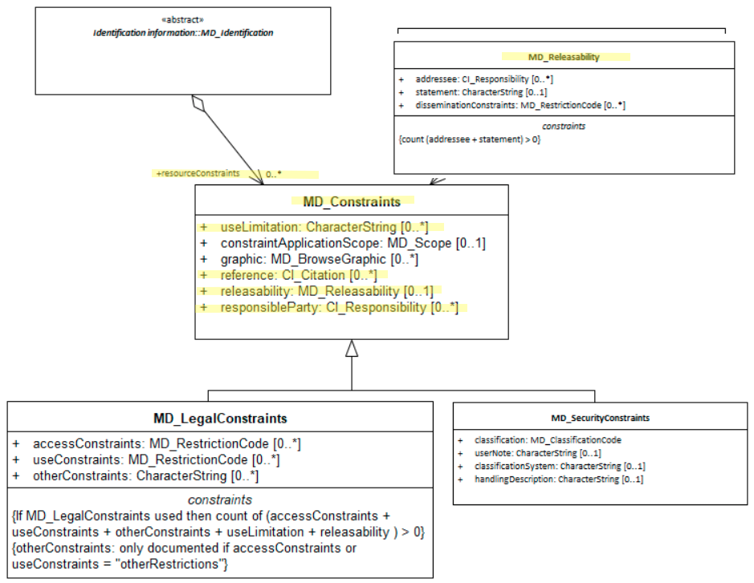

# Resource Other Constraints ★★★★
*The presence (or at times absence) of constraints (other than those of [legal](./ResourceLegalConstraints) of [security](./ResourceSecurityConstraints) nature) on a spatial resource is important to document. Potential users need to be informed of rights, restrictions and responsibilities that apply to the use of such resources. These include *use limitations* and *releasability* constraint information.*

- **Path** -  *MD_Metadata.identificationInfo>MD_DataIdentification.resourceConstraints*
- **Governance** - *Agency*
- **Primary use -** *Resource use* 
- **Audience -**
  - machine resource - ⭑
  - general - ⭑⭑⭑⭑⭑
  - data manager - ⭑⭑⭑⭑
  - specialist - ⭑⭑
- **Metadata type -** *administrative*
- *ICSM Level of Agreement* - ⭑⭑⭑

## Definition -
**Rights, restrictions, and responsibilities for the access and use of this cited resource.  While these may optionally be of subtypes legal ([MD_LegalConstraints](./class-MD_LegalConstraints)) or security ([MD_SecurityConstraints](./class-MD_SecurityConstraints)) there are other types of constraints to consider that exist under the more general class [MD_Constraints](./class-md_constraints) including *useLimitations* and *releasability* restrictions** 

### ISO Obligation

- There should be zero to many [0..\*] *resourceConstraints* recorded for the cited resource in the  *[MD_DataIdentification](./class-MD_Dataidentification)* package of class [MD_Constraints](./class-md_constraints) in a metadata record,

### ICSM Good Practice

- The MDWG recommends populating  `resourceConstraints`  with `useLimitation`, `releasability` and other constraint information to sufficient level to determine the limits and restrictions on a cited resource.

#### Recommended Sub-Elements

- **useLimitation -** (*type - charstr*) [0..\*] limitation(s) affecting the fitness for use of the resource or metadata. Example, "not to be used for navigation".  If legal by nature, use as parent subtype [MD_LegalConstraints](./ResourceLegalConstraints). If security by nature, use as parent subtype [MD_SecurityConstraints](./MetadataSecurityConstraints). Otherwise, use  MD_Constraint.
- **reference -** *(class - [CI_Citation](./class-CI_Citation))* [0..\*] citation/URL for the limitation or constraint, eg. copyright statement, license agreement, security classification system, etc.
  - **title** - *(type - charstr)*  [1..1] Madatory for `CI_Citation` The name of the constraint.
  - **alternateTitle** - *(type - charstr)* [0..\*] Other title the constraint may be known by, if needed
  - **edition** - *(type - charstr)* [0..1] the version of the constraint, if needed
  - **citedResponsibleParty -** *(class -[CI_Responsibility](./class-CI_Responsibility))* [0..\*]  the party responsible for governance of the constraint standard referenced
- **releasability -** *(class - [MD_Releasability](./class-md_constraints))* [0..\*] information concerning the parties to whom the resource can or cannot be released
  - **addressee -** *(type [CI_Responsibility](./class-CI_Responsibility))* [0..\*] party to which the release statement applies
  - **statement -** *(type - charstr)* [0..\*] release statement
  - **disseminationConstraints -** *(codelist - [MD_RestrictionCode](./class-md_constraints#MD_RestrictionCode---codelist))* [0..\*] component in determining releasability. A Limitation placed upon the access or use of the data
  - **responsibleParty -** *(class [CI_Responsibility](./class-CI_Responsibility))* [0..\*] contact information for those responsible for managing the security of the cited resource.

## Discussion

Almost all spatial resources carry some rights, restrictions and responsibility regarding their access and use.  These may be legal, security or other.  It is important that these be recorded and shared with existing and potential users.  Each agency needs to develop consistant guidance on the use of such statements and share clear understanding of their meaning.  This is often done by reference to a external body that manages the definitions of the constraints applied.

## Recommendations

Therefore - In order for users to understand the administrative constraints applied to a cited resource, the details of these constraints, together with sufficient information and linkages to provide access to further information as to the deeper meaning and implications of such constraints, needs to be capture in the metadata about the resource.

### Crosswalk considerations

<details>

#### ISO19139

See guidance provided in *[MD_Constraints](./class-md_constraints)*

#### RIF-CS

Maps to the agregate `Rights/@accessRights`

</details>

## Also Consider

- **[Resource Security Constraints](./ResourceSecurityConstraints)** contains security restrictions that apply to the resource cited by the metadata
- **[Resource Legal Constraints](./ResourceLegalConstraints)**  A sibling to resource security constraints. Contains information regarding any legal restriction on the use or access of the resource.

## Examples

<details>

### XML

```
<mdb:MD_Metadata>
....
  <mdb:identificationInfo>
    <mri:MD_DataIdentification>
    ....
       <mri:resourceConstraints>
            <mco:MD_Constraints>
               <mco:useLimitation>
                  <gco:CharacterString>Not to be used for measurement</gco:CharacterString>
               </mco:useLimitation>
               <mco:reference>
                  <cit:CI_Citation>
                     <cit:title>
                        <gco:CharacterString>My own list of constraints
                        </gco:CharacterString>
                     </cit:title>
                  </cit:CI_Citation>
               </mco:reference>
               <mco:releasability>
                  <mco:MD_Releasability>
                     <mco:addressee>
                        <cit:CI_Responsibility>
                           <cit:role>
                              <cit:CI_RoleCode 
                              codeList="https://schemas.isotc211.org/19115
                              /resources/Codelist/cat/codelists.xml#CI_RoleCode"
                              codeListValue="resourceProvider"/>
                           </cit:role>
                        </cit:CI_Responsibility>
                     </mco:addressee>
                     <mco:statement>
                        <gco:CharacterString>not useful to others
                        </gco:CharacterString>
                     </mco:statement>
                  </mco:MD_Releasability>
               </mco:releasability>
               <mco:responsibleParty>
                  <cit:CI_Responsibility>
                     <cit:role>
                        <cit:CI_RoleCode 
                        codeList="https://schemas.isotc211.org/19115/resources
                        /Codelist/cat/codelists.xml#CI_RoleCode" 
                        codeListValue="publisher"/>
                     </cit:role>
                     <cit:party>
                        <cit:CI_Organisation>
                           <cit:name>
                              <gco:CharacterString>OpenWork Ltd
                              </gco:CharacterString>
                           </cit:name>
                           <cit:contactInfo>
                              <cit:CI_Contact>
                                 <cit:address>
                                    <cit:CI_Address>
                                       <cit:electronicMailAddress>
                                         <gco:CharacterString>info@openwork.nz
                                         </gco:CharacterString>
                                       </cit:electronicMailAddress>
                                    </cit:CI_Address>
                                 </cit:address>
                              </cit:CI_Contact>
                           </cit:contactInfo>
                        </cit:CI_Organisation>
                     </cit:party>
                  </cit:CI_Responsibility>
               </mco:responsibleParty>
            </mco:MD_Constraints>
         </mri:resourceConstraints>
     ....
     </mri:MD_DataIdentification>
  </mdb:identificationInfo>
....
</mdb:MD_Metadata>
```

### UML diagrams

Recommended elements highlighted in Yellow



</details>

\pagebreak
