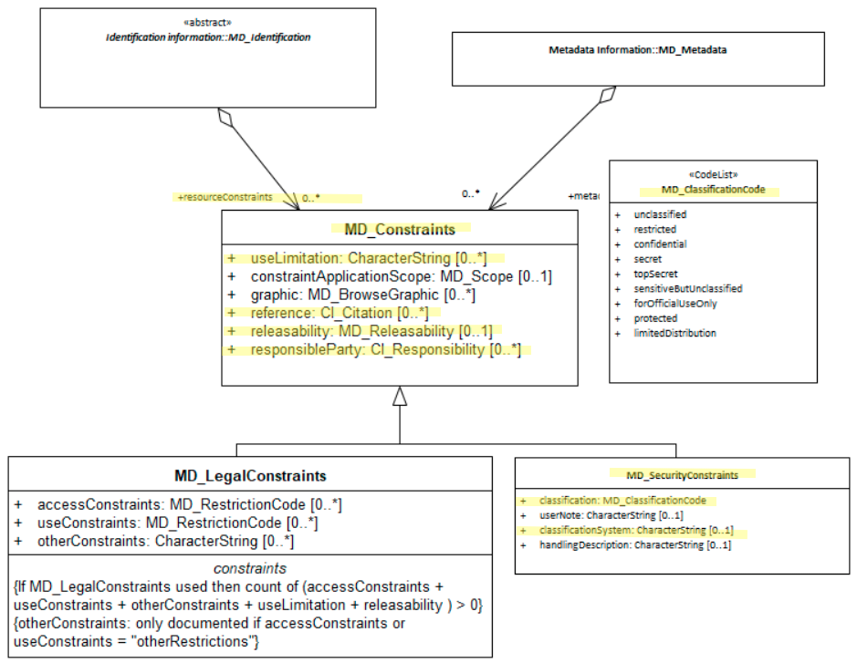

# Resource Security Constraints ★★★★★
*When constraints ([MD_Constraints]) on a spatial resource [MD_Identification]  concern security it is important to document these. Potential users need to be informed of the presence or absence of concerns about security that apply to the use of such resources.*

- **Path** - *MD_Metadata.identificationInfo>MD_DataIdentification.resourceConstraints>MD_SecurityConstraints*
- **Governance** - *National, Agency*
- **Purpose -** *Resource use* 
- **Audience - ** 
  - machine resource - ⭑ 
  - general - ⭑⭑⭑⭑⭑
  - data manager - ⭑⭑⭑⭑
  - specialist - ⭑⭑
- **Metadata type -** *administrative*
- *ICSM Level of Agreement* - ⭑⭑⭑

# Definition 
**Handling restrictions imposed on this cited resource for national security or similar concerns e.g. commercial sensitivity, privacy considerations.**

## ISO Obligation
- There should be zero to many [0..\*] security related *resourceConstraints* recorded for the cited resource in the  *[MD_DataIdentification](https://www.loomio.org/d/oqKd8GHM/class-md_dataidentification)* package of class *[MD_SecurityConstraints](https://www.loomio.org/d/1jaxGSgR/class-md_securityconstraints)* in a metadata record.

## ICSM Good Practice
- The MDWG recommends populating  `resourceConstraints`  with security constraint information to sufficient level to determine the security structures and  restrictions on a cited resource.

### Recommended Sub-Elements 
- **useLimitation -** (*type - charstr*) [0..\*] when a limitation(s) affecting the fitness for use of the resource is of a security nature. 
- **classification -** *(codelist - [MD_RestrictionCode](https://www.loomio.org/d/1jaxGSgR/class-md_securityconstraints#undefinedmd_restrictioncode)* [0..\*] name of the handling restrictions on the resource
- **userNote -** *(type - charstr)*  0 to 1 - explanation of the application of the legal constraints or other restrictions and legal prerequisites for obtaining and using the resource or metadata. Use when needed
- **classificationSystem -** *(type - charstr)*  0 to 1 - name of the classification system. Use when needed
- **handlingDescription -** *(type - charstr)*  0 to 1 - additional information about the restrictions on handling the resource or metadata. Use when needed
- See guidance provided in [MD_Constraints](https://www.loomio.org/d/TqdZp04C/class-md_constraints) for the following elements:
  - **reference -** *(class - [CI_Citation](https://www.loomio.org/d/Iei80UQH/class-ci_citation))* [0..\*] can be used to cite the Protective Security Policy Framework
  - **releasability -** *(class - [MD_Releasability](http://wiki.esipfed.org/index.php/MD_Releasability))* [0..\*] use when some parties have special considerations for use or access of the cited resource
  - **responsibleParty -** *(class [CI_Responsibility](https://www.loomio.org/d/r5blTcY0/class-ci_responsibility))* [0..\*] contact information for those responsible for managing the security of the cited resource.

# Discussion  
Many spatial resources carry some security restrictions regarding their access and use, such as national security, financial or commercial sensitivity, or privacy concerns as is common with census data. These security restrictions  need be documented for users and resource managers along with the identity of the applier of these constraints.  Each agency needs to develop consistent guidance on the use of such statement and share clear understanding of their meaning.  This is often done by reference to a external body that manages the definitions of the security constraints applied.

## Outstanding Issues

> **Australian security classification codes**
The official codes used in Australia as mandated by Australian [Protective Security Policy Framework](https://www.protectivesecurity.gov.au/Pages/default.aspx), differ from those in the [MD_RestrictionCode](https://www.loomio.org/d/1jaxGSgR/class-md_securityconstraints#undefinedmd_restrictioncode) codelist. How to address using codes other than those supplied by `MD_RestrictionCode` needs to be discussed. For interoperability, should we include the `MD_RestrictionCode` as well as the PSPF?

> **Other security frameworks support**
There will be cases where other security frameworks and classification systems need be cited, such as for New Zealand Defence. Instructions for how to include these are needed. Should such guidance be prescriptive or general?

# Recommendations 
Therefore - It is important to capture all security constraints that apply to a spatial resource. If there be none it may be useful to capture such, particularly if your organisation does regularly handle sensitive resources. Agencies should develop consistent guidance on the use of security classifications and share clear understanding of their meaning with users. 

At a minimum the name (primary and alternate) and version by which this security restriction on the access and use of this cited resource is known should be captured along with the classification value selected from the codelist - [MD_RestrictionCode](https://www.loomio.org/d/1jaxGSgR/class-md_securityconstraints#undefinedmd_restrictioncode), or the codelist mandated by your agency, e.g. Australian [Protective Security Policy Framework](https://www.protectivesecurity.gov.au/Pages/default.aspx)

## Crosswalk considerations 

### ISO19139
See guidance provided in [MD_Constraints](https://www.loomio.org/d/TqdZp04C/class-md_constraints)

### RIF-CS
Maps to the agregate `Rights/@accessRights`

# Also Consider
- **[Metadata Security Constraints](https://www.loomio.org/d/gxbVXJdF/md_identification-resourcesecurityconstraints-definition)** contains security restriction information that apply to the metadata that cites the resource.
- **[Resource Legal Constraints](https://www.loomio.org/d/kA6QOfgR/md_identification-resourcelegalconstraints)**  A sibling to resource security constraints. Contains information regarding any legal restriction on the use or access of the resource.
- **[Other Constraints ](https://www.loomio.org/d/TqdZp04C/class-md_constraints)**  other constraints that apply to the access and use of a cited resource

# Examples

## XML 

```
<mdb:MD_Metadata>
....
  <mdb:identificationInfo>
    <mri:MD_DataIdentification>
    ....
       <mri:resourceConstraints>
            <mco:MD_LegalConstraints>
               <mco:useLimitation>
                  <gco:CharacterString>Not to be used for navigation</gco:CharacterString>
               </mco:useLimitation>
               <mco:reference>
                  <cit:CI_Citation>
                     <cit:title>
                        <gco:CharacterString>“Creative Commons Attribution 4.0 International Licence”</gco:CharacterString>
                     </cit:title>
                     <cit:citedResponsibleParty>
                        <cit:CI_Responsibility>
                           <cit:role>
                              <cit:CI_RoleCode codeList="https://schemas.isotc211.org/19115/resources/Codelist/cat/codelists.xml#CI_RoleCode"
                                               codeListValue="rightsHolder"/>
                           </cit:role>
                           <cit:party>
                              <cit:CI_Organisation>
                                 <cit:name>
                                    <gco:CharacterString>OpenWork Ltd</gco:CharacterString>
                                 </cit:name>
                                 <cit:contactInfo>
                                    <cit:CI_Contact>
                                       <cit:address>
                                          <cit:CI_Address>
                                             <cit:electronicMailAddress>
                                                <gco:CharacterString>info@openwork.nz</gco:CharacterString>
                                             </cit:electronicMailAddress>
                                          </cit:CI_Address>
                                       </cit:address>
                                    </cit:CI_Contact>
                                 </cit:contactInfo>
                              </cit:CI_Organisation>
                           </cit:party>
                        </cit:CI_Responsibility>
                     </cit:citedResponsibleParty>
                  </cit:CI_Citation>
               </mco:reference>
               <mco:accessConstraints>
                  <mco:MD_RestrictionCode codeListValue="copyright"
                                          codeList="https://schemas.isotc211.org/19115/resources/Codelist/cat/codelists.xml#MD_RestrictionCode"/>
               </mco:accessConstraints>
               <mco:useConstraints>
                  <mco:MD_RestrictionCode codeListValue="otherRestrictions"
                                          codeList="https://schemas.isotc211.org/19115/resources/Codelist/cat/codelists.xml#MD_RestrictionCode"/>
               </mco:useConstraints>
               <mco:otherConstraints>
                  <gco:CharacterString>For non-commercial purposes only</gco:CharacterString>
               </mco:otherConstraints>
            </mco:MD_LegalConstraints>
         </mri:resourceConstraints>
     ....
     </mri:MD_DataIdentification>
</mdb:identificationInfo>
....
</mdb:MD_Metadata>
```

## UML diagrams

Recommended elements highlighted in Yellow

