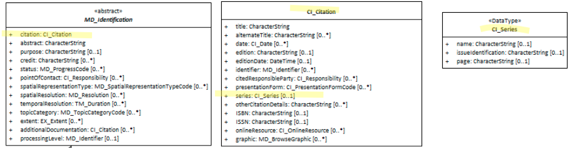

#  Resource Series ★★★
*Very often, resources identified in a catalogue are part of a larger body of work. When this is the case it is useful to document such a relation in the metadata.  The resource metadata element *series* is designed for this purpose.*

- **Path** - *MD_Metadata.identificationInfo>MD_DataIdentification.citation>CI_Citation.series*
- **Governance** -  *Agency, Domain*
- **Purpose -** *Discovery, identification*
- **Audience -** 
  - machine resource - ⭑⭑⭑
  - general - ⭑⭑⭑⭑⭑
  - data manager - ⭑⭑⭑⭑
  - specialist - ⭑⭑⭑
- **Metadata type -** *descriptive*
- *ICSM Level of Agreement* - ⭑⭑

# Definition 
**Information about the series, or aggregate resource, of which the resource is a part.**

## ISO Obligation 
- There may be one  [0..1] *series* package for the cited resource in the  *[MD_DataIdentification.citation](./ResourceCitation)* package  of class *[CI_Series](http://wiki.esipfed.org/index.php/CI_Series)* in a metadata record.

##  ICSM Good Practice 
- This element should be populated in all metadata records where the resource is one part of a series.

### Recommended Sub Elements 
From class *[CI_Series](http://wiki.esipfed.org/index.php/CI_Series)*
- **name -** *(type - charStr)* [0..1] name of the series, or aggregate resource, of which the resource is a part
- **issueIdentification -**  *(type - charStr)*  [0..1]  information identifying the issue of the series
- **page -** *(type - charStr)* [0..1] Mostly not recommended as not common. Details on which pages of the publication the article was published

# Discussion 
The content of all three *CI_Series* elements are free text and optional. How one would link back to the Series metadata is unclear. It could be captured in "Name" as a resolvable URI. Perhaps through the Parent Metadata element? What is the relation between "Series" and "Parent Metadata"

It Is conceivable that there may be more than one series to which a dataset may belong. The dataset may be part of a time series while also part of a thematic series. But, by the standard, a resource may only belong to one cited series. Guidance needs to be developed for users on this topic.

# Recommendations 
**Series** has proven to be a difficult element to pin down for a number of reasons. Below is a list of issues that should be included in good practice guidance on this element:

* Definition of this element needs to be expanded to include a definition of "Series" in our context.
* Which a cardinality of zero to one, we need this well defined since it is conceivable that a resource may be part of multiple series depending on the definition and post of view.
* Good practices of how one captures links to series metadata needs development.
* The relation (if any) between series and parent metadata needs discussion.
* The use of the three CI_Series elements are not well defined for the spatial context in which they reside. Further discussion is recommended.

Until these topics are resolved I would not recommend the inclusion of Series as recommended elements.
If series information is to be captured, the minimum information needed would be CI_Series > name.  

It may be better to use other elements such as `parentMetadata` or `associatedResource` to capture series type relationships.

## Crosswalk considerations

### DCAT
Maps to `prov:wasMemberOf` 

### RIF-CS
Maps to `Context` 

# Also Consider
- **[Parent Metadata](./ParentMetadata)** - hierarchical relations of metadata records
- **[AssociatedResource](./AssociatedResources)** information about aggregate data and related resources
- **[Resource  Citation](./ResourceCitation)** - parent to this element

# Examples

## XML 
```
<mdb:MD_Metadata>
....
   <mdb:identificationInfo>
      <mri:MD_DataIdentification>
      ....
         <mri:citation>
            <cit:CI_Citation>
               ....
               <cit:series>
                  <cit:CI_Series>
                     <cit:name>
                        <gco:CharacterString>OpenWork GeoData Series</gco:CharacterString>
                     </cit:name>
                     <cit:issueIdentification gco:nilReason="missing">
                        <gco:CharacterString/>
                     </cit:issueIdentification>
                  </cit:CI_Series>
               </cit:series>
               .....
           </cit:CI_Citation>
         </mri:citation>
         ....
      </mri:MD_DataIdentification>
   </mdb:identificationInfo>
....
</mdb:MD_Metadata>
```

## UML diagrams
Recommended elements highlighted in Yellow

