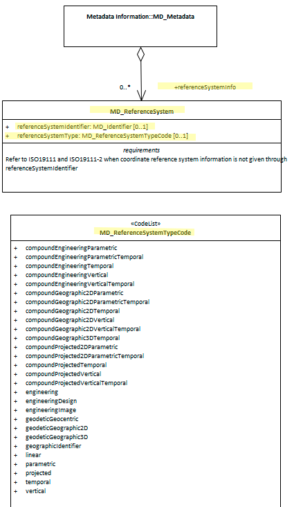

# Spatial Reference System ★★★★
*In order to be of repeatable use and combined with other resources, geospatial information is most always captured according to a [spatial reference system - (SRS)](https://www.w3.org/TR/sdw-bp/#dfn-coordinate-reference-system-(crs)). (Also referred to as a Coordinate Reference System - CRS.) Sharing the specifics of the reference systems used allows the resource to be compared and combined with others with precision and accuracy.*

- **Path** - *MD_Metadata.referenceSystemInfo*
- **Governance** - 
  - Common (for acceptable CRS registries)
  - Domain (for acceptable values within a community of users)
- **Primary use -** *Usage, Fitness*
- **Audience -**
  - machine resource - ⭑⭑⭑⭑
  - general - ⭑⭑
  - data manager - ⭑⭑⭑⭑
  - specialist - ⭑⭑⭑⭑⭑
- **Metadata type -** *Structural*
- *ICSM Level of Agreement* - ⭑⭑⭑

## Definition
**The information about the reference system that define the system use to describe spatial position descriptions in a resource.**

### ISO Obligation
- There should be zero or many [0..\*] *spatialReferenceInfo* packages for the cited resource in the  *[MD_Metadata](./class-MD_Metadata)* package of class *[MD_ReferenceSystem](http://wiki.esipfed.org/index.php/MD_ReferenceSystem)* in a metadata record for spatial resources.

### ICSM Good Practice
- There should be at least one instance of spatialReferenceInfo for every dataset that contains spatial information referenced to a datum.

#### Recommended Sub-Classes
* **referenceSystemType -** (*codelist - [MD_ReferenceSystemTypeCode](http://wiki.esipfed.org/index.php/ISO_19115-3_Codelists#MD_ReferenceSystemTypeCode)*) 0 to 1 - to describe the type of system used.
* **referenceSystemIdentifier -** *(class - [MD_Identifier](./class-MD_Identifier))* mandatory - identifier, codespace and authority information for reference system
  * *code -* (type - charStr) mandatory - alphanumeric value identifying an instance in the namespace, e.g. '4283', '4326'
  * *codespace -* (type - charStr) strongly recommended - 	Identifier or namespace in which the code is valid, e.g. EPSG
  * *version -* (type - charStr) optional - use if needed to distinguish a code
  * *description -* (type - charStr) optional - Common language description of the reference system, e.g. 'WGS84 - World Geodetic System 1984, used in GPS', 'NZTM'
  * *authority -* (class - [CI_Citation](./class-CI_Citation)) optional (GA, ABARES - conditional?) - Information about the party responsible for the spatial or temporal reference system used in this cited resource.

#### Related Codelists
**MD_ReferenceSystemTypeCode**
  There are 28 options to choose from in the reference system type code list (MD_ReferenceSystemTypeCode). Many would never be used by a particular professional. The most common for most geospatial professionals is 'projected'. The list below sorts these options with the most common on top.

  * Common
    * **projected -** coordinate reference system derived from a two-dimensional geodetic coordinate reference system by applying a map projection e.g. easting, northing
    * **temporal -** reference system against which time is measured e.g. time
    * **vertical -** one-dimensional coordinate reference system based on a vertical datum (datum describing the relation of gravity-related heights or depths to the Earth) e.g. [gravity-related] height or depth
    * **geodeticGeographic2D -** geodetic CRS having an ellipsoidal 2D coordinate system e.g. latitude, longitude
    * **geodeticGeographic3D -** geodetic CRS having an ellipsoidal 3D coordinate system e.g. latitude, longitude, ellipsoidal height

  * Less common
    * **geodeticGeocentric -** geodetic CRS having a Cartesian 3D coordinate system e.g. [geocentric] X,Y,Z
    * **geographicIdentifier -** spatial reference in the form of a label or code that identifies a location e.g. post code
    * **linear -** reference system that identifies a location by reference to a segment of a linear geographic feature and distance along that segment from a given point e.g. x km along road

  * Specialised
    * *compoundGeographic2DTemporal* - compound spatio-temoral coordinate reference system containing a 2 dimensional geographic horizontal coordinate reference system and a temporal reference system e.g. latitude, longitude, time
    * *compoundGeographic2DVertical* - compound coordinate reference system in which one constituent coordinate reference system is a horizontal geodetic coordinate reference system and one is a vertical coordinate reference system e.g. latitude, longitude, [gravity-related] height or depth
    * *compoundGeographic2DVerticalTemporal* - compound spatio-temporal coordinate reference system containing a 2 dimensional geographic horizontal, a vertical, and a temporal coordinate reference system e.g. latitude, longitude, height, time
    * *compoundGeographic3DTemporal* - compound spatio-temporal coordinate reference system containing a 3 dimensional geographic and a temporal coordinate reference system e.g. latitude, longitude, ellipsoidal height, time
    * *compoundGeographic2DParametric* - compound statio-parametric coordinate reference system containing a 2 dimensional geographic horizontal coordinate reference system and a parametric reference system e.g. latitude, longitude, pressure
    * *compoundGeographic2DParametricTemporal* - compound statio-parametric-temporal coordinate reference system containing a 2 dimensional geographic horizontal, a parametric and a temporal coordinate reference system e.g. latitude, longitude, pressure, time
    * *compoundProjected2DParametric* - compound statio-parametric coordinate reference system containing a projected horizontal coordinate reference system and a parametric reference system e.g. easting, northing, density
    * *compoundProjected2DParametricTemporal* - compound statio-parametric-temporal coordinate reference system containing a projected horizontal, a parametric, and a temporal coordinate reference system e.g. easting, northing, density, time
    * *compoundProjectedTemporal* - compound spatio-temporal coordinate reference system containing a projected horizontal and a temporal coordinate reference system e.g. easting, northing, time
    * *compoundProjectedVertical* - compound spatial reference system containing a horizontal projected coordinate reference system and a vertical coordinate reference system e.g. easting, northing, [gravity-related] height or depth
    * *compoundProjectedVerticalTemporal* - compound spatio-temporal coordinate reference system containing a projected horizontal, a vertical, and a temporal coordinate reference system e.g. easting, northing, height, time
    * *engineering* - coordinate reference system based on an engineering datum (datum describing the relationship of a coordinate system to a local reference)e.g. [local] x,y
    * *engineeringDesign* - engineering coordinate reference system in which the base representation of a moving object is specified e.g. [local] x,y
    * *engineeringImage* - coordinate reference system based on an image datum (engineering datum which defines the relationship of a coordinate system to an image)e.g. row, column
    * *parametric* - coordinate reference system based on a parametric datum (datum describing the relationship of a parametric coordinate system to an object) e.g. pressure
    * *compoundEngineeringParametric* - compound spatio-parametric coordinate reference system containing an engineering coordinate reference system and a parametric reference system e.g. [local] x, y, pressure
    * *compoundEngineeringParametricTemporal* - compound spatio-parametric-temporal coordinate reference system containing an engineering, a parametric, and a temporal coordinate reference system e.g. [local] x, y, pressure, time
    * *compoundEngineeringTemporal* - compound spatio-temporal coordinate reference system containing an engineering and a temporal coordinate reference system e.g. [local] x, y, time
    * *compoundEngineeringVertical* - compound spatial reference system containing a horizontal engineering coordinate reference system and a vertical coordinate reference system e.g. [local] x, y, height
    * *compoundEngineeringVerticalTemporal* - compound spatio-temporal coordinate reference system containing an engineering, a vertical, and a temporal coordinate reference system e.g. [local] x, y, height, time

## Discussion  
In order to common understand of location in geospatial resource, standardised spatial reference systems are used. A spatial reference helps describe where features are located in the real world. Different spatial reference systems are used for different purposes. (The terms spatial reference and coordinate system used interchangeably although they are slightly different.) People and machines that use spatial resources need to be provided in the metadata the details of the spatial reference systems used by the resource in order to conduct meaningful analysis and to combine this resource with others.

To adequately describe a resource, there may be the need to include multiple SRS in the metadata. Usually, each of these would be of a different type (referenceSystemType).


### Outstanding Issues

> **Dynamic (Earth Centric) Datums**
When the SRS is Earth centered as is the case with WGS 84, in order to understand position relative to object catured in the same SRS but at a different date, the *Epoch* (time of posisiton information capture) must be recorded. A best practice way of doing so is under discussion. A full resolution of this problem will most likely require changes to the ISO19115-1 standard.

> **Authority**
Authority has been indicated as a conditional field by ABARES and GA.  But little guidance exist on the use of this element in this context. Should authority be about the owner of the registry (e.g. EPSG) or the provider of the SRS (LINZ in the case of NZTM)?

> **MD_ReferenceSystemTypeCode**
This is a long and confusing list. Should we recommend a shortly one?


## Recommendations
Therefore - To ensure the usability of your spatial resource, it is important to include the Spatial Reference System used by this resource in its metadata. Doing so will allow the proper use and analysis to occur.

At a minimum the reference system type, the code and the codespace must be captured. 

To date the European Petroleum Survey Group (EPSG) holds the most complete and common register of SRS. It is recommended that this source be used as codespace (and authority?) for SRS information in the metadata.

### Crosswalk considerations

<details>

#### Dublin core / CKAN / data.gov.au
No mapping provided

#### DCAT
Maps to `dct:conformsTo`

#### RIF-CS
Maps to the aggregate element `Coverage/Spatial`

</details>

## Also Consider
- **[Spatial representation information](http://wiki.esipfed.org/index.php/ISO_Spatial_Representation)** *(class - [MD_SpatialRepresentation](http://wiki.esipfed.org/index.php/MD_SpatialRepresentation))* Not discussed by MDWG. Contains detailed information about digital mechanisms used to represent spatial information. Particularly useful for gridded data.

## Examples

<details>

### XML
```
<mdb:MD_Metadata>
....
  <mdb:referenceSystemInfo>
      <mrs:MD_ReferenceSystem>
         <mrs:referenceSystemIdentifier>
            <mcc:MD_Identifier>
               <mcc:code>
                  <gco:CharacterString>WGS 1984</gco:CharacterString>
               </mcc:code>
            </mcc:MD_Identifier>
         </mrs:referenceSystemIdentifier>
      </mrs:MD_ReferenceSystem>
  </mdb:referenceSystemInfo>
....
</mdb:MD_Metadata>
```

### UML diagrams
Recommended elements highlighted in Yellow



</details>

\pagebreak
