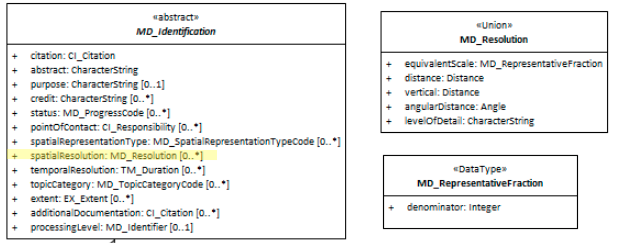

#  Spatial Resolution ★★★★★
*To be useful for its given purpose geospatial data is recorded at an appropriate level of generalisation. This helps reduce overhead and can give a more useful product for the scale it is designed to be used. Too much data can be as much a problem as too little. Providing users this information allows better judgement as to the fitness of the resource to their purpose.*

- **Path** - *MD_Metadata.identificationInfo>MD_DataIdentification.spatialResolution*
- **Governance** -  *Common ICSM*
- **Purpose -** *discovery, evaluation*
- **Audience -** 
  - machine resource - ⭑⭑
  - general - ⭑⭑⭑⭑⭑
  - data manager - ⭑⭑⭑
  - specialist - ⭑⭑⭑⭑
- **Metadata type -** *structural*
- *ICSM Level of Agreement* - ⭑⭑⭑

# Definition 
**The nominal scale and/or spatial resolution of the resource.**

## ISO Obligation 
- There may zero to many [0..\*] *spatialResolution* entries for the cited resource in the  *[MD_DataIdentification](./class-MD_DataIdentification)* package of class *[MD_Resolution](http://wiki.esipfed.org/index.php/MD_Resolution)* in a metadata record.

## ICSM Good Practice 
- The *spatialReolution* package should be populated with enough information to give the reader a good understanding of the spatial scale at which the resource was designed to be used.

### Recommended Sub-Elements  
**MD_Resolution** [1..1] is a class of type *Union* (meaning only one attribute from the available list can be used) that provides level of detail expressed as a scale factor, a distance or an angle. Similar to codelist, one and only one [1..1] must be chosen per `spatailResolution` instance. Possible attribute choice include:
- **equivalentScale -** *(class - [MD_RepresentativeFraction](http://wiki.esipfed.org/index.php/MD_RepresentativeFraction))* 
  - level of detail expressed as the scale of a comparable hardcopy map or chart
  - MD_RepresentativeFraction derived from ISO/TS 19103 Scale where MD_RepresentativeFraction.denominator = 1 / Scale.measure And Scale.targetUnits = Scale.sourceUnits
    * denominator - integer - the number below the line in a vulgar fraction
- **distance -**  *(type - [Distance](http://wiki.esipfed.org/index.php/Distance))*  
  * horizontal ground sample distance
  * Distance: This class is documented in full in ISO/TS 19103. Includes unitOfMeasure attribute 
    * UnitOfMeasure: This class is documented in full in ISO/TS 19103. 
- **vertical -** *(type - [Distance](http://wiki.esipfed.org/index.php/Distance))*  
    * vertical sampling distance
    * Distance: This class is documented in full in ISO/TS 19103. Includes unitOfMeasure attribute 
      * UnitOfMeasure: This class is documented in full in ISO/TS 19103.
- **angularDistance -** *(type - [Angle](http://wiki.esipfed.org/index.php/Angle))*  
  * angular sampling measure
  * Angle: Amount of rotation needed to bring one line or plane into coincidence with another, generally measured in radians or degrees. This class is documented in full in ISO/TS 19103.
    * UnitOfMeasure: This class is documented in full in ISO/TS 19103.
- **levelOfDetail -** *(type - charStr)* 
  - brief textual description of the spatial resolution of the resource

# Discussion 
*SpatialResolution* is most commonly represented as a factor which provides a general understanding of the density of spatial data in the resource or describes the range of resolutions in which a digital resource may be used.  This element should be repeated when describing upper and lower range.

*SpatialResolution* is recommended in ISO 19115.1-2015 as a metadata element to be used for discovery of geospatial resources.

*SpatialResolution* has no value of its own. The spatialResolution type are selectable from the class [MD_Resolution](http://wiki.esipfed.org/index.php/MD_Resolution).

## Outstanding Issues
> **Scale has little meaning in digital context**
The most common way of capturing spatial resolution is as a denominator value using `equivalentScale`.  While this made intuitive sense in the days of paper maps printed at a particular size, scales such as 1 : 20,000 have little real meaning when the size of a map is totally dependent on the display sceen. Will younger spatial professionals who may only have passing knowledge of fixed scale maps relate to this value? Will it have meaning to the young neo-geo? It would be useful to work towards expressing scale, a fundamental concept in geospatial data, in a more digitally friendly way.  Perhaps something like standardised zoom levels?
Would "distance", sampling size be of greater use? Most relatable would be something like "zoom level" which could be captured in "level of detail" but there is currently a lack of standardisation as to what terms like "zoom level" mean. Also, he levelOfDetail option lacks citation support that would be needed to make this usable in such a manner. Work on Discreet Global Grid Systems (DGGS) may provide some guidance to this topic.

# Recommendations 
Therefore - capture the spatial resolution of a resource as it is useful information for determining the fitness to purpose of geospatial data. Data gathered at too high or too low a resolution may make it unfit to your needs. Mixing data of different resolutions can give uncertain results. Spatial resolution provides a rough guide to the precision and accuracy of a resource. (Data quality elements should be used to document precision and accuracy more fully.)

Spatial resolution can be documented in many ways. For ISO19115-1, these are limited to the methods itemised in the class MD_Resolution and documented above. Equivalent scale is the default of many systems, including supplied templates in GeoNetwork. It is captured with a single denominator value such as "20,000" as in a 1:20,000 map.

> Note BC 19-7: Do we recommend equivalent scale as default?

## Crosswalk considerations

### Dublin core / CKAN / data.govt.nz
Maps to ?

### DCAT
Maps to ?

### RIF-CS
Maps to ?

# Also Consider

- **[Spatial Representation Type](./SpatialRepresentationType)** Documents the method used to spatially represent geographic information
- **dataQualityInfo>MD_DataQuality -** TBD - From ISO19157 - quality information for the data specified by a data quality scope 

# Examples

## ABARES
```
    <mri:spatialResolution><mri:MD_Resolution>
        <mri:distance><gco:Distance uom="metre">123</gco:Distance></mri:distance>
    </mri:MD_Resolution></mri:spatialResolution>
    <mri:spatialResolution><mri:MD_Resolution>
        <mri:angularDistance><gco:Angle uom="degreeLatitude">0.1</gco:Angle></mri:angularDistance>
    </mri:MD_Resolution></mri:spatialResolution>
    <mri:spatialResolution><mri:MD_Resolution>
        <mri:angularDistance><gco:Angle uom="degreeLongitude">0.05</gco:Angle></mri:angularDistance>
    </mri:MD_Resolution></mri:spatialResolution>
    <mri:spatialResolution><mri:MD_Resolution>
        <mri:vertical><gco:Distance uom="metre">123</gco:Distance></mri:vertical>
    </mri:MD_Resolution></mri:spatialResolution>
```

## GA
```
    <mri:spatialResolution>
        <mri:MD_Resolution>
            <mri:levelOfDetail>
               <gco:CharacterString>1:1000000 to 1:2000000</gco:CharacterString>
            </mri:levelOfDetail>
        </mri:MD_Resolution>
    </mri:spatialResolution>
```
> Note BC 11-6: This example from GA, shown here as levelOfDetail, would more appropriately be captured as equivalentScale. But interestingly, this information is sharing the range in which the data are useful.  This is a useful approach, but is this standard sufficiently able to support this?


## XML -
```
<mdb:MD_Metadata>
....
   <mdb:identificationInfo>
      <mri:MD_DataIdentification>
      ....
         <mri:spatialResolution>
            <mri:MD_Resolution>
               <mri:distance>
                  <gco:Distance uom="m">1</gco:Distance>
               </mri:distance>
            </mri:MD_Resolution>
         </mri:spatialResolution>
         ....
      </mri:MD_DataIdentification>
   </mdb:identificationInfo>
....
</mdb:MD_Metadata>
```

## UML diagrams
Recommended elements highlighted in Yellow

