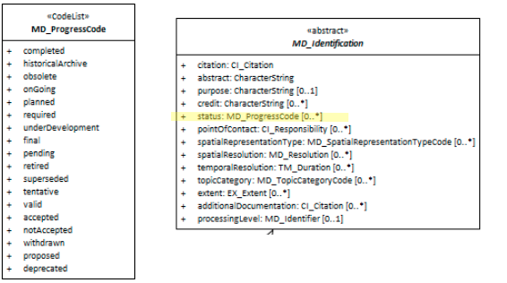

# Resource Status ★★★★
*In order to quickly find, catagorise and evaluate the fitness of a resource to our needs it is usefull to include in our metadata a high level description of the progress status of the resource our metadata descibes.*

- **Path** - *MD_Metadata.identificationInfo>MD_DataIdentification.status*
- **Governance** -  *Common ICSM*
- **Purpose -** *discovery, management*
- **Audience -** 
  - machine resource - ⭑⭑⭑
  - general - ⭑⭑⭑⭑
  - data manager - ⭑⭑⭑⭑
  - specialist - ⭑⭑⭑
- **Metadata type -** *descriptive, administrative*
- *ICSM Level of Agreement* - ⭑⭑⭑

# Definition 
**The status of the resource populated from a domain of values** 

## ISO Obligation 
- There can be zero to many [0..\*] *status* entries for the cited resource in the  *[MD_DataIdentification](./class-MD_DataIdentification)* package selected from codelist *[MD_ProgressCode](http://wiki.esipfed.org/index.php/ISO_19115_and_19115-2_CodeList_Dictionaries#MD_ProgressCode)*.

## ICSM Good Practice  
  - At least one instance of this element should be populated in all metadata records.

### Possible Values for **status** *(codelist - MD_ProgressCode)* 
- *completed -* has been completed
- *historicalArchive -* stored in an offline storage facility
- *obsolete -* no longer relevant
- *onGoing -* continually being updated
- *planned -* fixed date has been established upon or by which the resource will be created or updated
- *required -* needs to be generated or updated
- *underDevelopment -* currently in the process of being created
- *final -* progress concluded and no changes will be accepted
- *pending -* committed to, but not yet addressed
- *retired -* item is no longer recommended for use. It has not been superseded by another item
- *superseded -* replaced by new
- *tentative -* provisional changes likely before resource becomes final or complete
- *valid -* acceptable under specific conditions
- *accepted -* agreed to by sponsor
- *notAccepted -* rejected by sponsor
- *withdrawn -* removed from consideration
- *proposed -* suggested that development needs to be undertaken
- *deprecated -* resource superseded and will become obsolete, use only for historical purposes

# Discussion 
According to the ISO model, a resource may exist in many states. Not all values are mutual exclusive. This element is optional and has only been lightly discussed. As it has been determined a valuable element we may want to increase these recommendations.

## Outstanding Issues
> **Abstract Class - MD_Identification**
SpatialRepresentationType is one of many elements belonging to the abstract class MD_Identification.  MD_Identification is only instantiated as MD_DataIdentification or SV_ServiceIdentification. At this stage we are not addressing service metadata, We are assuming all metadata is for data resources. At a later time, when we include Service metadata guidance, a seperate discussion of MD_Identifier should be made.

> **CKAN**
It has been indicatcated that CKAN records in its related field booloen values for this item. Boolean does not map well to ISO domain values. Some options in the MD_ProgressCode are noncampatible some are compatible. Clarification and validation would be useful.

# Recommendations 
Therefore - The status of a resource is valuable information to those who may want to use it. It is recommended that the status field be populated and regularly updated as needed.
As harvesting of metadata to more geeneral purpose catalogues is desirable, some thought need be given to crosswalk with boolean values (CKAN) or those that only accept one occurrence of this element.
Values for this element must come from the MD_ProgressCode codelist. 

## Crosswalk considerations

### Dublin core / CKAN / data.govt.nz
Maps to `data status`

# Examples

## XML -
```
<mdb:MD_Metadata>
....
   <mdb:identificationInfo>
      <mri:MD_DataIdentification>
      ....
         <mri:status>
            <mri:status>
            <mcc:MD_ProgressCode codeList="http://standards.iso.org/ittf/PubliclyAvailableStandards/ISO_19139_Schemas/resources/codelist/ML_gmxCodelists.xml#MD_ProgressCode"
                                 codeListValue="underDevelopment"/>
         </mri:status>
         <mri:status>
            <mcc:MD_ProgressCode codeList="http://standards.iso.org/ittf/PubliclyAvailableStandards/ISO_19139_Schemas/resources/codelist/ML_gmxCodelists.xml#MD_ProgressCode"
                                 codeListValue="tentative"/>
         </mri:status>
         ....
      </mri:MD_DataIdentification>
   </mdb:identificationInfo>
....
</mdb:MD_Metadata>
```

## UML diagrams
Recommended elements highlighted in Yellow

