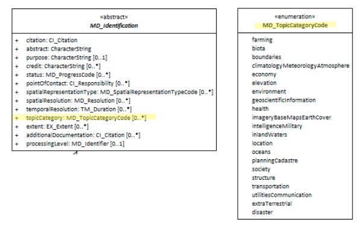

# Topic Category ★★★★★
*Categorisation of a resource against a standardised thematic keyword list provides a useful way to filter and discover resources.*

- **Path** - *MD_Metadata.identificationInfo>MD_DataIdentification.topicCategory*
- **Governance** -  *Common ICSM, Agency, Domain*
- **Purpose -** *discovery, evaluation*
- **Audience -** 
  - machine resource - ⭑⭑⭑
  - general - ⭑⭑⭑⭑⭑
  - data manager - ⭑⭑⭑⭑
  - specialist - ⭑⭑⭑⭑
- **Metadata type -** *descriptive*
- *ICSM Level of Agreement* - ⭑⭑⭑

# Definition 
**The main themes of the resource populated from a fixed domain of values**

## ISO Obligation 
- There may zero to many [0..\*] *topicCategory* entries for the cited resource in the  *[MD_DataIdentification](./class-MD_DataIdentification)* package in a metadata record selected from the enumeration *MD_TopicCategoryCode*.

## ICSM Good Practice 
- Populate of the *topicCategory* element as many times as useful for search and categorisation of the resource.  Values are restricted to those provided by *MD_TopicCategoryCode*

### Possible Values for *topicCategory* 
Type enumeration - [MD_TopicCategoryCode](http://wiki.esipfed.org/index.php/ISO_19115_and_19115-2_CodeList_Dictionaries#MD_TopicCategoryCode) 
- **farming -** rearing of animals and/or cultivation of plants
  - Examples: agriculture, irrigation, aquaculture, plantations, herding, pests and diseases affecting crops and livestock
- **biota -** flora and/or fauna in natural environment 
  - Examples: wildlife, vegetation, biological sciences, ecology, wilderness, sealife, wetlands, habitat
- **boundaries -** legal land descriptions 
  - Examples: political and administrative boundaries
- **climatologyMeteorologyAtmosphere -** processes and phenomena of the atmosphere 
  - Examples: cloud cover, weather, climate, atmospheric conditions, climate change, precipitation
- **economy -** economic activities, conditions and employment 
  - Examples: production, labour, revenue, commerce, industry, tourism and ecotourism, forestry, fisheries, commercial or subsistence hunting, exploration and exploitation of resources such as minerals, oil and gas
- **elevation -** height above or below a vertical datum
  - Examples: altitude, bathymetry, digital elevation models, slope, derived products
- **environment -** environmental resources, protection and conservation 
  - Examples: environmental pollution, waste storage and treatment, environmental impact assessment, monitoring environmental risk, nature reserves, landscape
- **geoscientificInformation -** information pertaining to earth sciences 
  - Examples: geophysical features and processes, geology, minerals, sciences dealing with the composition, structure and origin of the earth's rocks, risks of earthquakes, volcanic activity, landslides, gravity information, soils, permafrost, hydrogeology, erosion
- **imageryBaseMapsEarthCover -** base maps 
  - Examples: land cover, topographic maps, imagery, unclassified images, annotations
- **intelligenceMilitary -** military bases, structures, activities
  - Examples: barracks, training grounds, military transportation, information collection
- **inlandWaters -** inland water features, drainage systems and their characteristics 
  - Examples: rivers and glaciers, salt lakes, water utilisation plans, dams, currents, floods, water quality, hydrographic charts
- **location -** positional information and services 
  - Examples: addresses, geodetic networks, control points, postal zones and services, place names
- **oceans -** features and characteristics of salt water bodies (excluding inland waters) 
  - Examples: tides, tidal waves, coastal information, reefs
- **planningCadastre -** information used for appropriate actions for future use of the land 
  - Examples: land use maps, zoning maps, cadastral surveys, land ownership
- **society -** characteristics of society and cultures 
  - Examples: settlements, anthropology, archaeology, education, traditional beliefs, manners and customs, demographic data, recreational areas and activities, social impact assessments, crime and justice, census information
- **structure -** man-made construction Examples: buildings, museums, churches, factories, housing, monuments, shops, towers
- **transportation -** means and aids for conveying persons and/or goods 
  - Examples: roads, airports/airstrips, shipping routes, tunnels, nautical charts, vehicle or vessel location, aeronautical charts, railways
- **utilitiesCommunication -** energy, water and waste systems and communications infrastructure and services
  - Examples: hydroelectricity, geothermal, solar and nuclear sources of energy, water purification and distribution, sewage collection and disposal, electricity and gas distribution, data communication, telecommunication, radio, communication networks
- **extraTerrestrial -** region more than 100 km above the surface of the Earth
- **disaster -**   Information related to disasters
  - Examples: site of the disaster, evacuation zone, disaster-prevention facility, disaster relief activities

# Discussion 
The Resource Topic Category is recommended in ISO 19115.1-2015 as a metadata element to be used for discovery of geospatial resources. It provides high level filtering of data using standardised terms from the enumeration `MD_Topic CategoryCode`. This enumeration cannot be extended and should not be as it is the fixed nature that makes this element of particular value. These values allow metadata aggregated from anywhere in the world to be sorted and filtered into like categories - such as is done in a faceted search interface. Search results can be easily sorted by humans and machines. If this list were extensible, this would not be as effective.

Many resources may fit into multiple categories.  ISO199115-1 allows multiple instances of `topicCategory` to accomodate such instances.  Discussions need be made as to when an aspect of the resource is too minor to include an instance of the `MD_TopicCategoryCode` value.

Topic categories are essentially keywords, but of a particular enumeration. Like other keywords, search engines and indices use these to provide search support.  If a topic category code satisfies the need for a particular keyword, it is probably unbeneficial to include that value as part of your [Keywords](./Keywords).

## Outstanding Issues
> **GeoNetwork issues**
NOTE BC 11-6: GeoNetwork 3.6 ISO 19115-3 template currently lacks the domain restriction tools on the editor for Topic category. It also lacks multiplicity on his element. Pointers to the codelist do not appear in the records for MD_TopicCategoryCode. This needs to be fixed.

# Recommendations 
Therefore -  in order to comply with ICSM best guidance, include at least one instance of `topicCategory` in the metadata for your resource  to provide high level filtering and categorisation of data. Multiple values may be captured and this is encouraged as to avoid the lack of discovery due to too narrow categorisations. This field is particularly useful in faceted search interfaces such as GeoNetwork.

It is not recommended that this list be extended as its value is in part due to the standardised values it contains. Extended values, if needed are better captured in other keyword fields.

## Crosswalk considerations

### ISO19139
This element, along with spatialRepresentationType and spatialResolution, were moved from MD_DataIdentification to MD_Identification in order to allow their use for service identification. Two new values were added to this enumeration: *extraTerrestrial* and *disaster* from the ISO19139 version.

### Dublin core / CKAN / data.govt.nz
Maps to *ISO 19115 topic*

### DCAT
Maps to *dcat:keyword*

### RIF-CS
Maps to *Subject*

# Also Consider
- **[Keywords](./Keywords)** provides a more lengthy flexible system to attach keywords - including from custom thesari and free text.
- **[Resource Scope](./ResourceScope)** holds keyword  identifying the type of resource, e.g. service, a collection, an application which the metadata describes
- **[Spatial Representation Type](./SpatialRepresentationType)** holds keywords related to the spatial type of the resource, such as vector, grid, tin, etc.

# Examples

## XML 
```
<mdb:MD_Metadata>
....
   <mdb:identificationInfo>
      <mri:MD_DataIdentification>
      ....
         <mri:topicCategory>
            <mri:MD_TopicCategoryCode>environment</mri:MD_TopicCategoryCode>
         </mri:topicCategory>
         <mri:topicCategory>
            <mri:MD_TopicCategoryCode>biota</mri:MD_TopicCategoryCode>
         </mri:topicCategory>
         <mri:topicCategory>
            <mri:MD_TopicCategoryCode>inlandWaters</mri:MD_TopicCategoryCode>
         </mri:topicCategory>
         ....
      </mri:MD_DataIdentification>
   </mdb:identificationInfo>
....
</mdb:MD_Metadata>
```

## UML diagrams
Recommended elements highlighted in Yellow

