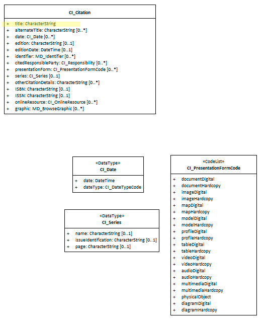

# class - CI_Citation 

In order to provide a standardised way of capturing information related to the various citations described in a metadata record, a shema, by way of the CI_Citation is provided. The provision of a consitant way of structuring this information make it easier to capture and understand.

- **Governance** -  *ISO*
- **Metadata Type -** *structural*
- *ICSM Level of Agreement* - ⭑⭑

# Definition 

**A standardized resource reference framework.**

## ISO Associations (May be found in) -
- MD_Metadata.parentMetadata 
- MD_Metadata.metadataStandard
- MD_Metadata.metadataProfile
- MD_Metadata.alternativeMetadataReference
- MD_Identification.citation
- MD_Identification.additionalDocumentation
- MD_Keywords.thesaurusName
- MD_KeywordsClass.ontology
- MD_Usage.additionalDocumentation
- MD_Usage.identifiedIssues
- MD_AssociatedResource.name
- MD_AssociatedResource.metadataReference
- MD_Constraints.reference
- LI_Lineage.additionalDocumentation
- LI_ProcessStep.reference
- LI_Source.sourceCitation
- LI_Source.sourceMetadata
- MD_Georeferenceable.parameterCitation
- MD_FeatureCatalogueDescription.featureCatalogueCitation
- MD_PortrayalCatalogueReference.portrayalCatalogueCitation
- MD_Format.formatSpecificationCitation
- MD_Medium.name
- MD_ApplicationSchemaInformation.name
- SV_ServiceIdentification.operatedDataset
- SV_ServiceIdentification.profile
- SV_ServiceIdentification.serviceStandard
- SV_CoupledResource.resourceReference
- MD_Identifier.authority
- 

### Recomended Attributes - 
- **title -** *(type - charStr)*[1..1] Mandatory - name by which the cited resource is known
- **alternateTitle -** *(type - charStr)* [0..\*] short name or other language name by which the cited information is known. Example: DCW as an alternative title for Digital Chart of the World. Recommended whenever there are alternate names commonly in use.
- **date -** *(class - [CI_Date](./class-CI_Date))*  [0..\*]  reference date for the cited resource
- **edition -** *(type - charStr)* [0..1] version of the cited resource
- **editionDate -** *(type - DateTime)*[0..1] date of the edition
- **identifier -** *(class - [MD_Identifier](./class-MD_Identifier))* [0..\*] value uniquely identifying an object within a namespace
- **citedResponsibleParty -** *(class - [CI_Responsibility](./class-CI_Responsibility))*[0..\*] roles, name, contact, and position information for an individual or organisation that is responsible for the resource
- **presentationForm -**  *(class - [CI_PresentationFormCode](http://wiki.esipfed.org/index.php/ISO_19115-3_Codelists#CI_PresentationFormCode))* [0..\*] mode in which the resource is represented
- **series -**  *(class - [CI_Series](http://wiki.esipfed.org/index.php/CI_Series))* [0..1] information about the series, or aggregate resource, of which the resource is a part
- **otherCitationDetails -**  *(type - charStr)* [0..\*] other information required to complete the citation that is not recorded elsewhere
- **ISBN -**  *(type - charStr)* [0..1] international Standard Book Number
- **ISSN -**  *(type - charStr)* [0..1] international Standard Serial Number
- **onlineResource -**  *(class -  [CI_OnlineResource](./class-CI_OnlineResource))* [0..\*] online reference to the cited resource
- **graphic -**  *(class - [MD_BrowseGraphic](http://wiki.esipfed.org/index.php/MD_BrowseGraphic))* [0..\*] citation graphic or logo for cited party

# Discussion
Citations are used to provide information about citing the resource being described in the metadata or to refer to resources outside of the metadata record.
Citations use CI_Citation and cite the party responsible using CI_Responsibility. CI_Responsibility may be used without CI_Citation. CI_Responsibility is an aggregate of one or more parties (CI_Party). CI_Party may be specified as CI_Individual and/or CI_Organisation.

# Recommendations 

Therefore - It is recommended that all citation instances follow the general guidance of ISO 19115-1 unless directed otherwise. The mandatory element `title` must be populated in all instances noting the the type and form of the contents in this field is dependent on location in the metadata record.

> Note BC 18-7 - MDWG may wish to further standardise the use of CI_Citation

## References

http://wiki.esipfed.org/index.php/CI_Citation

https://geo-ide.noaa.gov/wiki/index.php?title=ISO_Citations#CI_Citation.2B.2B

## UML diagrams

Recommended elements highlighted in Yellow

