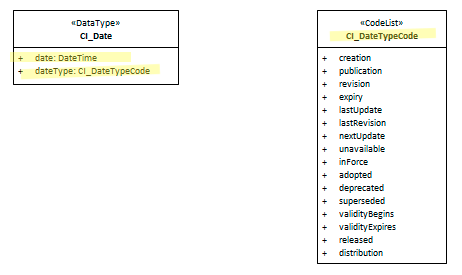

#  class - CI_Date
To support and maintain the recording of temporal elements in the metadata it is important to provide consistency of use. The class CI_Date provides this for all temporal elements in a ISO 19115-1 metadata record.

- **Governance** -  *ISO*
- **Metadata type -** *administrative*
- *ICSM Level of Agreement* - ⭑⭑⭑

# Definition 

**A reference date and event used to describe it**

## ISO Associations -
- MD_Metadata.dateInfo
- CI_Citation.date
- MD_MaintenanceInformation.maintenanceDate
- PT_LocaleContainer.date

### ICSM Recommended Sub-Elements 
For class CI_OnlineResource 
- **date -** *(type - DateTime)* [1..1] Madatory for CI_OnlineResource instances. Must be in ISO 8601 format
- **dateType -** *(codelist - [CI_DateTypeCode](https://geo-ide.noaa.gov/wiki/index.php?title=ISO_19115_and_19115-2_CodeList_Dictionaries#CI_DateTypeCode))* [1..1] Madatory for CI_OnlineResource instances. Event used for reference date. Options include:
  - creation - date identifies when the resource was brought into existence
  - publication - date identifies when the resource was issued
  - revision - date identifies when the resource was examined or re-examined and improved or amended 
  - expiry - date identifies when resource expires 
  - lastUpdate - date identifies when resource was last updated
  - lastRevision - date identifies when resource was last reviewed
  - nextUpdate - date identifies when resource will be next updated
  - unavailable - date identifies when resource became not available or obtainable
  - inForce - date identifies when resource became in force
  - adopted - date identifies when resource was adopted
  - deprecated - date identifies when resource was deprecated
  - superseded - date identifies when resource was superseded or replaced by another resource
  - validityBegins - time at which the data is considered to become valid. Note: There could be quite a delay between creation and validity begins
  - validityExpires - time at which the data is no longer considered to be valid
  - released - the date that the resource shall be released for public access
  - distribution - date identifies when an instance of the resource was distributed

# Recommendations 

Therefore - in order to provide the consistancy needed to avoid confusion for both machines and humans, it is recommended that all dates included in a metadata record implement the class CI_Date and follow the guidance provided by ISO and ICSM.

## UML diagrams

Recommended elements highlighted in Yellow

! > FIX ME
