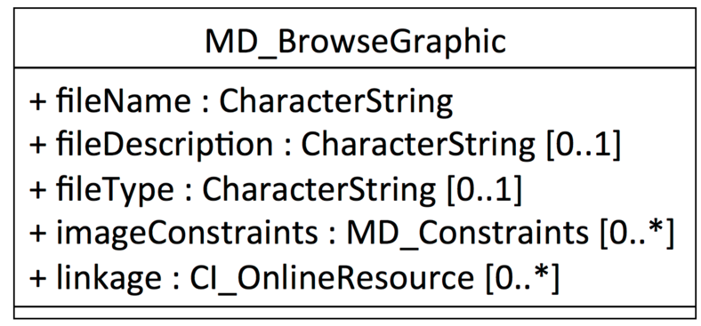

# Class - MD_BrowseGraphic

Geospatial data and service are largely visual by nature.  Geospatial practicianers tend to be visually oriented. Browse graphics are a way of including in the metadata visual clues as to the nature and usefulness of resources.

- **Governance** -  *ISO*
- **Metadata type -** *discriptive*
- *ICSM Level of Agreement* - ⭑⭑

## Definition
**A graphic that provides an illustration of a resource**

NOTE - Should include a legend for the graphic, if applicable.

EXAMPLE - A dataset, an organisation logo, security constraint or citationgraphic..

### ISO Obligation

In a metadata record there should be zero to many {0..*] graphicOverview packages  of class MD_BrowseGraphic describing  a resource. These should typically include the name linkage to the graphic.

#### Recommended Sub Elements
* **fileName -** *(type - CharStr)* Mandatory - name of the file that contains a graphic that provides an illustration of the resource. 
* **linkage -** *(class - CI_OnlineResource)*  0 to many - link to browse graphic.
* Optional
  * **imageConstraints -** *(class - MD_Constraints)*  0 to many - restriction on access and/or use of browse graphic
  * **fileType -** *(type - CharStr)* f0 to 1 - format in which the illustration is encoded (e.g.: EPS, GIF, JPEG, PBM, PS, TIFF, PDF)
  * **extent -** *(class -  EX_Extent)* Information about the horizontal, vertical and temporal extent of the resource specified by the scope

## Discussion

Geospatial professionals by nature, rely to a large extent on visual information to gain understanding of resources. Browse graphics provide in the metadata a way to communicate with users visually.

## Recommendations

Therefore - in order to provide a quick way for users to discover and identify the resource they need, provide a graphic overview in the metadata.  At a minimum this should include a name and link to the image.

### Crosswalk considerations

#### ISO19139
browseGraphic is a new package in iso19115-1. New elements include:
- **MD_BrowseGraphic.imageConstraint** *(class - [MD_Constraints](./class-md_constraints))*
  - This new element was added in order to allow the specification of constraints on a browse graphic associated with a resource.
- **MD_BrowseGraphic.linkage** *(class - [CI_OnlineResource](./class-CI_OnlineResource)*
  - This new element was added in order to allow a straightforward specification of the link to the browse graphic and the capability to add additionalinformation (name, description, …) about that graphic.

## Also Consider
- [**CI_OnLineFunctionCode**](http://wiki.esipfed.org/index.php/ISO_19115-3_Codelists#CI_OnLineFunctionCode) - A property of [CI OnlineResource](http://wiki.esipfed.org/index.php/CI_OnlineResource). This codelist contains an option *browseGraphic*

## Examples

### UML diagrams
Recommended elements highlighted in Yellow

