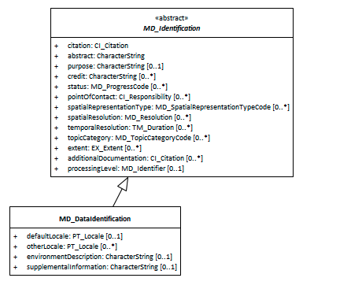

#  Class - MD_DataIdentification 
*When capturing information on a spatial cataresource, it is important to identify and categorise information as pertaining to the data resource and to distinguish these information from that which applies to the metadata itself or service resources. MD_DataIdentification extends the abstract class MD_Identification to document a spatial data resource.*

- **Governance** -  *ISO*
- **Metadata Type -** *structural*
- *ICSM Level of Agreement* - ⭑⭑

# Definition -

**basic information required to uniquely identify a data resource.**

## ISO Associations 
**[MD_Identification](http://wiki.esipfed.org/index.php/MD_Identification)** is an abstract class that is parent to 
- **MD_DataIdentification**
It is a child of 
- MD_Metadata.identificationInfo

## Atributes and packages
the following provides additional gauidance to [MD_Identification](./class-MD_Identification).

### MDWG Recomended - 
In addition to all the attributes of [MD_Identification](./class-MD_Identification), the additional recommended elements apply - 
- **[Locale -](./ResourceLocale)** *(class - [PT_Locale](./PT_Locale))* [0..1] 
- **[Extents -](./ResourceExtent)** *(class - [EX_Extent](http://wiki.esipfed.org/index.php/EX_Extent))* [0..\*]  High-level thematic classifications to assist in the grouping and searching of data. Required when the hierarchyLevelName scopeCode is 'dataset'.

### Additional optional attributes
- **[otherLocale -](./ResourceLocale)** *(class - [PT_Locale](./PT_Locale))* [0..\*] 
- **environmentDescription -** *(type - charStr)* [0..1] description of the resource in the producer's processing environment, including items such as the software, the computer operating system, file name, and the dataset size
- **supplementalInformation -** *(type - charStr)*[0..1] any other descriptive information about the resource

# Discussion
Identification information about a resource is of high importance to document as this information strongly impacts on the ability of a user to asses the resource fitness to use. MD_DataIdentification instantiates the abstract class [MD_Identification](./class-MD_Identification)  for use with data resources.

# Recommendations 
# Related Classes
- **[MD_Identification](./class-MD_Identification)** the abstract parent class to `MD_DataIdentification`
- See guidances for the composite elements.

## UML diagrams
Recommended elements highlighted in Yellow

