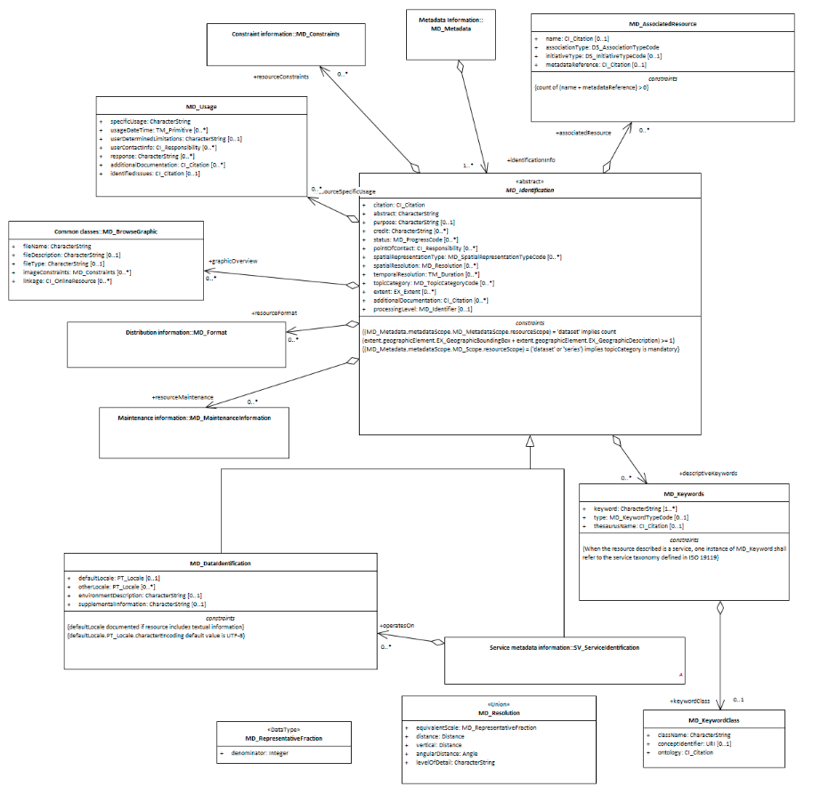

#  Class (abstract) - MD_Identification
*When capturing information on a spatial resource, it is important to identify and categorise information as pertaining to the data or service resource and to distinguish these information from that which applies to the metadata itself. MD_Identification provide a abstract package, the properties of which can be expressed for data (MD_DataIdentification) or service SV_ServiceIdentification) resources.*

- **Governance** -  *ISO*
- **Metadata Type -** *structural*
- *ICSM Level of Agreement* - ⭑

# Definition

**basic information required to uniquely identify a resource or resources.**

## ISO Requirements
At least one [1..\*] [MD_Identification](http://wiki.esipfed.org/index.php/MD_Identification)  must be present in a metadata record. This must be instantiated as a `MD_DataIdentification` or `SV_ServiceIdentification` instance.

## ISO Associations
**[MD_Identification](http://wiki.esipfed.org/index.php/MD_Identification)** is an abstract class that can be instantiated as either
- MD_DataIdentification
- SV_ServiceIdentification
It is a child of 
- MD_Metadata.identificationInfo

## Child packages  -
### Concrete subsclasses of MD_Identification
- **Data Identification -** *(class MD_DataIdentification)* > ?create Entry?
- **Service Identification -** *(class SV_ServiceIdentification)* > To Be Completed at later date

### MDWG recommended MD_Identification packages
- **[resourceLineage -](./ResourceLineage)** *(class - Li_Lineage)* [0..\*]
- **[referenceSystemInfo -](https://www.loomio.org/d/4SliNjWE/md_metadata-md_referencesystem-definition)** *(class - MD_ReferenceSystem)*
- **metadataConstraints -** *( abstract class [MD_Constraints](./class-md_constraints))* [0..\*] see
- **[Metadata Security Constraints](./MetadataSecurityConstraints)**
- **[Metadata Legal Constraints](./MetadataLegalConstraints)** 
-  **indentificationInfo -** *(abstract class - MD_Identification)* [1..\*] see:
- **Data Identification -** *(class MD_DataIdentification)* > ?create Entry?
- **Service Identification -** *(class SV_ServiceIdentification)* > To Be Completed
- **[distributionInfo -](./DistributionInfo)** *(class - MD_Distribution)* [0..\*]

### Other packages - not yet addressed by MDWG
- **metadataMaintenance -** *(class MD_MaintenanceInformation)* [0..1]
- **spatialRepresentationInfo -** *(abstract class - MD_SpatialRepresentation)* [0..\*]
- **metadataExtensionInfo -** *(class - MD_MetadataExtensionInformation)* [0..\*]
- **applicationSchemaInfo -** *(class - MD_ApplicationSchemaInformation)* [0..\*]
- **portrayalCatalogInfo -** *(class - MD_ProtrayalCatalogueReference)* [0..\*]
- **contentInfo -** *(abstract class - MD_ContentInformation)* [0..\*]
- **dataQualityInfo -** *(class - DQ_DataQuality (from ISO19157))* [0..\*]

## Atributes and packages
### MDWG Recommended
Click on the attribute name for guidance.
- **[abstract -](./Abstract)** *(type - charStr)* [1..\*] 
- **[purpose -](./Purpose)** *(type - charStr))* [0..1] 
- **[status -](./Status)** *(codelist - [MD_ProgressCode](http://wiki.esipfed.org/index.php/ISO_19115_and_19115-2_CodeList_Dictionaries#MD_ProgressCode))*[0..1]
- **[topicCategory -](./TopicCategory)** *(enumeration - [MD_TopicCategoryCode](http://wiki.esipfed.org/index.php/ISO_19115_and_19115-2_CodeList_Dictionaries#MD_TopicCategoryCode))*[0..\*]
- **[pointOfContact -](./PointOfContact)** *(class -  [CI_Responsibility](./class-CI_Responsibility))* [0..1]
- **[spatialRepresentationType -](./SpatialRepresentationType)** *(codelist - MD_SpatialRepresentationTypeCode)*[0..\*]
- **[spatialResolution](./SpatialResolution) -**  *(class - [MD Resolution](http://wiki.esipfed.org/index.php/MD_Resolution))* [0..\*] 
- **[additionalDocumentation](./AdditionalDocs) -**  *(class - [CI_Citation](./class-CI_Citation))* [0..\*] 
- **[associatedResource](./AssociatedResources) -**  *(class - [MD AssociatedResource](http://wiki.esipfed.org/index.php/MD_AssociatedResource))* [0..\*] 
- **[Citation -]()** *(class - [CI_Citation](./class-CI_Citation) 
- **[Extents -](./ResourceExtents)** *(class - [EX_Extent](http://wiki.esipfed.org/index.php/EX_Extent))* [0..\*]  High-level thematic classifications to assist in the grouping and searching of data.

### Others - not yet addressed by MDWG
- **credit -** *(type - charStr)* [0..\*] Recognition of those who contributed to the dataset. Do not include URLs here. Provide full citations in MD_AssociatedResource section.
- **temporalResolution -** *(class - [TM_PeriodDuration](http://wiki.esipfed.org/index.php/TM_PeriodDuration)* [0..\*]   The temporal resolution (level of temporal detail) of the dataset.
- **processingLevel -** *(class - [MD_Identifier](./class-MD_Identifier))* [0..\*]   An identifier code that identifies the level of processing in the producers coding system.
- **resourceSpecificUsage -** *(class - [MD_Usage](http://wiki.esipfed.org/index.php/MD_Usage))* [0..\*] Basic information about specific application(s) for which the resource(s) has been or is being used by different users.

# Discussion
Identification information about a resource is of high importance to document as this information strongly impacts on the ability of a user to asses the resource fitness to use. The **identificationInfo** package must be of either type *data*  (*MD_DataIdentification*) or *service* (*SV_ServiceIdentification*).

# Recommendations 

There must be at least one (and usually just one) `identificationInfo` packages in a metadata record that contains the substantive  information about a cited resource.

# Related Classes
- **[MD_DataIdentification](./class-MD_DataIdentification)** An instantiation of the abstract calss for data resource metadata

## UML diagrams
Recommended elements highlighted in Yellow

