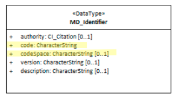

# class - MD_Identifier

In order for machines and people to distinguish singlton elements cited a Metadata record [MD_Metadata](http://link.to.MD_Metadata) , a method to provide a unique identifier. 

- **Governance** -  *ISO*
- **Metadata type -** *administrative*
- *ICSM Level of Agreement* - ⭑⭑

# Definition
**Provides a value uniquely identifying an object within a namespace**

## ISO Associations
- MD_Metadata.metadataIdentifier
- MD_ReferenceSystem.referenceSystemIdentifier
- MD_Medium.identifier
- MD_RangeDimension.name
- MD_ImageDescription.imageQualityCode
- MD_CoverageDescription.processingLevelCode
- EX_GeographicDescription.geographicIdentifier
- CI_Citation.identifier 
- CI_Party.PartyIdentifier

### Sub Elements for class MD_Identifier
- **code -** (*type - charStr*) [1..1] alphanumeric value identifying an instance in the namespace, mandatory when identifier is provided
- **codespace -** *(type - charStr)* [0..1] identifier or namespace in which the code is valid. Usually a  URL  path by which, when combined with the uuid, the full path to the resource is provided.
- **authority -** *(class CI_Citation)* [0..1] the provider of the UUID
- **version -** (*type - charStr*) [0..1] version identifier for the namespace
- **description -** (*type - charStr*) [0..1] natural language description of the meaning of the code value

# Recommendations

It is recommended that the MDWG develop general advise on the use of MD_Identifier - particularly concerning the use of `<mcc:codespace>`  and leverage the ability of combining this element with its mandatory sibling element `<mcc:code>` to provide a linkage to a cited resource. It would also be beneficial to discuss other sibling elements `<mcc:authority>`, `<mcc:version>` and `<mcc:description>` and develop any needed advice on their general use.

## UML diagrams

Recommended elements highlighted in Yellow

