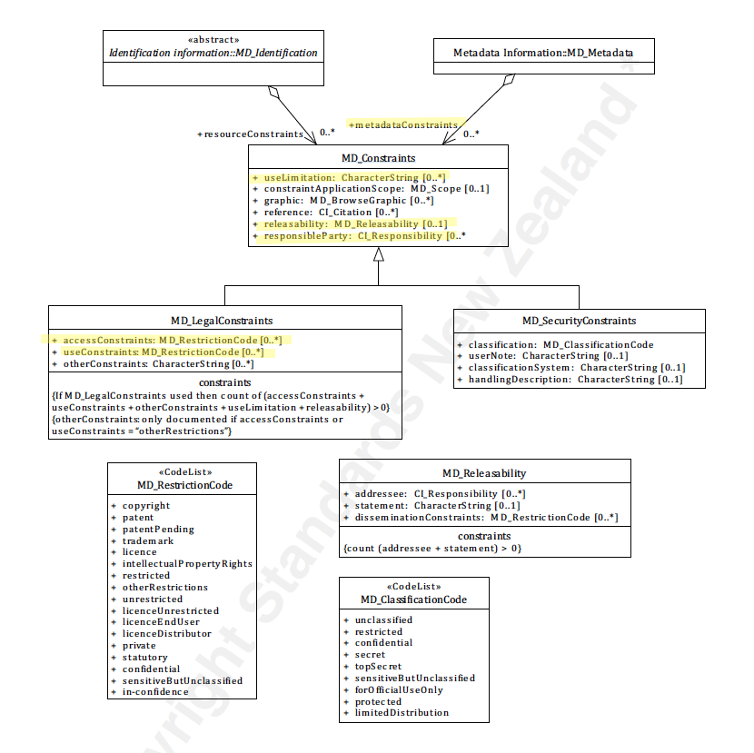

#  Class - MD_LegalConstraints
When constraint ([MD_Constraints](./class-md_constraints)) are of a legal nature they should be captured using the class **MD_LegalConstrints**.

- **Governance** -  *ISO*
- **Metadata type -** *structural*
- *ICSM Level of Agreement* - ⭑⭑

# Definition 
**restrictions and legal prerequisites for accessing and using the resource or metadata.**

## ISO Associations  
The class, *MD_LegalConstraints* is an specialisation of *[MD_Constraints](./class-md_constraints)*. Follow the guidance provided for that class plus the following additional guidance.

### ISO Constraints 
When `MD_LegalConstraints` is used the at least one of the elements  `accessConstraints`, `useConstraints`, `useLimitation`,  `releasability` and `otherConstraints` must be present.  When using `otherConstraints`, either `accessConstraints` or `useConstrants` must equal `otherRestrictions`.

### Attributes  
Has all the attributes of [MD_Constraints](./class-md_constraints) plus the following:
- **accessConstraints -** *(codelist - [MD_RestrictionCode](./class-md_constraints#MD_RestrictionCode---codelist))* [0..\*] access constraints applied to assure the protection of privacy or intellectual property, and any special restrictions or limitations on obtaining the resource or metadata
- **useConstraints -** *(codelist - [MD_RestrictionCode](./class-md_constraints#MD_RestrictionCode---codelist))* [0..\*] constraints applied to assure the protection of privacy or intellectual property, and any special restrictions or limitations or warnings on using the resource or metadata
- **otherConstraints -** *(type - charStr)* [0..\*]  other restrictions and legal prerequisites for accessing and using the resource or metadata

# Discussion
Information about constraints on the access and use of a resource or its metadata is of high importance to document as this information strongly impacts on the usability of the resource to the user. Constraints may be security (*MD_SecurityConstraints*), legal (*MD_LegalConstraints*) or other (*MD_Constraints*).

A restriction may be applicable to a particular aspect of the resource. In this case capture this scope in *constraintApplicationScope* using a value from *MD_Scope*

Almost all created resources (including metadata) carry some legal rights, restrictions and responsibility regarding their access and use. For instance, in most jurisdictions, copyright is automatically granted to the creator of a creative work. Legal restrictions such as licences and end user agreements, need be documented for users and resource managers along with the identity of the holder of these rights. Each agency needs to develop consistant guidance on the use of such statement and share clear understanding of their meaning. This is often done by reference to a external body that manages the definitions of the legal constraints applied.

## Outstanding Issues
> Good Practice examples lacking
There is a need to gain greater consensus as to the general use of MD_LegalConstraints across its instances by the MDWG.

> Distribution Constraints
Currently there are no clear methods to apply different legal constraints to different distributions. This may be an ISO issue to address. We should develop use cases.

# Recommendations 
Therefore - It is important to capture all legal constraints that apply to a resource. This should include licences, end user agreements, etc. If the resource is public domain, this should be cited appropriately. Many juristrictions encourage the use of open data and Creative Commons license. This should be encouraged through the use of copyright licenses such as CC0 or CC By. Provide the user links to additional information about such constraints, there use and meaning. In addition, document the holder of such rights and how to contact for more information.

## Crosswalk considerations

### ISO19139
See guidance provided in [MD_Constraints](./class-md_constraints) 

# Related Classes
- **[MD_Constraints](./class-md_constraints)** the Superclass to `MD_LegalConstraints`. `MD_LegalConstraints` implements all the properties of `MD_Constraints`.  Full guidance of the associated elements are discussed there.
- **[MD_SecurityConstraints](path)** A sibling to `MD_LegalConstraints` and an extension to `MD_Constraints` for constraints applied for security purposes.

## UML diagrams
Recommended elements highlighted in Yellow

