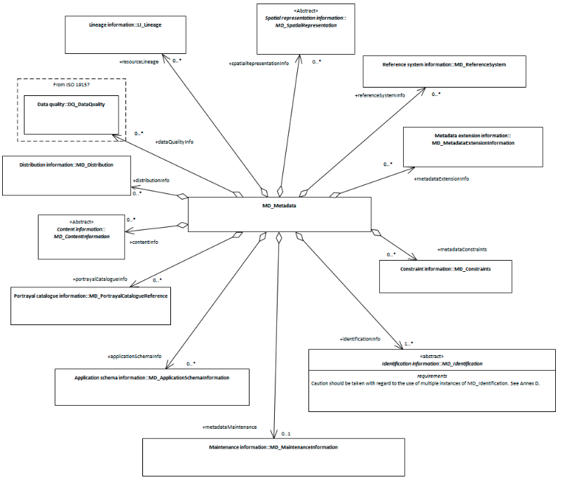

# class - MD_Metadata 

*In order to create consistent structured metadata, we need a schema to provide a structure and a class to hold it.  MD_Metadata provides this for ISO19115-1.*

- **Governance** -  *ISO*
- **Metadata Type -** *structural*
- *ICSM Level of Agreement* - ⭑⭑

# Definition 

**Root entity which defines metadata about a resource or resources**

## Child packages  
### MDWG recommended
- **[resourceLineage -](./ResourceLineage)** *(class - Li_Lineage)* [0..\*]
- **[referenceSystemInfo -](https://www.loomio.org/d/4SliNjWE/md_metadata-md_referencesystem-definition)** *(class - MD_ReferenceSystem)*
- **metadataConstraints -** *( abstract class [MD_Constraints](./class-md_constraints))* [0..\*] see
  - **[Metadata Security Constraints](./MetadataSecurityConstraints)**
  - **[Metadata Legal Constraints](./MetadataLegalConstraints)** 
  
-  **indentificationInfo -** *(abstract class - MD_Identification)* [1..\*] see:
  - **Data Identification -** *(class MD_DataIdentification)* > ?create Entry?
  - **Service Identification -** *(class SV_ServiceIdentification)* > To Be Completed
- **[distributionInfo -](./DistributionInfo)** *(class - MD_Distribution)* [0..\*]
  
### Other packages - not yet addressed by MDWG
- **metadataMaintenance -** *(class MD_MaintenanceInformation)* [0..1]
- **spatialRepresentationInfo -** *(abstract class - MD_SpatialRepresentation)* [0..\*]
- **metadataExtensionInfo -** *(class - MD_MetadataExtensionInformation)* [0..\*]
- **applicationSchemaInfo -** *(class - MD_ApplicationSchemaInformation)* [0..\*]
- **portrayalCatalogInfo -** *(class - MD_ProtrayalCatalogueReference)* [0..\*]
- **contentInfo -** *(abstract class - MD_ContentInformation)* [0..\*]
- **dataQualityInfo -** *(class - DQ_DataQuality (from ISO19157))* [0..\*]

## Atributes
### MDWG Recomended Attributes - 
- **[metadataIdentifier -](./MetadataIdentifier)** (*class - [MD_Identifier](./class-MD_Identifier)*) [0..1]
- **[dateInfo -](./MetadataDate)** *(class - [CI_Date](./class-CI_Date))* [1..\*] 
- **[contact -](./MetadataContact)** *(class - [CI_Responsibility](./class-CI_Responsibility))* [0..1] 
- **[defaultLocale -](./MetadataLocale)** *(class - [PT_Locale](./PT_Locale))*[0..1]
- **[metadataLinkage -](./MetadataLinkage)** *(class - [CI_OnlineResource](./class-CI_OnlineResource))*[0..\*]
- **[parentMetadata -](./ParentMetadata)** *(class - [CI_Citation](./class-CI_Citation)* [0..1]
- **[metadataScope -](./MetadataScope)** *(class - MD_MetadataScope)*[0..\*]
- **metadataStandard -**  *(class - [CI_Citation](./class-CI_Citation))* [0..\*] AS/NZS ISO 19115-3  > recommnded but not yet detailed by MDWG
- **metadataProfile -**  *(class - [CI_Citation](./class-CI_Citation))* [0..\*] >  recommnded butnot yet detailed by MDWG

### Other attributes - not yet addressed by MDWG
- **otherLocale -** *(class - [PT_Locale](./PT_Locale))*[0..\*]
- **alternativeMetadataReference -** *(class - [CI_Citation](./class-CI_Citation)* [0..\*]
  

# Discussion

The MD_Metadata package defines the schema for describing the complete metadata about a resource and metadata about the metadata itself. It is composed through an aggregate of 12 additional metadata classes as shown above. The MD_Metadata class also contains attributes providing information about the metadata. Those recommnded attributes are covered in other sections as cited above

# Recommendations 

Therefore - It is recommended that all spatial metadata utilise the structure provided by the ISO19115-1 MD_Metadata class and follow the guidance provided.

## UML diagrams

Recommended elements highlighted in Yellow

