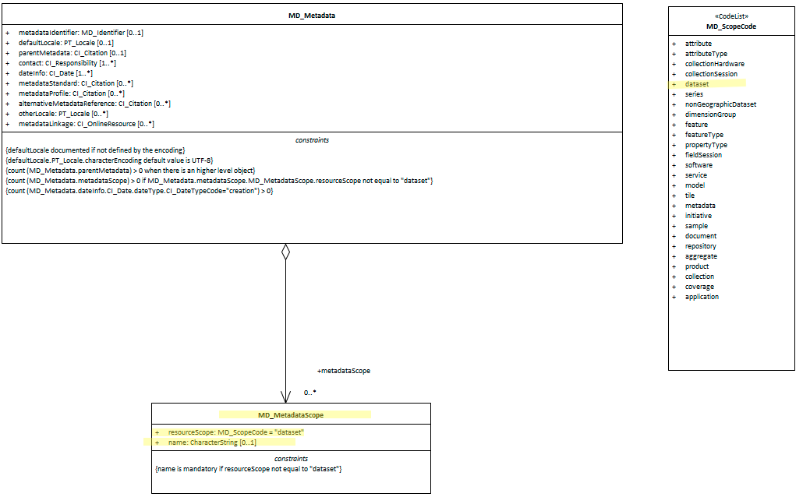

#  Class MD_Scope 

*The capture of information about the physical extents of the resource is needed under many packeges of inforation about a cited reosurce.  A standarised way of this scope is useful.  This function is provided by the class **MD_Scope**.*

- **Governance** -  *ISO*
- **Metadata type -** *structural*
- *ICSM Level of Agreement* - ⭑⭑

# Definition 

**the target resource and physical extent for which information is reported.**

## ISO Associations (May be found in) 
- MD_Constraints.constraintApplicationScope
- LI_Lineage.scope
- LI_ProcessStep.scope
- LI_Source.scope
- MD_MaintenanceInformation.maintenanceScope

## Attributes - 
- **level -** *(codelist - MD_ScopeCode)* [1..1] Mandatory when using MD_Scope - target resource covered
- **extent -** *(class - [EX_Extent](https://www.loomio.org/d/ilObJX24/md_identification-extent-definition))* [0..\*] Information about the horizontal, vertical and temporal extent of the resource specified by the scope
- **levelDescription -** *(codelist - MD_ScopeDescription)* [0..\*] detailed description/listing of the items specified by the level

## Associated Classes, Codelists and Unions
### [MD_ScopeCode](http://wiki.esipfed.org/index.php/ISO_19115-3_Codelists#MD_ScopeCode) - codelist
Class of information to which the referencing entity applies
- *attribute* - information applies to the attribute value
- *attributeType* -   information applies to the characteristic of a feature
- *collectionHardware* - information applies to the collection hardware class
- *collectionSession* - information applies to the collection session
- *dataset* - information applies to the dataset
- *series* - information applies to the series
- *nonGeographicDataset* - information applies to non-geographic data
- *dimensionGroup* - information applies to a dimension group
- *feature* - information applies to a feature
- *featureType* - information applies to a feature type
- *propertyType* - information applies to a property type
- *fieldSession* - information applies to a field session
- *software* - information applies to a computer program or routine
- *service* - information applies to a capability which a service provider entity makes available to a service user entity through a set of interfaces that define a behaviour, such as a use case
- *model* - information applies to a copy or imitation of an existing or hypothetical object
- *tile* - information applies to a tile, a spatial subset of geographic data
- *metadata* - information applies to metadata
- *initiative* - information applies to an initiative
- *sample* - information applies to a sample
- *document* - information applies to a document
- *repository* - information applies to a repository
- *aggregate* - information applies to an aggregate resource
- *product* - metadata describing an ISO 19131 data product specification
- *collection* - information applies to an unstructured set
- *coverage* - information applies to a coverage
- *application* - information resource hosted on a specific set of hardware and accessible over a network

### [MD_ScopeDescription](http://wiki.esipfed.org/index.php/MD_ScopeDescription) - union
(Union - class describing a selection of one of the specified types) 

Description of the class of information covered by the information
- **attributes -** *(Set - charStr)* instances of attribute types to which the information applies
- **features -** *(Set - charStr)* instances of feature types to which the information applies
- **featureInstances -** *(Set - charStr)* feature instances to which the information applies
- **attributeInstances -** *(Set - charStr)* attribute instances to which the information applies
- **dataset -** *(charStr)* dataset to which the information applies
- **other -** *(charStr)* class of information that does not fall into the other categories to which the information applies

# Discussion
Information about scope of a citation of an aspect of a resource or its maintenance is of high importance to document as this information strongly impacts on the understandabillity of the resource metadata to the user. 

The MD_Scope is used to describe the breadth and or type of the resource that a metadata record or class describes. It includes a MD_ScopeCode as a brief indicator of the scope which can be useful in search and presentation applications and a MD_ScopeDescription in order to provide more detail. The values in the MD_ScopeCode list are intentionally general and details of their application are left to the data provider. In order to foster interoperability, the usage of the scope codes should be carefully documented in any community of practice. Clause E.5 outlines possible applications of codes from the MD_ScopeCode codelist and related codes included in ISO/TS 19139 as part of the MX_ScopeCode list. These examples are meant to provide reasonable starting points and are certainly not exhaustive.

# Recommendations 
## Crosswalk considerations

### ISO19139
HierarchyLevel attributes were replaced by an MD_Scope class to improve the description of the scope of the metadata;

- `MD_Constraints.constraintApplicationScope` (New Element)
  - This new element was added in order to allow description of constraints on a resource that vary in space and/or time and/or level
- `DQ_DataQuality.scope` (replaced by) `LI_Lineage.scope`
  - This element allows the description of the type and/or extent of the lineage information. DQ_Data-Quality/scope was moved to ISO 19157
- `LI_Lineage.sourceExtent` (replaced by) `LI_Source.scope`
  - This new element was added in order to allow description of more details of the scope of a lineage section. This was required, in part, to replace the DQ_Scope from the DQ_DataQuality class that was moved from 19115 to the new data quality standard (ISO 19157).
- `LI_ProcessStep.scope` (New Element) 
  - This new element was added in order to allow description of the scope of a process step independently from the scope of the entire lineage section. This was required, in part, to replace the DQ_Scope from the DQ_DataQuality class that was moved from 19115 to the new data quality standard (ISO 19157).
- `MD_MaintenanceInformation.updateScope` and `MD_MaintenanceInformation.updateScopeDescription` (Replaced by) `MD_MaintenanceInformation.maintenanceScope`
  - These two roles were combined into maintenance-Scope: MD_Scope [0..\*] in order to allow specifying a scope that includes a spatial and temporal extent
  
## Related Links
- [ESIP MD_Scope](http://wiki.esipfed.org/index.php/MD_Scope)

## UML diagrams
Recommended elements highlighted in Yellow

