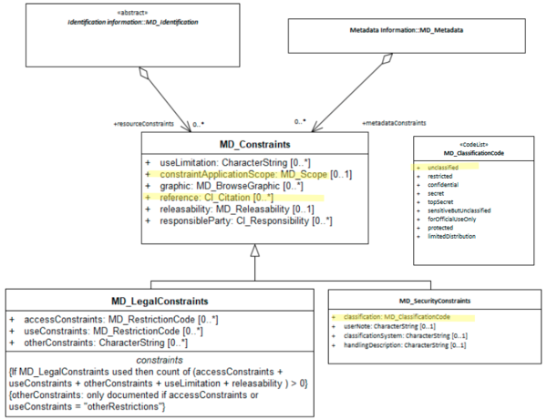

#  Class - MD_SecurityConstraints
When constraints information *([MD_Constraints](./class-md_constraints))* concern security issues they should be captured using the class *MD_SecurityConstraints*.

- **Governance** -  *ISO, Common, Agency*
- **Metadata type -** *structural*
- *ICSM Level of Agreement* - ⭑⭑

## Definition
**Handling restrictions imposed on the resource or metadata for national security or similar security concerns.**

### ISO Associations
The class, *MD_SecurityConstraints* is an specialisation of [MD_Constraints](./class-md_constraints). Follow the guidance provided for that class plus the following additional guidance.

### Attributes -
*MD_SecurityConstraints* has all the attributes of [MD_Constraints](./class-md_constraints) plus the following:
- **classification -** *(codelist - [MD_RestrictionCode](./class-md_constraints#MD_RestrictionCode---codelist))* [0..\*] Mandatory when using `MD_SecurityConstraints` - the name of the handling restrictions on the resource or metadata
- **userNote -** *(type - charStr)* [0..1] explanation of the application of the legal constraints or other restrictions and legal prerequisites for obtaining and using the resource or metadata
- **classificationSystem -** *(type - charStr)* [0..1]  name of the classification system
- **handlingDescription -** *(type - charStr)* [0..1]  additional information about the restrictions on handling the resource or metadata

### Associated Codelists

#### MD_RestrictionCode - codelist
name of the handling restrictions on the resource
- *unclassified* - information applies to the dataset
- *restricted* - information applies to the series
- *confidential* - information applies to non-geographic data
- *secret* - information applies to a dimension group
- *topSecret* - information applies to a feature
- *sensitiveButUnclassified* - although unclassified, requires strict controls over its distribution
- *forOfficialUseOnly* -   information applies to the characteristic of a feature
- *protected* - information applies to the collection hardware class
- *limitedDistribution* - information applies to the collection session

## Discussion
Information about constraints on the access and use of a resource or its metadata is of high importance to document as this information strongly impacts on the usability of the resource to the user. Constraints may be security (*MD_SecurityConstraints*), legal (*MD_LegalConstraints*) or other (*MD_Constraints*).

A restriction may be applicable to a particular aspect of the resource. In this case capture this scope in *constraintApplicationScope* using a value from *MD_Scope*

Many of the resources and even its metadata may carry some security restrictions regarding their access and use.  The reasons may be for national security, financial or commercial sensitivity, or privacy concerns as is common with census data. These security restrictions need be documented for users and resource managers along with the identity of the applier of these constraints. Each agency needs to develop consistent guidance on the use of such statement and share clear understanding of their meaning. This is often done by reference to an external body that manages the definitions of the security constraints applied.

### Outstanding Issues
> Good Practice examples lacking
There is a need to gain greater consensus as to the general use of MD_SecurityConstraints across its instances by the MDWG.

> Australia Protective Security Policy Framework
A best practice method of using the new Australia Protective Security Policy Framework in ISO 19115-1 must be created by the MDWG. While `classificationSystem` allows use to declare the security framework we are using, it does not do so as a citation whick limits our ability to document our reference properly. Also, how to include the values in the framework is not clear.  Extending `MD_RestrictionCode` seems the most obvious, but is changing an ISO codelist the best approach given we want our recommendations not to change the underlying ISO 19115-1.

## Recommendations
Therefore - It is important to capture all security constraints that apply to a resource, including its metadata. If there be none then it may be useful to state this fact through the use of the `unclassified` value of `MD_RestrictionCode`, particularly if your organisation does regularly handle sensitive resources. Agencies should develop consistent guidance on the use of security classifications and share clear understanding of their meaning with users.

At a minimum the Name (primary and alternate) and version by which this security restriction on the access and use of this cited resource is known should be captured along with the classification value selected from the codelist - MD_ClassificationCode.

### Crosswalk considerations

#### ISO19139
See guidance provided in [MD_Constraints](./class-md_constraints) 

## Related Classes
- **[MD_Constraints](./class-md_constraints)** the Superclass to `MD_LegalConstraints`. `MD_LegalConstraints` implements all the properties of `MD_Constraints`.  Full guidance of the associated elements are discussed there.
- **[MD_LegalConstraints](./class-MD_LegalConstraints)** A sibling to `MD_SecurityConstraints` and an extension to `MD_Constraints` for constraints applied for legal purposes.

### UML diagrams
Recommended elements highlighted in Yellow

\pagebreak
