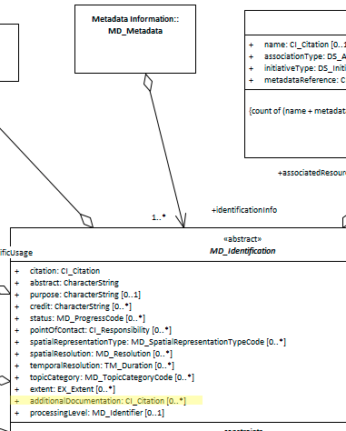

# Additional Documentation ★★★
*A cited resource may have any number of related documents such as articles, publications, user guides, data dictionaries that are useful in applying the resource to desired purposes. Often these are difficult to discover and manage. Capturing these in the metadata is recommended.*

| | |
| --- | --- |
| **Element Name** | *additionalDocumentation* |
| **Parent** | *[MD_Metadata.identificationInfo>MD_Identification](./class-MD_Identification)* |
| **Class/Type** | *[CI_Citation](./class-CI_Citation)* |
| **Governance** | *Domain, Agency* |
| **Purpose** | *Data Management, Resource Use* |
| **Audience** | machine resource - ⭑ |
| | general - ⭑ ⭑ ⭑ |
| | resource manager - ⭑ ⭑ ⭑ ⭑ ⭑ |
| | specialist - ⭑ ⭑ ⭑ ⭑ ⭑ |
| **Metadata type** | *descriptive* |
| **ICSM Level of Agreement** | ⭑ ⭑ ⭑ |

## Definition 
**Citation of other documentation associated with the resource, e.g. related articles, publications, user guides, data dictionaries**

### ISO Obligation 

There may be zero to many [0..\*] *additionalDocumentation* packages for the cited resource in the *[MD_DataIdentification](./class-MD_DataIdentification)* package of class [CI_Citation](./class-CI_Citation) in the metadata record. 

## Discussion

To make the best use of a given resource, additional documentation may be useful or required. Providing instructions for accessing these documents can greatly enhance the value of a resource to its users and providers. Capturing these additional documents in the metadata is also helpful to resource managers who need to properly track the linkages between a resource and its documentation. The resource may be data or service, [MD_DataIdentification](./class-MD_DataIdentification)* or *[SV_ServiceIdentification](./ServiceIdentification)

## ICSM Recommendations 

Therefore - to make the best use of a given resource capturing the links to additional documentation related to this resource is highly recommended. Capture those documents of the highest value to your most likely community of users. If possible, include some reference to documentation or its metadata that can be easily understood by laypeople and label this accordingly.

This element should be populated in all metadata records with a minimum of `title`, `identifier`, `date` and `citedResponsibleParty`. If possible, use the link to the metadata for the cited additional documentation as the resource landing page.

### Recommended Sub-Elements

* **title -** *(type - charStr)* [1..1] mandatory for citations, the name by which the cited resource is known
* **date -** *(class - [CI_Date](./class-CI_Date))* recommended, the reference date for the cited resource
In addition, some direction should be given about how to access the cited additional resource
* **onlineResource -** *(class [CI_OnlineResource](./class-CI_OnlineResource))* [0..\*] a description of how to access the cited additional resource online
* **citedResponsibleParty -** *(class [CI_Responsibility](./class-CI_Responsibility))* [0..\*] contact information for someone who can give guidance about accessing the cited additional resource

## Also Consider 

- **[MD_DataIdentification.supplementalInformation -](https://www.isotc211.org/hmmg/HTML/ConceptualModels/EARoot/EA1/EA13/EA2/EA12/EA4420.htm)** is defined as "any other descriptive information about the resource"
- **[MD_AssociatedResource -](https://www.isotc211.org/hmmg/HTML/ConceptualModels/EARoot/EA1/EA13/EA2/EA12/EA4419.htm)** contains information about resources of which this resource is a piece. Association types are taken from the [DS_AssociationTypeCode](https://www.isotc211.org/hmmg/HTML/ConceptualModels/EARoot/EA1/EA13/EA2/EA12/EA4378.htm)

### Outstanding Issues

> **DCAT**
Previously captured DCAT related documentation on these elements calls what is considered the equivalent "A free-text account of the catalog." Mapping seems incorrect.

## Crosswalk considerations 

<details>

### DCAT 

Maps to `dct.description` free-text 

### RIF-CS 

Maps to `Description 'notes'`

</details>

## Examples

<details>

### XML 
```
<mdb:MD_Metadata>
....
  <mdb:identificationInfo>
   <mri:MD_DataIdentification>
   ....
     <mri:additionalDocumentation>
      <cit:CI_Citation>
        <cit:title>
         <gco:CharacterString>Usage guide</gco:CharacterString>
        </cit:title>
        <cit:date>
         <cit:CI_Date>
           <cit:date>
            <gco:Date>2019-07-01</gco:Date>
           </cit:date>
           <cit:dateType>
            <cit:CI_DateTypeCode 
            codeList="https://schemas.isotc211.org/19115/resources/Codelist/
            cat/codelists.xml#CI_DateTypeCode"
                       codeListValue="creation"/>
           </cit:dateType>
         </cit:CI_Date>
        </cit:date>
        <cit:citedResponsibleParty>
         <cit:CI_Responsibility>
           <cit:role>
            <cit:CI_RoleCode 
            codeList="https://schemas.isotc211.org/19115/resources
            /Codelist/cat/codelists.xml#CI_RoleCode"
            codeListValue="custodian"/>
           </cit:role>
           <cit:party>
            <cit:CI_Organisation>
              <cit:name>
               <gco:CharacterString>OpenWork Ltd</gco:CharacterString>
              </cit:name>
              <cit:contactInfo>
               <cit:CI_Contact>
                 <cit:address>
                  <cit:CI_Address>
                    <cit:electronicMailAddress>
                    <gco:CharacterString>info@openwork.nz
                    </gco:CharacterString>
                    </cit:electronicMailAddress>
                  </cit:CI_Address>
                 </cit:address>
               </cit:CI_Contact>
              </cit:contactInfo>
              <cit:individual>
               <cit:CI_Individual>
                 <cit:name>
                  <gco:CharacterString>Byron Cochrane
                  </gco:CharacterString>
                 </cit:name>
               </cit:CI_Individual>
              </cit:individual>
            </cit:CI_Organisation>
           </cit:party>
         </cit:CI_Responsibility>
        </cit:citedResponsibleParty>
        <cit:onlineResource>
         <cit:CI_OnlineResource>
           <cit:linkage>
            <gco:CharacterString>https://openwork-nz.github.io
            /Resources/2019/04/25/gn-plugins.html
            </gco:CharacterString>
           </cit:linkage>
           <cit:protocol gco:nilReason="missing">
            <gco:CharacterString/>
           </cit:protocol>
           <cit:name gco:nilReason="missing">
            <gco:CharacterString/>
           </cit:name>
           <cit:description gco:nilReason="missing">
            <gco:CharacterString/>
           </cit:description>
           <cit:function>
            <cit:CI_OnLineFunctionCode codeList=
            "https://schemas.isotc211.org/19115/resources/Codelist
            /cat/codelists.xml#CI_OnLineFunctionCode"
            codeListValue=""/>
           </cit:function>
         </cit:CI_OnlineResource>
        </cit:onlineResource>
      </cit:CI_Citation>
     </mri:additionalDocumentation>
   ....
   </mri:MD_DataIdentification>
  </mdb:identificationInfo>
....
</mdb:MD_Metadata>
```

\pagebreak

### UML diagrams
Recommended elements highlighted in yellow



</details>

\pagebreak

