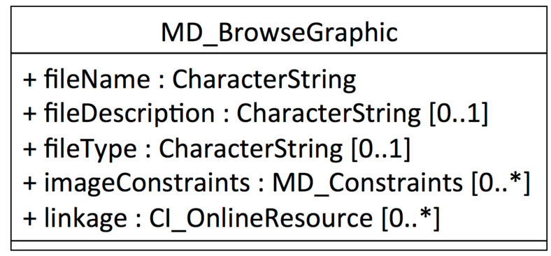

# Resource Graphic Overview ★★★
*Geospatial data and service are largely visual by nature. Geospatial practitioners tend to be visually oriented. Browse graphics are a way of including in the metadata visual clues as to the nature and usefulness of resources.*

| | |
| --- | --- |
| **Element Name** | *graphicOverview* |
| **Parent** | *[MD_Metadata.identificationInfo>MD_Identification](./class-MD_Identification)* |
| **Class/Type** | *MD_BrowseGraphic* |
| **Governance** | *Common ICSM, Agency, Domain* |
| **Purpose** | *Discovery, Identification* |
| **Audience** | machine resource - ⭑ |
| | general - ⭑ ⭑ ⭑ ⭑ ⭑ |
| | resource manager - ⭑ ⭑ |
| | specialist - ⭑ ⭑ ⭑ |
| **Metadata type** | *descriptive* |
| **ICSM Level of Agreement** | ⭑ ⭑ ⭑ |

## Definition 

**A graphic that provides an illustration of a resource**

### ISO Obligation

In a metadata record there should be zero to many [0..\*] *graphicOverview* packages for the cited resource in the *[MD_DataIdentification](./class-MD_DataIdentification)* package of class *[MD_BrowseGraphic](http://wiki.esipfed.org/index.php/MD_BrowseGraphic)* in a metadata record.

## Discussion  

Geospatial professionals by nature, rely to a large extent on visual information to gain an understanding of resources. Browse graphics provide in the metadata a way to communicate with users visually. 

>NOTE - Should include a legend for the graphic, if applicable.

>EXAMPLE - A dataset thumbnail image, an organisation logo, security constraint or citation graphic.

## ICSM Recommendations 

Therefore - to provide a quick way for users to discover and identify the resource they need, provide a graphic overview of the metadata. At a minimum, this should include a name and link to the image.

#### Recommended Sub-Elements 

From class *[MD_BrowseGraphic](http://wiki.esipfed.org/index.php/MD_BrowseGraphic)*

- **fileName -** *(type - CharStr)* [1..1] Mandatory for browse graphic elements - name of the file that contains a graphic that provides an illustration of the resource. 
- **linkage -** *(class - [CI_OnlineResource](./class-CI_OnlineResource))* [0..\*] - link to browse graphic.
- Optional:
 - **imageConstraints -** *(class - [MD_Constraints](./class-MD_Constraints))* [0..\*] - restriction on access and/or use of browse graphic
 - **fileType -** *(type - CharStr)* [0..\*] - format in which the illustration is encoded (e.g.: EPS, GIF, JPEG, PBM, PS, TIFF, PDF)
 - **extent -** *(class - [EX_Extent](./ResourceExtent))* [0..\*] Information about the horizontal, vertical and temporal extent of the resource specified by the scope
  
## Also Consider

 - **[MD_BrowseGraphic -](http://wiki.esipfed.org/index.php/MD_BrowseGraphic)** associates to a large number of packages for different purposes, such as business or product icons and logos
 - **[CI_OnLineFunctionCode -](http://wiki.esipfed.org/index.php/ISO_19115-3_Codelists#CI_OnLineFunctionCode)** This codelist contains an option *browseGraphic*
  
## Crosswalk considerations 

<details>

### ISO19139 

**browseGraphic** is a new package in iso19115-1. New elements include:
- **MD_BrowseGraphic.imageConstraint** *(class - [MD_Constraints](./class-MD_Constraints))
 - This new element was added in order to allow the specification of constraints on a browse graphic associated with a resource.
- **MD_BrowseGraphic.linkage** *(class - [CI_OnlineResource](./class-CI_OnlineResource))
 - This new element was added in order to allow a straightforward specification of the link to the browse graphic and the capability to add additionalinformation (name, description, …) about that graphic.

</details>


## Examples

<details>

### XML -

```
<mdb:MD_Metadata>
....
  <mdb:identificationInfo>
   <mri:MD_DataIdentification>
     <mri:citation>
      <cit:CI_Citation>
        ....
        <cit:graphic>
         <mcc:MD_BrowseGraphic>
           <mcc:fileName>
            <gco:CharacterString>
            https://static.wixstatic.com/media
            /414fd2_2f712656fb5547f39a08a53aab98cc29~mv2.png/v1
            /fill/w_92,h_146,al_c,q_80,usm_0.66_1.00_0.01
            /IFaGR9yg.webp</gco:CharacterString>
           </mcc:fileName>
           <mcc:linkage>
            <cit:CI_OnlineResource>
              <cit:linkage>
               <gco:CharacterString>
               https://static.wixstatic.com/media
               /414fd2_2f712656fb5547f39a08a53aab98cc29~mv2.png
               /v1/fill/w_92,h_146,al_c,q_80,usm_0.66_1.00_0.01
               /IFaGR9yg.webp
               </gco:CharacterString>
              </cit:linkage>
              <cit:protocol>
               <gco:CharacterString>
                WWW:LINK-1.0-http--link
               </gco:CharacterString>
              </cit:protocol>
              <cit:name gco:nilReason="missing">
               <gco:CharacterString/>
              </cit:name>
              <cit:description gco:nilReason="missing">
               <gco:CharacterString/>
              </cit:description>
              <cit:function>
               <cit:CI_OnLineFunctionCode codeList=
               "https://schemas.isotc211.org/19115/resources
               /Codelist/cat/codelists.xml#CI_OnLineFunctionCode"
               codeListValue="browseGraphic"/>
              </cit:function>
            </cit:CI_OnlineResource>
           </mcc:linkage>
         </mcc:MD_BrowseGraphic>
         ....
      </cit:CI_Citation>
     </mri:citation>
   </mri:MD_DataIdentification>
  </mdb:identificationInfo>
....
</mdb:MD_Metadata>
```

\pagebreak

### UML diagrams

Recommended elements highlighted in yellow



</details>

\pagebreak

