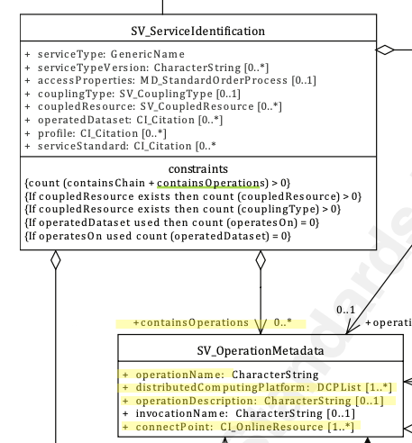

# Contains Operations  ★★★★ 

*Once a service is discovered, potential users need to know what operations the service provides and on what resources it operates. Provision of the specifics of the operations allows such evaluation and use.*

|  |  |
| --- | --- |
| **Element Name** | *containsOperations* |
| **Parent** |  *[MD_Metadata.identificationInfo>SV_ServiceIdentification](./ServiceIdentification)* |
| **Class/Type** | *SV_OperationMetadata* |
| **Governance** |  *Common ICSM* |
| **Purpose** | *Evaluation, Use* |
| **Audience** | machine resource - ⭑ ⭑ ⭑ ⭑ |
|  | general - ⭑ ⭑ ⭑|
|  | resource manager - ⭑ ⭑ |
|  | specialist - ⭑ ⭑ ⭑ ⭑ |
| **Metadata type** | *structural* |

- *ICSM Level of Agreement* - ⭑ ⭑

## Definition  
**provides information about the operations that comprise the service**

### ISO Requirements

This is an ISO optional element. There may be zero or many [0..\*] *containsOperations* entries for the cited resource in the  *[SV_ServiceIdentification](./ServiceIdentification)* package of class *SV_OperationMetadata*  in a metadata record for a service resource.

## Discussion  
It is useful when documenting a service to document the particular operations that the service can be called upon to do.  As many of the services we may call will have operations that summarise the operations that the service provides it may be better to document this one service in order not to duplicate or cause confusion. GetCapabilities would be an example of this as would an OpenAPI endpoint as implemented in OGC API common based services.

## ICSM Recommendations 

Therefore - If a potential client of a service is to use such service once discovered, descriptions of the functionality and use of operations provided shoud be documented in metadata of a geospatial service. When there exists a an operation that details the operations available, such as *GetCapabilities* or an OpenAPI/Swagger endpoint, it is recommend that this operation be captured here. Further operations detailed by such a service need not be detailed here. At a minimum, the ICSM recommended subelemnts to be populated include *operationName*, *distributedComputingEnvironment*, *operationDescription*, *connectPoint*.

### Recommended Sub-Elements 

- **operationName -** *(type - charStr)* [1..1] - Mandatory. A unique identifier within the service for this interface e.g. GetCapabilities, OpenAPI 
- **distributedComputingPlatform -** *(codelist - DCPList)* [1..\*] - Mandatory by ISO 19115-1. Distributed computing platforms on which the operation has been implemented. Suggest use of *Web Services* as default valueas use of this element is not clearly described or agreed upon. 
- **operationDescription -** *(type - charStr)* [0..1] - Highly recommended. Free text description of the intent of the operation and the results of the operation
- **connectPoint -** *(class - [CI_OnlineResource](class-CI_OnlineResource)* [1..\*] - Mandatory. Handle for accessing the service interface. Usually a complete URL. Recommend that this be the full path to a *GetCapabilities* document. Recommended *connectPoint* sub-elements include for service operation:
- **linkage** - Mandatory for *(class - [CI_OnlineResource](class-CI_OnlineResource)*. A URL link to invoke the service.
  - **protocol** - E.g. WFS, WFS, CSW
  - **function** - Drawn from codelist - [CI_OnlineFunctionCode](./class-CI_OnlineResource). Use if appropriate values are available.
- **[parameter -](./Parameter)** *(class - SV_Parameter)* [0..\*] - Recommended when parameters are needed for the operation. A description of the parameters that can be provided to the operation. 

#### Other Optional Sub-Elements
- **invocationName -** *(type - charStr)* [0..1] - The name used to invoke this interface within the context of the DCP. The name is identical for all DCPs. The mandatory elements *operationName* and *connectPoint* usually suffice thus making *invocationName* surperfluous in most cases
- **dependsOn** - *(class - SV_OperationsMetadata)*  [0..\*] - Recommnded when there exists operations that must be completed immediately before current operation is invoked. When multiple, structured as a list for capturing alternate predecessor paths and sets for capturing parallel predecessor paths

### Related Codelists

####  DCPList - codelist

There are 10 options to choose from in the Distributed Computing Platform code list (DCPList). At least one must be chosen when describing a service operation. As the use of this codelist has not been agreed upon, current ICSM guidance is to use *webService* as default value unless there is clear reason otherwise. Available values are as follows:

* **XML** - eXtensible Markup Language
* **CORBA** - Common Object Request Broker Architecture
* **JAVA** - JAVA programming language
* **COM** - Component Object Model - Microsoft's framework for developing and supporting program component objects
* **SQL** - Structured Query Language - a standard interactive and programming language for getting information from and updating a database
* **SOAP** - Simple Object Access Protocol
* **Z3950** - ISO 23950, an international standard client–server, application layer communications protocol for searching and retrieving information from a database over a TCP/IP computer network.
* **HTTP** - HyperText Transfer Protocol
* **FTP** - File Transfer Protocol
* **webServices** - **Default** - any web based services


## Outstanding Issues

> **Distributed Computing Platform Codelist**
The mandatory selection of DCPList values presents some some area for disagreement and varied implementation. The values available and guidance of their use and purpose is lacking. 


#### Other Discussion 
{from other sources of note - other standards and implementations. In Markdown Notes format. Such as:}

> **OGC API Notes** -
The `containsOperations' equivalent in OGC API Records (under development) will likely describe the operations available on a single path. A Path Item MAY be empty, due to ACL constraints. The path itself is still exposed to the documentation viewer but they will not know which operations and parameters are available.

## Crosswalk considerations 

#### ISO 19119/19139 
None Known

#### Dublin core / CKAN / data.gov.au 
None Known

#### DCAT 
*operationDiscription* maps to *dcat:endpointDescription*
*connectPoint* maps to *dcat:endpointURL*

#### RIF-CS
*connectPoint* maps to *Location/Electronic/@type='url'*

## Also Consider

**[Coupled Resource -](./CoupledResource)**  Present an option to connect a coupled resource to a particular operation.

## Examples

### GA
{example - if any useful}

### ABARES
{example - if any useful}

### Others
{### who - example - if any useful}}

### XML -

```
<mdb:MD_Metadata>
....
  <mdb:identificationInfo>
      <srv:SV_ServiceIdentification>
      ....
         <srv:containsOperations>
             <srv:SV_OperationMetadata>
                <srv:operationName>
                   <gco:CharacterString>GetCapabilities</gco:CharacterString>
                </srv:operationName>
                <srv:distributedComputingPlatform>
                   <srv:DCPList codeList="http://standards.iso.org/iso/19115/resources/Codelists/cat/codelists.xml#DCPList"
                                codeListValue="WebServices"/>
                </srv:distributedComputingPlatform>
                <srv:operationDescription>
                   <gco:CharacterString>Description of available operations</gco:CharacterString>
                </srv:operationDescription>
                <srv:connectPoint>
                   <cit:CI_OnlineResource>
                      <cit:linkage>
                         <gco:CharacterString>https://my.webite.io/cgi-bin/wfs?SERVICE=WFS&amp;VERSION=1.0.0&amp;REQUEST=GetCapabilities</gco:CharacterString>
                      </cit:linkage>
                      <cit:protocol>
                         <gco:CharacterString>OGC:WFS</gco:CharacterString>
                      </cit:protocol>
                      <cit:name gco:nilReason="missing">
                         <gco:CharacterString/>
                      </cit:name>
                      <cit:description gco:nilReason="missing">
                         <gco:CharacterString/>
                      </cit:description>
                      <cit:function>
                         <cit:CI_OnLineFunctionCode codeList="http://standards.iso.org/iso/19115/resources/Codelists/cat/codelists.xml#CI_OnLineFunctionCode"
                                                    codeListValue=""/>
                      </cit:function>
                   </cit:CI_OnlineResource>
                </srv:connectPoint>
             </srv:SV_OperationMetadata>
          </srv:containsOperations>
        ....    
      </srv:SV_ServiceIdentification>
  </mdb:identificationInfo>
....
</mdb:MD_Metadata>
```

### UML diagrams

Recommended elements highlighted in Yellow



\pagebreak
