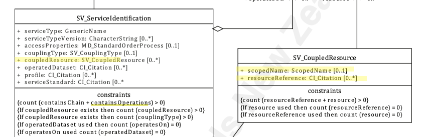

# Coupled Resource  ★★★★

*When documenting a service, the nature of the relationship of the service to the data resources on which it interacts is important to capture so as to provide potential users an understanding of the applicability of such service to their needs. When a service is highly dependant on particular data, these data needs need to be documented in the service metadata.*

|  |  |
| --- | --- |
| **Element Name** | *coupledResource* |
| **Parent** |  *[MD_Metadata.identificationInfo>SV_ServiceIdentification](./ServiceIdentification)* |
| **Class/Type** | *SV_CoupledResources* |
| **Governance** |  *Common ICSM* |
| **Purpose** | *Evaluation, Use* |
| **Audience** | machine resource - ⭑ ⭑ ⭑ |
|  | general - ⭑ ⭑ ⭑| 
|  | resource manager - ⭑ ⭑ ⭑ ⭑ |
|  | specialist - ⭑ ⭑ ⭑ |
| **Metadata type** | *structural* |
| **ICSM Level of Agreement** | ⭑ ⭑ | 

## Definition  
**Further description of the data coupling in the case of tightly coupled services**

### ISO Requirements

There must be zero or many [0-\*]  *coupledResource* entries for the cited resource for a  *[SV_ServiceIdentification](./ServiceIdentification)* package of class *SV_CoupledResource* in a metadata record. If a *[Coupling Type](./CouplingType)* is tight, at least one instance of this element must be populated.


## Discussion  
The relation of a geospatial service to the data on which it operates is varied. This relation impacts the decisions one may make regarding the capture of useful metadata for such a service. These services fall into three categories depending on how tightly coupled the data is to the service: *tightly*, *loosely*, or *mixed*. 

An example of a tightly coupled service would be a WFS service delivering a particular dataset. In the tightly coupled case, the service metadata shall describe both the service and the geographic dataset. The permitted values for the description of operations shall be constrained by the values defined by the datasets associated with the service.

An example of a loosely coupled service could be a reprojection service with user selected input datasets. Loosely coupled services may have an association with data types through the service type definition (SV_ServiceIdentification.serviceType). Dataset metadata need not be provided in the service metadata for the loosely coupled case.

A mixed coupling might be a WMS service into which you may add additional data sources of your choice. In a mixed coupling situation a single service instance may be associated to both kinds of data associated, loosely and tightly coupled. 

Coupled resource information must be provided when the *couplingType* is *tightly* or *mixed*. 

While there are numerous ways the related data resource may be captured in a service metadata record (e.g. *operatesOn*, *operatedDataset*, or even a sibling *MD_DataIdentifcation* package), ISO 19115-1 recommends *coupledResource* as minimum metadata required for the discovery of service resources.


## ICSM Recommendations

Therefore - the element *coupledResource* should be populated in all service metadata records where the Coupling Type is *tight*. One instance for each coupled resource should be populated. This should be done using the *SV_CoupledResource.resourceReference* citing the name and online location of the metadata for the coupled resources.

#### Recommended Sub-Elements 
ICSM recommends population of *SV_CoupledResources* sub-elements as follows:

- **scopedName** *(type - scopedName)* [0..1] Scoped identifier of the resource in the context of the given service instance. This ScopedName is the name of the resources as it is used by a service instance (e.g. feature type name in a WFS or layer name in a WMS).
- **resourceReference -** *(class - [CI_Citation](./class-CI_Citation))* [0..\*] reference to the resource on which the service operates. Recommended *CI_Citation* elements to include:
  - **title -** (type - charStr)*[1..1] Mandatory - the name by which the cited data resource is known as described in its metadata. May be different than the scoped name
  - **onlineResource -**  *(class -  [CI_OnlineResource](./class-CI_OnlineResource))* [0..\*] Highly Recommended. The online reference to the cited resource metadata (or landing page). Recommended *CI_OnlineResource* sub-elements include:
    - **linkage** - Mandatory for *(class - [CI_OnlineResource](class-CI_OnlineResource)*). A URL link to the metadata for the data resource.
    - **description** - E.g. "Metadata for dataset in OWL GeoNetwork Catalogue"

## Also Consider
There are numerous alternate ways to document related dataset to a service. We recommend *coupledDataset* in line with ISO 19115-1 advice in section F.2 *Metadata for the discovery of non-service geographic resources*. Here we list some of the alternatives and why we do not recommnd them. 

- **[Coupling Type](./CouplingType)** If not `tight` or `mixed`, *CoupledResources* need not be populated.
- **operatesOn** - *SV_ServiceIdentification.operatesOn* - Not Recommended. This element is of class - MD_DataIdentification and thus creates a metadata record with multiple MD_Identifier elements. This creates confusion within a metadata record and upon harvesting to other metadata systems, thus should be avoided.
- **resource** -  *SV_ServiceIdentification.coupledResource.resource* - Not Recommended. This element is of class - MD_DataIdentification and thus creates a metadata record with multiple MD_Identifier elements. This creates confusion within a metadata record and upon harvesting to other metadata systems and thus should be avoided. Note - When *resource* is used, *resourceReference* cannot be used. When *resourceReference* is used, *resource* cannot be used.
- **operatedDataset** - *SV_ServiceIdentification.operatedDataset* -  As this is of class - CI_Citation, its use does not suffer the same issues as the above option. However, the lack of the ScopedName provided in the CoupledResource option means that one cannot include both the resource name and the name by which the service presents it.

## Outstanding Issues

> **CORE ISSUE: Choice of Element to Hold Related Data Resource Reference**  
There are numerous ways the related data resource may be captured in a service metadata record (e.g. *operatesOn*, *operatedDataset*, or even a sibling *MD_DataIdentification* package. The choice of *coupledResource* is made for the following reasons. ISO 19115-1 recommends *coupledResource* as minimum metadata required for the discovery of service resources. The options *operatesOn*, *SV_CoupledResource.resource* and a sibling *identificationInfo/MD_DataIdentification* all require a *MD_Identifier* package. This would create metadata records that identify more than one resource. ICSM guidance is that such a situation be avoided as it could confuse other catalogues that expect a one-to-one relationship between metadata resources and resources.


## Examples

<details>

### GA
{example - if any useful}

### ABARES
{example - if any useful}

### Others
{### who - example - if any useful}}

### XML -

```
<mdb:MD_Metadata>
....
  <mdb:identificationInfo>
     <srv:SV_ServiceIdentification>
        <mri:citation>
           <cit:CI_Citation>
           ....
           </cit:CI_Citation>
        </mri:citation>
        <mri:abstract/>
        <srv:serviceType>
           <gco:ScopedName>view</gco:ScopedName>
        </srv:serviceType>
        <srv:couplingType>
           <srv:SV_CouplingType codeList="http://standards.iso.org/iso/19115/resources/Codelists/cat/codelists.xml#SV_CouplingType"
                                codeListValue="tight"/>
        </srv:couplingType>
        <srv:coupledResource>
           <srv:SV_CoupledResource>
              <srv:scopedName>
                 <gco:ScopedName>MyLayerName</gco:ScopedName>
              </srv:scopedName>
              <srv:resourceReference>
                 <cit:CI_Citation>
                    <cit:title>
                       <gco:CharacterString>MyDataSet</gco:CharacterString>
                    </cit:title>
                    <cit:onlineResource>
                       <cit:CI_OnlineResource>
                          <cit:linkage>
                             <gco:CharacterString>https://dev.geodata.nz/geonetwork/srv/eng/catalog.search#/metadata/4c0a67e1-04ce-e2d8-57d8-33f8e063aaf0</gco:CharacterString>
                          </cit:linkage>
                          <cit:protocol gco:nilReason="missing">
                             <gco:CharacterString/>
                          </cit:protocol>
                          <cit:name gco:nilReason="missing">
                             <gco:CharacterString/>
                          </cit:name>
                          <cit:description>
                             <gco:CharacterString>Metadata for dataset in OWL GeoNetwork Catalogue</gco:CharacterString>
                          </cit:description>
                          <cit:function>
                             <cit:CI_OnLineFunctionCode codeList="http://standards.iso.org/iso/19115/resources/Codelists/cat/codelists.xml#CI_OnLineFunctionCode"
                                                        codeListValue=""/>
                          </cit:function>
                       </cit:CI_OnlineResource>
                    </cit:onlineResource>
                 </cit:CI_Citation>
              </srv:resourceReference>
           </srv:SV_CoupledResource>
        </srv:coupledResource>
        <srv:containsOperations>
        ....
        </srv:containsOperations>
     </srv:SV_ServiceIdentification>
  </mdb:identificationInfo>
....
</mdb:MD_Metadata>
```

\pagebreak

### UML diagrams

Recommended elements highlighted in yellow



</details>

\pagebreak
