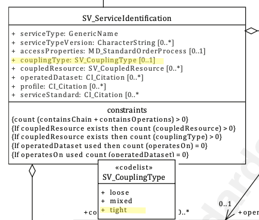

# Coupling Type ★★★★

*When documenting a service, the nature of the relationship of the service to the data resources on which it interacts is important to capture to provide potential users with an understanding of the applicability of such service to their needs. A service may be highly dependant on particular data, independent of the data or a mixture.*

| | |
| --- | --- |
| **Element Name** | *couplingType* |
| **Parent** | *[MD_Metadata.identificationInfo>SV_ServiceIdentification](./ServiceIdentification)* |
| **Class/Type** | codelist - *SV_CouplingType* |
| **Governance** | *Domain, Agency* |
| **Purpose** | *Evaluation, Use* |
| **Audience** | machine resource - ⭑ ⭑ ⭑ |
| | general - ⭑ ⭑ ⭑ |
| | resource manager - ⭑ ⭑ ⭑ ⭑ |
| | specialist - ⭑ ⭑ ⭑ |
| **Metadata type** | *structural* |
| **ICSM Level of Agreement** | ⭑ ⭑ | 

## Definition
**The type of coupling between service and associated data (if exists)**

### ISO Requirements

There must be zero or one [0-1] *couplingType* entries for the cited resource for a *[SV_ServiceIdentification](./ServiceIdentification)* package selected from the codelist *SV_CouplingType* in a metadata record. If a *[coupled resource](./CoupledResource)* exists, this element must be populated.


## Discussion
The relation of a geospatial service to the data on which it operates is varied. This relation impacts the decisions one may make regarding the capture of useful metadata for such a service. These services fall into three categories depending on how tightly coupled the data is to the service: *tightly*, *loosely*, or *mixed*. 

An example of a tightly coupled service would be a WFS service delivering a particular dataset. In the tightly coupled case, the service metadata shall describe both the service and the geographic dataset. The permitted values for the description of operations shall be constrained by the values defined by the datasets associated with the service.

An example of a loosely coupled service could be a reprojection service with user-selected input datasets. Loosely coupled services may have an association with data types through the service type definition (SV_ServiceIdentification.serviceType). Dataset metadata need not be provided in the service metadata for the loosely coupled case.

A mixed coupling might be a WMS service into which you may add additional data sources of your choice. In a mixed coupling situation a single service instance may be associated with both kinds of data associated, loosely and tightly coupled. 


## ICSM Best Practice Recommendations

Therefore - the element *couplingType* should be populated in all service metadata records. If the Coupling Type is *tight* then the *[coupled resource](./CoupledResource)* element must be populated for all coupled resources. 

### Values for Codelist *SV_CouplingType*

From codelist - **[SV_CouplingType](https://github.com/ISO-TC211/schemas/blob/master/19115/resources/Codelist/gml/SV_CouplingType.xml)**. Available values for *SV_CouplingType* are: 

- *loose* - service instance is loosely coupled with a data instance, i.e. no MD_DataIdentification class has to be described
- *mixed* - service instance is mixed coupled with a data instance, i.e. MD_DataIdentification describes the associated data instance and additionally the service instance might work with other external data instances
- *tight* - service instance is tightly coupled with a data instance, i.e. MD_DataIdentification class MUST be described


## Examples
<details>
### GA
{example - if any useful}

### ABARES
{example - if any useful}

### Others
{### who - example - if any useful}}

### XML -

```
<mdb:MD_Metadata>
....
 <mdb:identificationInfo>
   <srv:SV_ServiceIdentification>
    <mri:citation>
    ...
    </mri:citation>
    <mri:abstract/>
    <srv:serviceType>
      <gco:ScopedName>view</gco:ScopedName>
    </srv:serviceType>
    <srv:couplingType>
      <srv:SV_CouplingType codeList="http://standards.iso.org/iso/19115/resources/Codelists/cat/codelists.xml#SV_CouplingType"
                codeListValue="tight"/>
    </srv:couplingType>
    <srv:coupledResource>
     ....
      </srv:SV_CoupledResource>
    </srv:coupledResource>
    <srv:containsOperations>
    ....
    </srv:containsOperations>
   </srv:SV_ServiceIdentification>
 </mdb:identificationInfo>
....
</mdb:MD_Metadata>
```

\pagebreak

### UML diagrams

Recommended elements highlighted in yellow



</details>

\pagebreak

