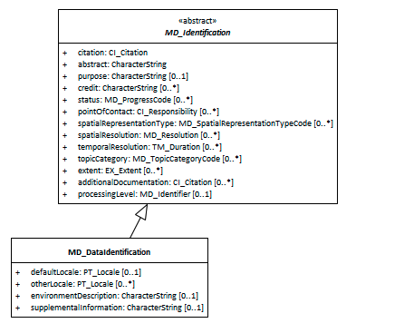

#  Data Identification ★★★★
*When capturing information on a spatial resource, it is important to identify and categorise information as pertaining to the data resource and to distinguish these information from that which applies to the metadata itself or service resources. MD_DataIdentification extends the abstract class MD_Identification to document a spatial data resource.*

- **Path** -  *MD_Metadata.identificationInfo>MD_DataIdentification*
- **Governance** -  *ISO*
- **Purpose -** *Discovery, Use*
- **Audience -** 
- machine resource - ⭑ ⭑ ⭑ ⭑
- general - ⭑ ⭑
- resource manager - ⭑ ⭑ ⭑ ⭑
- specialist - ⭑ ⭑
- **Metadata Type -** *structural*
- *ICSM Level of Agreement* - ⭑ ⭑

## Definition -

**basic information required to uniquely identify and understand a data resource.**

### ISO Requirements
At least one [1..\*] [MD_Identification](http://wiki.esipfed.org/index.php/MD_Identification)  must be present in a metadata record. This must be instantiated as a `MD_DataIdentification` for metadata about data rsources.

### ISO Associations 

**[MD_Identification](http://wiki.esipfed.org/index.php/MD_Identification)** is an abstract class that is parent to 

- **MD_DataIdentification**

It is a child of 
- MD_Metadata.identificationInfo

#### Recommended Sub-Elements 

The following provides additional guidance to [MD_Identification](./class-MD_Identification) element recommendations.

- **[Citation -](./ResourceCitation)** *(class - [CI_Citation](./class-CI_Citation)*  [1..1] - Citation for the data resource, includes name, publication date, identifiers, originators and publishers.
- **[abstract -](./Abstract)** *(type - charStr)* [1..1] - A brief narrative summary of the cited data resource.
- **[purpose -](./Purpose)** *(type - charStr))* [0..1] - A brief summary of the intentions with which the data resource was develope
- **[status -](./Status)** *(codelist - [MD_ProgressCode](http://wiki.esipfed.org/index.php/ISO_19115_and_19115-2_CodeList_Dictionaries#MD_ProgressCode))* [0..1] - The status of the data resource populated from a domain of values
- **[topicCategory -](./TopicCategory)** *(enumeration - [MD_TopicCategoryCode](http://wiki.esipfed.org/index.php/ISO_19115_and_19115-2_CodeList_Dictionaries#MD_TopicCategoryCode))* [0..\*] - The main themes of the data resource populated from a fixed domain of values
- **[pointOfContact -](./ResourcePointOfContact)** *(class -  [CI_Responsibility](./class-CI_Responsibility))* [0..1] - The name and contact information for the organisation, role and/or individual that serves as the point of contact for the cited data resource.
- **[spatialRepresentationType -](./SpatialRepresentationType)** *(codelist - MD_SpatialRepresentationTypeCode)* [0..\*] - The method used by the data resource to spatially represent geographic information.
- **[spatialResolution -](./SpatialResolution)** *(class - MD_Resolution)* [0..\*] - The nominal scale and/or spatial resolution at which the information is designed to be used.
- **[graphicOverview -](./BrowseGraphic)** *(class - MD_BrowseGraphic)* [0..\*] - A graphic that provides an lightweight illustration pertaining a data resource
- **[additionalDocumentation](./AdditionalDocs) -**  *(class - [CI_Citation](./class-CI_Citation))* [0..\*] - Citation of other documentation associated with the data resource, e.g. related articles, publications, user guides, data dictionaries.
- **[associatedResource](./AssociatedResources) -**  *(class - [MD AssociatedResource](http://wiki.esipfed.org/index.php/MD_AssociatedResource))* [0..\*] - Used to indicate association between resources and records related to the data resources
- **[referenceSystemInfo -](https://www.loomio.org/d/4SliNjWE/md_metadata-md_referencesystem-definition)** *(class - MD_ReferenceSystem)*
- **resourceConstraints -** *( abstract class [MD_Constraints](./class-MD_Constraints))* [0..\*] see
- **[Resource Security Constraints](./ResourceSecurityConstraints)**
- **[Recource Legal Constraints](./ResourceLegalConstraints)** 
- **[Recource Other Constraints](./ResourceOtherConstraints)** 

In addition to all the attributes of [MD_Identification](./class-MD_Identification), the additional recommended elements apply - 

- **[Locale -](./ResourceLocale)** *(class - [PT_Locale](./PT_Locale))* [0..1] 
- **[distributionInfo -](./DistributionInfo)** *(class - MD_Distribution)* [0..\*]

#### Additional optional attributes

- **[otherLocale -](./ResourceLocale)** *(class - [PT_Locale](./PT_Locale))* [0..\*] 
- **environmentDescription -** *(type - charStr)* [0..1] description of the resource in the producer's processing environment, including items such as the software, the computer operating system, file name, and the dataset size
- **supplementalInformation -** *(type - charStr)*[0..1] any other descriptive information about the resource

## Discussion

Identification information about a resource is of high importance to document as this information strongly impacts on the ability of a user to asses the resource fitness to use. MD_DataIdentification instantiates the abstract class [MD_Identification](./class-MD_Identification)  for use with data resources.

## Recommendations

## Related Classes

- **[MD_Identification](./class-MD_Identification)** the abstract parent class to `MD_DataIdentification` - See guidances for the composite elements.
- **[SV_ServiceIdentification](./ServiceIdentification)** a sibling class and implementation of MD_Identification used for metadata for services as apposed to data resources.

### UML diagrams

Recommended elements highlighted in Yellow

\pagebreak
