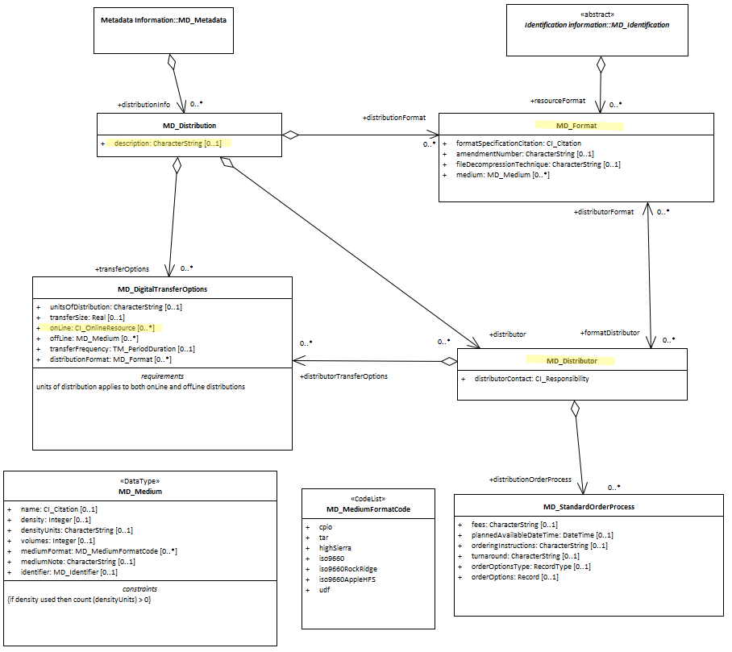

#  Distribution Info ★★★★★
*Commonly the most important purpose of a catalogue is to provide information by which one can access the resources described.  In ISO19115-1 the distrubutionInfo package contains and provides this information describing both online and offline access methods, contacts, and instructions.*

- **Path** -  *MD_Metadata.distributionInfo*
- **Governance** -  *Agency*
- **Purpose -** *Resource access*
- **Audience -** 
  - machine resource - ⭑⭑⭑
  - general - ⭑⭑⭑
  - resource manager - ⭑⭑⭑ 
  - specialist - ⭑⭑⭑⭑⭑
- **Metadata type -** *administrative*
- *ICSM Level of Agreement -* ⭑⭑⭑


## Definition 
**information about the distributor of and options for obtaining the resource**

### ISO Obligation -

- There should be zero to many [0..\*] *distributionInfo* packages for the cited resource in the  *[MD_Metadata](./class-MD_Metadata)* package of class *[MD_Distribution](http://wiki.esipfed.org/index.php/MD_Distribution)* in a metadata record.

### ICSM Good Practice

  - The *distributionInfo* package should be populated in all metadata records unless it obviously has no resource to be distributed, e.g. metadata for a series where resources are accessed via the children.

#### ICSM Recommended Sub-Elements

- **description -** *(type - charStr)*[0..1] (highly recommended when more than one distributionInfo package is present) a brief description of a set of distribution options 
- **distributor -** *(class - [MD_Distributor](http://wiki.esipfed.org/index.php/MD_Distributor))* [0..*] Name, contact information, and role of the organisation from which this distribution of this cited resource may be obtained.
  - **distributorContact -** *(class - [CI_Responsibility](./class-CI_Responsibility))* [0..*] (Highly recommended - CI_RoleCode should be *distributor*) party from whom the resource may be obtained. This list need not be exhaustive
  - **distributionOrderProcess -** *(class - [MD_StandardOrderProcess](http://wiki.esipfed.org/index.php/MD_StandardOrderProcess))* [0..*] (recommended when useful)  provides information about how the resource may be obtained, and related instructions and fee information
- **transferOptions -** *(class - [MD_DigitalTransferOptions](http://wiki.esipfed.org/index.php/MD_DigitalTransferOptions))* [0..*] technical means and media by which a resource is obtained from the distributor
  - **onLine -** *(class - [CI_OnlineResource](./class-CI_OnlineResource))* [0..*]   information about online sources from which the resource can be obtained. > TODO Link to CI_OnlineResource discusion
    - **linkage -** *(type - charStr)* [1..1] (required for each online resource) address for on-line access using a URL/URI or similar addressing scheme
    -  **protocol -** *(type - charStr)*[0..1] (optional) to document the connection type used.
    - **applicationProfile -** *(type - charStr)*[0..1] (optional) may be useful when the application of this distribution is limited.  The name of an application profile that can be used with the online resource
  - **offline -** *(class - [MD_Medium](http://wiki.esipfed.org/index.php/MD_Medium))* [0..*] information about offline media on which the resource can be obtained > TODO Link to MD_Medium discusion
  - **distributionFormat -** *(class - [MD_Format](http://wiki.esipfed.org/index.php/MD_Format))* [0..*] The name and version of the specification for the data format by which a distribution of this cited resource is provided
    - **formatSpecificationCitation -** *(class - [CI_Citation](./class-CI_Citation))* [1..1]   citation/URL of the specification for the format 
      - **title -** *(type - charStr)*[1..1] name of the data format in which the resource is distributed
      - **edition -** *(type - charStr)*[0..1] version of the distribution format used


## Discussion

The distributionInfo package is highly flexible and provides multiple ways to capture information related to the distribution of resources descibed in a metadata record. In this entry we describe what we have determined to be best practice in the ICSM context. For instance, the format of a distribution could be captured using the path:
`MD_Distribution.distributionFormat` or
`MD_Distribution.transferOptions>MD_DigitalTransferOptions.distributionFormat`
We have chosen to recommend the later.  This is to provide better clarity of the relation between the cited format to the cited access (online or off).
This format element describes the format of the data for a particular distribution of the resource. It does not describe the format of the resource native store or of the metadata. There may be multiple formats for a distribution. 

## Recommendations

Therefore - this package should contain at least the minimum information necessary to contact the party responsible for this distribution of the resource. We have identified three primary sub-elements to recommend:

- *Distributor*
- *Online resource*
- *Format*

Of these, *distributor* is is the most most highly recommended.

When needed, instructions for online access should be provided.  
It is often unclear as to what qualifies as a different distribute and what is simply a different format of the same distribution. A web feed may qualify as a different distribution than a download, but a different mime type of a download may not.
Provide as many distribution options as is useful.  Capture of rarely used options or those with only minor differences, unless one wants to encourage their use, is at the descretion of an agency. Do not overload a distribution entry with two many options. If a distribution gets too complex because of too many otions available, consider creating multiple distributions.
It is recommended that the format details are specific for the distribution. If two different version of the same format are available they be documented as two different formats.
When using a common distribution service that provides all data in a set number of formats, consider using `MD_Distribution.distributor>MD_Distributor.distributorFormat`.

### Offline distribution support

Offline access is an important option in many circumstances.  For offline access to the resource we recommend the use of `MD_Distribution.transferOptions>MD_DigitalTransferOptions.offline` to capture information about the media on which the resource is stored.  
The `MD_Distribution.transferOptions>MD_DigitalTransferOptions.online` with `CI_OnLineresource.function>CI_OnLineFunctionCode` value of `offlineAccess` is to be reserved for instructions (online) about how to access the resource from the providor offline. Another preferred apporach is to provide such instructions is via `MD_Distribution.distributor>MD_Distributor.distributionOrderProcess`.

There may also be instances where anonymous free online distribution is not desired for a cited resource.  The distribution package may still be of value in providing contact information by which one may discuss obtaining the resource from the provider. In this case we recommend that the description be populated as well as distributor information. in addition population of `MD_Distribution.distributor>MD_Distributor.distributionOrderProcess` is recommended.


### Crosswalk considerations

<details>

#### ISO19139

- The cardinality of **MD_Metadata.distributionInfo** was increased to [0..*] in order to allow more flexibility in defining distribution information.
- The new element **MD_Distribution.description** was added to allow a description of distribution options.
- **MD_Format.name**, **MD_Format.version** and **MD_Format.specification** were deleted and replace with:
  -  **MD_Format.formatSpecificationCitation** *(class - [CI_Citation](./class-CI_Citation))* 
  - This new element was added in order to allow more precise descriptions of formats and versions and to allow references to the full specifications of those formats.
- **MD_Format.medium** 
  - This new element was added in order to facilitate more precise associations between formats and distribution media.
- **MD_DigitalTransferOptions.transferFrequency** 
  - This new element was added in order to allow a distributor to specify how often new members of an on-going resource are made available.
- **MD_DigitalTransferOptions.distributionFormat**
  - This new element was added in order to allow unambiguous association of online resources with formats without requiring a separate MD_Distributor or MD_Format.
- **MD_Medium.identifier**
  - This new element was added to provide a uniqueidentifier for an instance of the medium.
- **MD_StandardOrderProcess.orderOptionsType** and **MD_StandardOrderProcess.orderOptions**
  - These two new roles were added in order to allow specification of custom ordering options associated with specific resources or implementations.

#### Dublin core / CKAN / data.gov.au

- `Format` maps to `format` - The file format of the distribution. If available in IANA, use Media Type
- `OnlineResource` *(MD_DigitalTransferOptions.online)* maps to `landing page`, `download URL` , `access URL`

#### DCAT

Recommended property to meet data citation requirement

- `distributionInfo` maps to `dct:distribution`
- `Format` maps to `dct:format`
- `distributor` maps to `dct:publisher`
- `OnlineResource` *(MD_DigitalTransferOptions.online)* maps to `dcat:accessURI/dcat.downloadURL/dcat:endpointDescription`
- `distributionFormat` - The file format, physical medium, or dimensions of the resource. A subproperty of `dct:relation`.

#### RIF-CS

- `Format` maps to `Location/Electronic/@format`
- `distributor` maps to `Related Party/relation='distributor'`
- `OnlineResource` *(MD_DigitalTransferOptions.online)* maps to `Location/Electronic/@url`

</details>

## Also Consider

- **[metadataLinkage -](./AdditionalDocs)**  for links that provide a download of the metadata
- **[resourceLineage -](./ResourceLineage)** Information about the provenance, source(s), and/or the production process(es) applied to the resource.
- **[browseGraphic -](./BrowseGraphic)**  associates to a large number of packages to provide linkage to associated image files, such as business or product icons and logos

## Examples

<details>

### XML

```
<mdb:MD_Metadata>
....
  <mdb:distributionInfo>
    <mrd:MD_Distribution>
       <mrd:description>
          <gco:CharacterString>
          A sample distribution record for a dataset
          </gco:CharacterString>
       </mrd:description>
       <mrd:distributor>
          <mrd:MD_Distributor>
             <mrd:distributorContact>
                <cit:CI_Responsibility>
                   <cit:role>
                      <cit:CI_RoleCode 
                      codeList="https://schemas.isotc211.org/19115/resources
                      /Codelist/cat/codelists.xml#CI_RoleCode"
                      codeListValue="distributor"/>
                   </cit:role>
                   <cit:party>
                      <cit:CI_Organisation>
                         <cit:name>
                            <gco:CharacterString>
                            OpenWork Ltd
                            </gco:CharacterString>
                         </cit:name>
                         <cit:contactInfo>
                            <cit:CI_Contact>
                               <cit:address>
                                  <cit:CI_Address>
                                     <cit:electronicMailAddress>
                                        <gco:CharacterString>
                                        info@openwork.nz
                                        </gco:CharacterString>
                                     </cit:electronicMailAddress>
                                  </cit:CI_Address>
                               </cit:address>
                            </cit:CI_Contact>
                         </cit:contactInfo>
                      </cit:CI_Organisation>
                   </cit:party>
                </cit:CI_Responsibility>
             </mrd:distributorContact>
             <mrd:distributionOrderProcess>
                <mrd:MD_StandardOrderProcess>
                   <mrd:fees>
                      <gco:CharacterString>Free</gco:CharacterString>
                   </mrd:fees>
                   <mrd:orderingInstructions>
                      <gco:CharacterString>
                      Contact us at the distributor email address
                      </gco:CharacterString>
                   </mrd:orderingInstructions>
                </mrd:MD_StandardOrderProcess>
             </mrd:distributionOrderProcess>
          </mrd:MD_Distributor>
       </mrd:distributor>
       <mrd:transferOptions>
          <mrd:MD_DigitalTransferOptions>
             <mrd:onLine>
                <cit:CI_OnlineResource>
                   <cit:linkage>
                      <gco:CharacterString>
                      https://data.openwork.nz/samplePath/toResource
                      </gco:CharacterString>
                   </cit:linkage>
                   <cit:protocol gco:nilReason="missing">
                      <gco:CharacterString/>
                   </cit:protocol>
                   <cit:name gco:nilReason="missing">
                      <gco:CharacterString/>
                   </cit:name>
                   <cit:description gco:nilReason="missing">
                      <gco:CharacterString/>
                   </cit:description>
                   <cit:function>
                      <cit:CI_OnLineFunctionCode 
                      codeList="https://schemas.isotc211.org/19115/resources
                      /Codelist/cat/codelists.xml#CI_OnLineFunctionCode" 
                      codeListValue=""/>
                   </cit:function>
                </cit:CI_OnlineResource>
             </mrd:onLine>
             <mrd:distributionFormat>
                <mrd:MD_Format>
                   <mrd:formatSpecificationCitation>
                      <cit:CI_Citation>
                         <cit:title>
                            <gco:CharacterString>
                            geopackage
                            </gco:CharacterString>
                         </cit:title>
                         <cit:edition>
                            <gco:CharacterString>1.2.0</gco:CharacterString>
                         </cit:edition>
                      </cit:CI_Citation>
                   </mrd:formatSpecificationCitation>
                </mrd:MD_Format>
             </mrd:distributionFormat>
          </mrd:MD_DigitalTransferOptions>
       </mrd:transferOptions>
       <mrd:transferOptions>
          <mrd:MD_DigitalTransferOptions>
             <mrd:onLine>
                <cit:CI_OnlineResource>
                   <cit:linkage>
                      <gco:CharacterString>
                      https://info.openwork.nz/linkTo/offlineAccess/instructions
                      </gco:CharacterString>
                   </cit:linkage>
                   <cit:protocol>
                      <gco:CharacterString>
                      WWW:DOWNLOAD-1.0-http--download
                      </gco:CharacterString>
                   </cit:protocol>
                   <cit:name gco:nilReason="missing">
                      <gco:CharacterString/>
                   </cit:name>
                   <cit:description gco:nilReason="missing">
                      <gco:CharacterString/>
                   </cit:description>
                   <cit:function>
                      <cit:CI_OnLineFunctionCode 
                      codeList="https://schemas.isotc211.org/19115/resources
                      /Codelist/cat/codelists.xml#CI_OnLineFunctionCode" 
                      codeListValue=""/>
                   </cit:function>
                </cit:CI_OnlineResource>
             </mrd:onLine>
             <mrd:offLine>
                <mrd:MD_Medium>
                   <mrd:name>
                      <cit:CI_Citation>
                         <cit:title>
                            <gco:CharacterString>
                            BigProject data
                            </gco:CharacterString>
                         </cit:title>
                      </cit:CI_Citation>
                   </mrd:name>
                </mrd:MD_Medium>
             </mrd:offLine>
          </mrd:MD_DigitalTransferOptions>
       </mrd:transferOptions>
    </mrd:MD_Distribution>
  </mdb:distributionInfo>
....
</mdb:MD_Metadata>
```

\pagebreak

### UML diagrams

Recommended elements highlighted in yellow



</details>

\pagebreak
