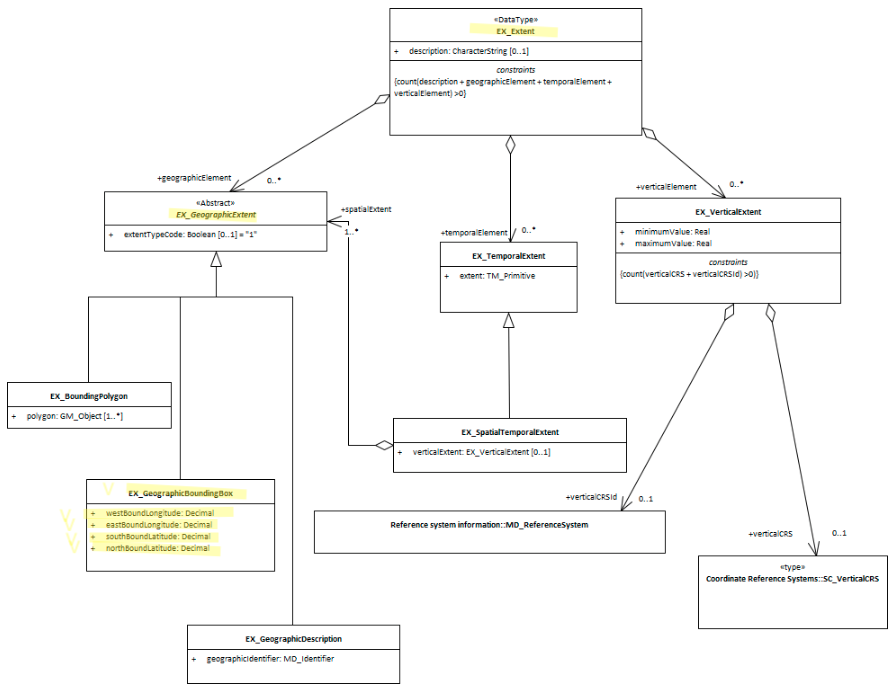

# Extent Bounding Box ★★★★
*In order to quickly determine the general location of spatial features included in an cited resource it is useful that the extent information includes a minimal set of coordinate values that form a bounding box containing all the features of the resource.*

- **Path** - *MD_Metadata.identificationInfo>MD_DataIdentification.extent>EX_Extent.geographicElement>EX_GeographicBoundingBox*
- **Governance** - *Common ICSM*
- **Purpose** - *Discovery*
- **Audience -**
  - machine resource - ⭑⭑⭑⭑
  - general - ⭑⭑⭑
  - data manager - ⭑⭑
  - specialist - ⭑⭑ 
  - **Metadata type -** *descriptive*
- *ICSM Level of Agreement* - ⭑⭑⭑⭑

## Definition
**A minimal set of geographic coordinates describing the geographic position of the resource. This is only an approximate reference so specifying the coordinate reference system is unnecessary and need only be provided with a precision of up to two decimal places** 

### ISO Obligation

- A metadata record may have zero to many  [0..\*] *geographicIdentifier* elements for the cited resource in the  *[GeographicExtent](./GeographicExtent)* package of class *EX_GeographicBoundingBox* that described the geographic extent of a cited resource.

### ICSM Good Practice -

- The MDWG recommends populating as many instances of Geographical Extent packages as need to give a common understanding of the spatial coverage of the cited resource.

#### Recommended Sub Elements

Use **extentTypeCode** *(Boolean)* [0..1] with a value of "0" to indicate exclusions
All four following subelements must be included in a bounding box description

* **westBoundLongitude** - *(type - Decimal)* western-most coordinate of the limit of the resource extent, expressed in longitude in decimal degrees (positive east - WGS 84)
* **eastBoundLongitude** - *(type - Decimal)*  eastern-most coordinate of the limit of the resource extent, expressed in longitude in decimal degrees (positive east - WGS 84)
* **southBoundLatitude** - *(type - Decimal)* southern-most coordinate of the limit of the resource extent, expressed in latitude in decimal degrees (positive north - WGS 84)
* **eastBoundLongitude** - *(type - Decimal)* northern-most, coordinate of the limit of the resource extent expressed in latitude in decimal degrees (positive north - WGS 84)

## Discussion

Every metadata record describing geographic resources should contain a bounding box description that covers the location which describes the area of interest of the resource. Those searching for resources can be provided a quick visual of the usable location of the resource. Catalogue software can use these boxes to do overlay analyses and narrow searches to particular areas of interest. To ensure ease of use with metadata from other sources that may contain data in any number of projections, these bounding box needs to be expresses in a common WGS 84 projection. 

Because of the simple mathematics involed in calculating overlap with two coordinate pairs, bounding box descriptions provide a lightwieght way that those without GIS tools can tell if the resource overlaps with anaother.

The use of multiple bounding boxes is recommended for more complicated geometries, inclding exclusion areas.

### Outstanding Issues

> **Projections**
Geospatial data may be held and maintained by an organisation in any number of projections. Capturing the bounding box in common WGS 84 coordinates may require reprojection of coordinates. Workflows and tools need to be available to the metadata authors to simplify this task and reduce transcription errors.

> **180 degree problem**
To capture a bounding box that describes the area of the country of New Zealand, one must draw across 180 degree Longitude. This creates an issue with most software descriptions of bounding boxes and results in a bounding box that circles the world and excludes New Zealand. One common solution is to split into two such bounding boxes at +/-180 degree latitude.

## Recommendations

Therefore - It is strongly recommended that to support discovery of resources, every metadata record that describes a geographic resource contains at a minimum one bounding box description of the resource area of interest. To ensure commonality with other catalogued data, the coordinates of such need be captured in WGS 84.  If there be any exclusion areas, the use of the boolean extentTypeCode (set to "0") is recommended.

### Crosswalk considerations

<details>

#### Dublin core / CKAN / data.gov.au

Maps to `geospatial coverage`

#### DCAT 

Maps to `dct.spatial`

#### RIF-CS

Maps to the aggregate element `Coverage/Spatial`

</details>

## Also Consider

- **[EX_Extent](./ResourceExtent)** The class that contains all extent information about the cited resource - vertical, geographical or temporal.
- **[EX_GeographicExtents](./GeographicExtent)** is an abstract class and the parent of **EX_GeographicBoundingBox**
- **[EX_GeographicDescription -](./ExtentGeographicDescription)**  a sibling to this element.
- **EX_BoundingPolygon**  While very useful, particularly in describing irregular areas, this element is not described by the MDWG as a recommended element due to the difficult that many systems have in implementing it.
- **[EX_TemporalExtent](./TemporalExtents)** Contains temporal extent information for the cited resource
- **[EX_VerticalExtent -](./VerticalExtent)**  captures the vertical range of a resource.

## Examples

<details>

### XML
```
<mdb:MD_Metadata>
....
     <mdb:identificationInfo>
        <mri:MD_DataIdentification>
         ....
             <gex:EX_Extent>
               <gex:geographicElement>
                  <gex:EX_GeographicBoundingBox>
                     <gex:westBoundLongitude>
                        <gco:Decimal>110.70922852</gco:Decimal>
                     </gex:westBoundLongitude>
                     <gex:eastBoundLongitude>
                        <gco:Decimal>157.79663086</gco:Decimal>
                     </gex:eastBoundLongitude>
                     <gex:southBoundLatitude>
                        <gco:Decimal>-39.32048764</gco:Decimal>
                     </gex:southBoundLatitude>
                     <gex:northBoundLatitude>
                        <gco:Decimal>-10.68489957</gco:Decimal>
                     </gex:northBoundLatitude>
                  </gex:EX_GeographicBoundingBox>
               </gex:geographicElement>
             </gex:EX_Extent>
           ....
        </mri:MD_DataIdentification>
     </mdb:identificationInfo>
   ....
</mdb:MD_Metadata>
```

### UML diagrams
Recommended elements highlighted in Yellow



</details>

\pagebreak
