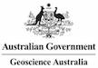
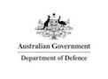
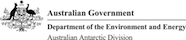

# ICSM ISO19115-1 Metadata Good Practice Guide

This document was compiled by [OpenWork Ltd (OWL)](http://openwork.nz) on behalf of and with guidance and contributions from the [ICSM Metadata Working Group (MDWG)](https://www.icsm.gov.au/what-we-do/metadata-working-group). The purpose of this document is to capture the consensus good practice guidance for the use of recommended ISO 19115-1 metadata elements for organisataion in the Australia / New Zealand region. Further this guidance will aid the migration from the retired [ANZLIC](https://www.anzlic.gov.au/) Metadata Profile of ISO 19115:2003 to the currently endorsed ISO 191125-1:2014 (including Amd.1:2018).

  
   
      
  

\pagebreak

## Acknowledgements

### ICSM Metadata Working Group 

- Chair :	Irina Bastrokova - irina.bastrakova@ga.gov.au
- Secretariat:	Andrew Whiting - andrew.whiting@ga.gov.au
- Secretariat:	Graham Logan - graham.logan@ga.gov.au
- ANZLIC:	Brian Sloan	- Brian.Sloan@ga.gov.au
- ANZLIC:	Ann Beaumaris	- Ann.Beaumaris@industry.gov.au
- ICSM: Executive Officer -	Lesley Waterhouse - lesley.waterhouse@ga.gov.au

### Contributors

- Lead Author: Byron Cochrane - OpenWorks Ltd - byron@openwork.nz
- Irina Bastrakova - Geoscience Australia - irina.bastrakova@ga.gov.au
- Shanti Rowlison - Australia Government Dept of Defense - shanti.rowlison@defence.gov.au
- Jenny Mahuika - Terrestrial Ecosystem Research Network (TERN) - j.mahuika@uq.edu.au
- Evert Bleys - ABARES - ejbleys@gmail.com
- Melanie Barlow - Australian Research Data Commons (ARDC)- melanie.barlow@ardc.edu.au
- Aaron Sedgmen - Geoscience Australia - Aaron.Sedgmen@ga.gov.au
- Martin Capobianco - Geoscience Australia - Martin.Capobianco@ga.gov.au
- Dave Connell - Australia Antarctic Division, Dept of the Environment and Energy - Dave.Connell@aad.gov.au

**>> [*Introduction*](../defs/GuidanceIntro)**

\pagebreak
