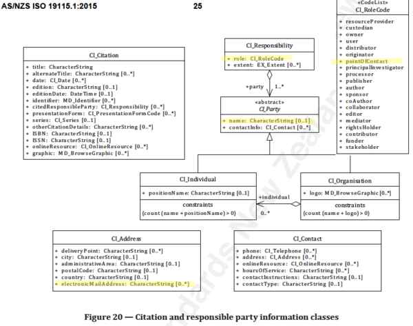

#  Metadata Responsible Party ★★★★★
*A contact for the person responsible for a metadata record is useful to curent and future users and managers of the resource and catalogue.*

|  |  |
| --- | --- |
| **Element Name** | *contact* |
| **Parent** |  *[MD_Metadata](./class-MD_Metadata)* |
| **Class/Type** | *[CI_Responsibility](./class-CI_Responsibility)* |
| **Governance** |  *Common ICSM, Agency* |
| **Purpose** | *Discovery, Data Management, Communications* |
| **Audience** | machine resource - ⭑ ⭑  |
|  | general - ⭑ ⭑ ⭑ ⭑ ⭑ |
|  | resource manager - ⭑ ⭑ ⭑ ⭑ ⭑ |
|  | specialist - ⭑ ⭑ ⭑  |
| **Metadata type** | *administrative* |
| **ICSM Level of Agreement** | ⭑ ⭑ ⭑ ⭑ |

## Definition

**Name and contact information about the organisation, role and individual who is responsible for the metadata record.**

### ISO Obligation
- There must be one or more [1..\*] *contact* packages for the cited resource in the  *[MD_Metadata](./class-MD_Metadata)* package provided in a metadata record for those responsible for the metadata itself. These will be of class *[CI_Responsibility](./class-CI_Responsibility)*.

## Discussion
This element refers to the party responsible for the metadata record itself and the maintenance of this metadata record. It does not refer to the party responsible for the resource the metadata describes.

This is a compound element of type CI_ResponsibleParty. At least one must be present. Recommended role value - "PointOfContact" with attached email; other roles can be added as required

## ICSM Recommendations

Therefore - In order to meet ICSM good practice, in all metadata records, at least one contact should be given for the party responsible for the metadata itself. One entry should be role code "Point of Contact".  In addition, for minimal conformity, `name` (of organisation preferred), `positionName` and `electrronicMailAddress` should also be popiulated.
The use of the new `partyIdentifier` element added in the 2018 ammendment to the standard is encouraged by all parties.

#### Recommended Sub-Elements

Follow the general guidance for [CI_Responsibility](./class-CI_Responsibility).

- One value of `role` should be "Point of Contact".

## Also Consider

- **[Resource Point of Contact](./ResourcePointOfContact)** Contact information for the recommended party to contact about the resource
- **[Resource Cited Reponsible Party](./ResourceResponsibleParty)** contact information for the parties otherwise responsible for aspects of the the resource creation and maintenance.
- **[DistributionInfo](./DistributionInfo)** Includes Distributor contact information.

## Crosswalk considerations

<details>

### ISO19139

See discussion at [CI_Responsibility](./class-CI_Responsibility)

### Dublin core / CKAN / data.gov.au

Maps to `contact`

### DCAT

Maps to `dcat:contactPoint`

### RIF-CS

Maps to `Related Party`

</details>


## Examples

<details>

### XML -
```
<mdb:MD_Metadata>
...
  <mdb:contact>
    <cit:CI_Responsibility>
      <cit:role>
        <cit:CI_RoleCode 
        codeList="https://schemas.isotc211.org/19115/resources/Codelist/cat
        /codelists.xml#CI_RoleCode"
        codeListValue="pointOfContact"/>
      </cit:role>
      <cit:party>
        <cit:CI_Organisation>
          <cit:name>
            <gco:CharacterString>OpenWork Ltd</gco:CharacterString>
          </cit:name>
          <cit:contactInfo>
            <cit:CI_Contact>
              <cit:address>
                <cit:CI_Address>
                  <cit:electronicMailAddress>
                    <gco:CharacterString>name@email.org</gco:CharacterString>
                  </cit:electronicMailAddress>
                </cit:CI_Address>
              </cit:address>
            </cit:CI_Contact>
          </cit:contactInfo>
          <cit:individual>
            <cit:CI_Individual>
              <cit:name>
                <gco:CharacterString>Metadata Bob</gco:CharacterString>
              </cit:name>
              <cit:positionName gco:nilReason="missing">
                <gco:CharacterString/>
              </cit:positionName>
            </cit:CI_Individual>
          </cit:individual>
        </cit:CI_Organisation>
      </cit:party>
      </cit:CI_Responsibility>
  </mdb:contact>
....
</mdb:MD_Metadata>
```

### UML diagrams
Recommended elements highlighted in Yellow



</details>

 \pagebreak
