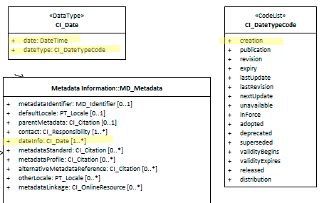

# Metadata Date Info ★★★★★
*In order to manage metadata and harvesting mechanism as giving updates to users it is useful to include in our metadata temporal information relating to metadata creation, publication, revision, etc.*

| | |
| --- | --- |
| **Element Name** | *dateInfo* |
| **Parent** | *[MD_Metadata](./class-MD_Metadata)* |
| **Class/Type** | *[CI_Date](./class-CI_Date)* |
| **Governance** | *Common ICSM* |
| **Purpose** | *Discovery, Data Management* |
| **Audience** | machine resource - ⭑ ⭑ ⭑ |
| | general - ⭑ ⭑ ⭑ |
| | resource manager - ⭑ ⭑ ⭑ ⭑ ⭑ |
| | specialist - ⭑ ⭑ ⭑ ⭑ |
| **Metadata type** | *descriptive* |
| **ICSM Level of Agreement** | ⭑ ⭑ ⭑ |

## Definition
**A named and dated event associated with the metadata record. (In ISO 8601 format).**

### ISO Obligation
- There can be one to many [1..\*] *dateInfo* entries for the cited resource in the *[MD_Metadata](./class-MD_Metadata)* package of class *[CI_Date](./class-CI_Date)* in a metadata record. One of these must be of `dateType` *creation*.

## Discussion

According to ISO guidance, there must be at least one instance of dateInfo in a metadata record (creation), but there may be multiple.

The CI_DateType CodeList contains 16 values. Which values are of most import needs further discussion. 

The ability to crosswalk easily with CKAN and DCAT is of high concern. These external catalogues commonly have a single date field. Which dateType we map to this field is of interest in discussions regarding the recommended dateTypes used.

Relation of metadata dateInfo to resource reference date needs to be discussed. The resource reference date (*MD_Metadata.idenitificationInfo > MD_DataIdentification.citation > CI_Citation.date*) is documented as the date that should be used for discovery of resources other than services. (For services *MD_Metadata.identificationInfo > SV_ServiceIdentification.citation > CI_Citation.date* is used.)

When does the metadata dataInfo require updating? For instance, is it okay to not update the metadata dataInfo when the resource reference date is updated if nothing else has changed? Our best practice guide should address these and related issues.

## ICSM Recommendations

Therefore - in order to provide an idea of the age, validity and other time dependant properties of a metadata record, it is important to capture the important events that happened or will happen to a particular metadata record in the `MD_Metadata.dateInfo` element. One of these important events must be of `dateType` "creation". This is often referred to as a "Metadata date stamp".

This element should be updated in a consistent yet to be agreed upon manner. We recommend GeoNetwork's current approach. GeoNetwork updates the **revision date** for the metadata record automatically on every save. This supports systems such as notifications and harvesting regimes that rely on the capture of the date that a metadata record was last modified.

### Recommended Sub-Elements

Follow the general guidance for [class - CI_Date](./class-CI_Date) with the following additional guidance:

- **date** - (Mandatory) the reference DateTime for the metadata record.
- **dateType -** One entry must be of this value *creation*. 
- **dateType** - (Mandatory for Revision when a revision is made) the event type to which the date refers. Populated from the CI_DateTypeCode codelist.

## Also Consider

- **[Resource Date](./ResourceDate) -** Dates associated with the resource
- **[CI_Date -](./class-CI_Date)** the class by which dates are expressed

## Other Discussion

> **Date and DateTime:**
When is it okay to use Date as opposed to DateTime?

> **DCAT:**
encoded using the relevant ISO 8601 Date and Time compliant string [DATETIME] and typed using the appropriate XML Schema datatype [XMLSCHEMA11-2]

## Crosswalk considerations

<details>

### ISO19139

The element `dateStamp` was replaced with `dateInfo` to allow other types of metadata date information to be recorded in addition to the creation date. The type and cardinality of this element were changed in order to allow associating more than one type of date with a metadata record.

### Dublin core / CKAN / data.gov.au

Maps to `publish` and `update date`

### DCAT

Maps to `dct:issued` and `dct:modified`

### RIF-CS

Maps to `@dateAccessioned`

</details>

## Examples

<details>

### XML -

```
<mdb:MD_Metadata>
....
<mdb:dateInfo>
   <cit:CI_Date>
     <cit:date>
      <gco:DateTime>2019-05-30T15:30:05</gco:DateTime>
     </cit:date>
     <cit:dateType>
      <cit:CI_DateTypeCode 
      codeList="https://schemas.isotc211.org/19115/resources/Codelist
      /cat/codelists.xml#CI_DateTypeCode"
      codeListValue="revision"/>
     </cit:dateType>
   </cit:CI_Date>
 </mdb:dateInfo>
  <mdb:dateInfo>
   <cit:CI_Date>
     <cit:date>
      <gco:DateTime>2005-03-31T19:13:30</gco:DateTime>
     </cit:date>
     <cit:dateType>
      <cit:CI_DateTypeCode codeList="codeListLocation#CI_DateTypeCode" 
      codeListValue="creation">creation</cit:CI_DateTypeCode>
     </cit:dateType>
   </cit:CI_Date>
 </mdb:dateInfo>
....
</mdb:MD_Metadata>
```

\pagebreak

### UML diagrams
Recommended elements highlighted in yellow



</details>

\pagebreak

