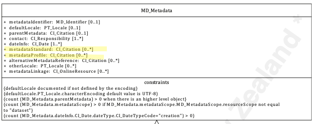

# Metadata Standard  ★★★★★ 

*Metadata records are captured to a particular standard. In our case that standard is ISO 19115-1. When exchanging metadata, it is importatant to know what standard the metadata uses in order to understand what it contains.*
|  |  |
| --- | --- |
| **Element Name** | *serviceTypeVersion* |
| **Parent** |  *[MD_Metadata.identificationInfo>SV_ServiceIdentification](./ServiceIdentification)* |
| **Class/Type** | *CI_Citation* |
| **Governance** |  *Common ICSM* |
| **Purpose** | *Use* |
| **Audience** | machine resource - ⭑ ⭑ |
|  | general - ⭑ ⭑ ⭑ |
|  | resource manager - ⭑ ⭑ ⭑ |
|  | specialist - ⭑ ⭑ ⭑ |
| **Metadata type** | *structural* |
| **ICSM Level of Agreement** | ⭑ ⭑ |

## Definition  
**The citation for the standard to which the metadata conforms**

### ISO Requirements

There may be zero to many [1-\*] *MetadataStandard* entries cited for a metadata record of class *[CI_Citation](./class-CI_Citation). Each Metadata standard citation should include an identifier.

## Discussion  

Documenting the metadata standard to which the metadata adheres is esential good practice in that this information provides the user ways to find the esential information and guidance about how to read the metadata. This is also essential information for those who may need to map such information to their own systems.

There are options about how to cite the standard used even in the context of this naroow guidance for ISO 19115-1. One could equally cite a compliant profile of this standard used by their organisation or ISO 19115-3, the XML implementation standad for ISO 19115-1. It is very useful if the standard is cited to the year and admendment number (if any). As there are allowed multiple entries for this element, the base standard and any profiles thereof may be captured together.

## ICSM Recommendations 

Therefore - In order for users to have a better understanding of the metadata they recieve, it is highly recommended that the *MetadataStandard* element  be populated with at minimum "ISO 19115-1". The year and admendment information should also be included. Currently, the approved standard and version of this standard in Australia and New Zealand is **AS/NZS ISO 19115.1:2015 (ISO 19115-1:2014 with ISO 19115-1:2014/Amd.1:2018, IDT)**. Any profile information of this standard should be included as a *MetadataProfile* entry.

### Recommended Sub-Elements 

From class *[CI_Citation](./class-CI_Citation):

- **title -** *(type - charStr)*[1..1] Strongly Recommended. Should be stated as `AS/NZS ISO 19115.1:2015` with any amendments e.g. `Amd.1:2018`
- **alternateTitle -** *(type - charStr)* [0..\*] May include here other names by which this standard is know e.g. `ISO 19115-3`, `ISO 19115-1:2014 `
- **date -** *(class - [CI_Date](./class-CI_Date))*  [0..\*]  May include the base year for the standard e.g. `2014`
- **edition -** *(type - charStr)* [0..1] version of the cited resource e.g. `Amd.1:2018`
- **editionDate -** *(type - DateTime)*[0..1] date of the edition e.g. `2018`
- **identifier -** *(class - [MD_Identifier](./class-MD_Identifier))* [0..\*] value uniquely identifying an object within a namespace
  - **code -** (*type - charStr*) [1..1] Strongly Recommended. Should be stated as `AS/NZS ISO 19115.1:2015 (ISO 19115-1:2014 with ISO 19115-1:2014/Amd.1:2018, IDT)`  (TBC)
  - **authority -** *(class CI_Citation)* [0..1] the provider of the id `AS/NZS`
  - **version -** (*type - charStr*) [0..1] optional version identifier for the namespace
  - **description -** (*type - charStr*) [0..1] optional natural language description of the meaning of the code value

## Also Consider

**MetadataProfile -** A sibling element to *MetadataStandard*. Also of class *CI_Citation*. Use the same guidance provided here to populate any profile information needed.

For Service resource metadata:
**[ServiceStandard -](./ServiceStandard)**  to document the standard to which a spatial service conforms

**[ServiceProfile -](/ServicePRofile)**  to document the profile to which a spatial service may conform

## Outstanding Issues
{

> **CORE ISSUE: ICSM Standardised agreement**  
There has as yet been little discussion as to what such information a *MetadataStandard* entry should contain. While the guidance here is correct, it has not been verified by a quorum of MDWG members. There may be other valid methods of capturing this information.

> **Multiplicity**
Should it be recommended that there be one and only one *MetadataStandard* entry in a metadata record? This could help avoid any unnecessary confusion to recipients of such metadata. Other names for the standard may be able to be captured in the `CI_Citation` elements.


## Crosswalk considerations 
<details>
### ISO19139 

**MD_Metadata/metadataStandardName** and **MD_Metadata/metadataStandardVersion** The Standard Name and StandardVersion were combined into a CI_Citation in order to allow more precise references to the particular standard being used. The MD_MetadataStandardName is replaced by CI_Citation.title and MD_MetadataStandardVersion is replaced by CI_Citation.edition.

## Examples

### XML -
<details>
```
<mdb:MD_Metadata>
....
 <mdb:metadataStandard xmlns:gn="http://www.fao.org/geonetwork"
                         xmlns:gmd="http://standards.iso.org/iso/19115/-3/mdb/1.0"
                         xmlns:geonet="http://www.fao.org/geonetwork">
      <cit:CI_Citation>
         <cit:title>
            <gco:CharacterString>AU/NZS ISO 19115-1:2014</gco:CharacterString>
         </cit:title>
      </cit:CI_Citation>
  </mdb:metadataStandard>
  <mdb:metadataStandard xmlns:gn="http://www.fao.org/geonetwork"
                         xmlns:gmd="http://standards.iso.org/iso/19115/-3/mdb/1.0"
                         xmlns:geonet="http://www.fao.org/geonetwork">
      <cit:CI_Citation>
         <cit:title>
            <gco:CharacterString>ISO 19115-1:2014</gco:CharacterString>
         </cit:title>
      </cit:CI_Citation>
  </mdb:metadataStandard>
  <mdb:metadataStandard xmlns:gn="http://www.fao.org/geonetwork"
                         xmlns:gmd="http://standards.iso.org/iso/19115/-3/mdb/1.0"
                         xmlns:geonet="http://www.fao.org/geonetwork">
      <cit:CI_Citation>
         <cit:title>
            <gco:CharacterString>ISO 19115-3</gco:CharacterString>
         </cit:title>
      </cit:CI_Citation>
  </mdb:metadataStandard>
  <mdb:metadataProfile xmlns:gn="http://www.fao.org/geonetwork"
                        xmlns:gmd="http://standards.iso.org/iso/19115/-3/mdb/1.0"
                        xmlns:geonet="http://www.fao.org/geonetwork">
      <cit:CI_Citation>
         <cit:title>
            <gco:CharacterString>Geoscience Australia Community Metadata Profile of ISO 19115-1:2014</gco:CharacterString>
         </cit:title>
         <cit:edition>
            <gco:CharacterString>Version 2.0, September 2018</gco:CharacterString>
         </cit:edition>
         <cit:identifier>
            <mcc:MD_Identifier>
               <mcc:code>
                  <gco:CharacterString>http://pid.geoscience.gov.au/dataset/ga/122551</gco:CharacterString>
               </mcc:code>
            </mcc:MD_Identifier>
         </cit:identifier>
      </cit:CI_Citation>
  </mdb:metadataProfile>
....
</mdb:MD_Metadata>
```

### UML diagrams

Recommended elements highlighted in Yellow


</details>
\pagebreak

